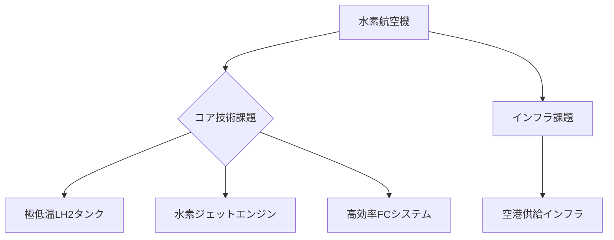

# T19-11-03 水素燃料航空機

## Summary（5つの要点）
1. **究極のゼロエミッション**: 液体水素（LH2）を燃料とし、燃焼時に**水（H2O）のみを排出し、CO2排出をゼロ**にする次世代航空機。
2. **技術的難題**: 水素を液体として貯蔵するための**極低温（-253℃）対応の軽量・高断熱燃料タンク**と、水素に対応した**燃料供給・制御システム**の開発が最難関である。
3. **推進方式**: 水素を直接燃焼させる**水素ジェットエンジン**と、水素燃料電池で発電し電動モーターを駆動させる**FC（Fuel Cell）ハイブリッド**の2つの方式が研究されている。
4. **開発ロードマップ**: Airbusは**ZEROe**プロジェクトを立ち上げ、2035年までの商用化を目指し、デモ機開発と技術実証を精力的に進めている。
5. **インフラ課題**: 液体水素の製造、輸送、空港での**安全かつ迅速な燃料供給インフラ**の整備が、技術開発と並行して求められる。

#### 概念図

---
### 日本の立ち位置・強み弱みのSummary
### 強み
1. JAXA、川崎重工などによる**液体水素の貯蔵・供給技術**に関する長年の基礎研究と実績。
2. 自動車分野での**燃料電池車（FCV）の開発**と、水素ステーション整備のノウハウ。
### 弱み
1. 水素航空機に特化した**機体全体の設計**、特にLH2タンクの統合設計技術が、Airbusなどの欧米勢に比べて遅れを取っている。
2. 航空機燃料としての**安全性認証（クライオジェニック対応）**に関する国際的な議論への主導権が弱い。
