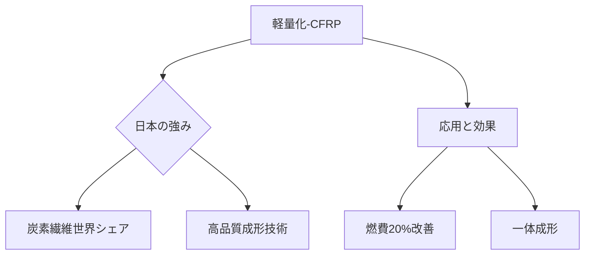

# T19-11-04 軽量化材料・CFRPエアフレーム

## Summary（5つの要点）
1. **燃費改善効果**: 機体重量を削減することで、搭載エンジンに関わらず**燃費を15～20%改善**し、航続距離の延伸にも貢献する。
2. **CFRPの活用**: 炭素繊維強化プラスチック（CFRP）は、アルミニウム合金より軽量で高強度であり、Boeing 787やAirbus A350では機体重量の**50%以上**に採用されている。
3. **日本の競争優位性**: **東レ、三菱ケミカル**が、航空機用途の高品質な炭素繊維で**世界トップシェア**を維持しており、川上技術で圧倒的な強みを持つ。
4. **次世代機への進化**: 次世代旅客機では、機体構造材だけでなく、主翼や胴体全体の**一体成形技術**を進化させ、部品点数の削減とさらなる軽量化を目指す。
5. **課題**: CFRPは電気を通しにくいため、雷撃時の電流を安全に流すための**特殊な導電性材料や構造**の組み込みが設計上の重要な課題となる。

#### 概念図

---
### 日本の立ち位置・強み弱みのSummary
### 強み
1. **東レ、三菱ケミカル**による高性能**炭素繊維（プリプレグ）**の圧倒的な製造技術とサプライチェーンの支配力。
2. CFRPの**高品質な複合材成形、非破壊検査**に関する技術とノウハウ。
### 弱み
1. CFRPの**製造コスト**が高止まりしており、量産型機への適用拡大にはさらなる低コスト化が課題。
2. 大型のCFRP構造物の**リサイクルシステム**が未整備であり、航空機の廃棄時に環境負荷となる可能性がある。
