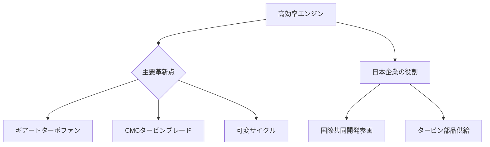

# T19-11-05 高効率ジェットエンジン・ギアードターボファン

## Summary（5つの要点）
1. **GTF（ギアードターボファン）**: ファンと低圧タービンの間に**減速ギア**を導入することで、ファンを低速、タービンを高速でそれぞれ最適に動作させ、**燃費を15～25%改善**した（例: Pratt & Whitney GTF）。
2. **複合材の活用**: エンジン内部の高温高圧部に、従来のニッケル合金よりも軽量で耐熱性の高い**セラミック複合材（CMC: Ceramic Matrix Composites）**を適用し、燃焼効率を向上させる。
3. **可変サイクルエンジン**: 飛行状況に応じてエンジンの運転サイクル（バイパス比など）を最適に変更し、**燃費と推力**を両立させる次世代エンジン技術（例: Rolls-Royce UltraFan、GE9X）。
4. **環境性能**: 燃費改善に加え、新しい燃焼技術（リーンバーン）により**NOx（窒素酸化物）排出量を削減**し、ギア機構により**騒音も大幅に低減**するなど、環境性能全般が向上している。
5. **日本の参画**: IHI、川崎重工がPratt & WhitneyやRolls-Royceなどのグローバルエンジンメーカーとの**国際共同開発**に主要なコンポーネント（ファン、タービン）で参画している。

#### 概念図

---
### 日本の立ち位置・強み弱みのSummary
### 強み
1. IHI、川崎重工が**世界の主要エンジン開発プログラム**に長年参画し、高性能なタービンやファンブレードの**設計・製造技術**を保有。
2. **燃焼技術**や**高温材料技術**（セラミック複合材など）に関する基礎研究力が高い。
### 弱み
1. エンジン全体の**アーキテクチャ設計**や**システムインテグレーション**といった中核技術の主導権が、GE、P&W、RRの3大メーカーに集中しており、最終製品の決定権がない。
2. **次世代技術（可変サイクルなど）**に関する自社ブランドでの開発実績が限定的である。
