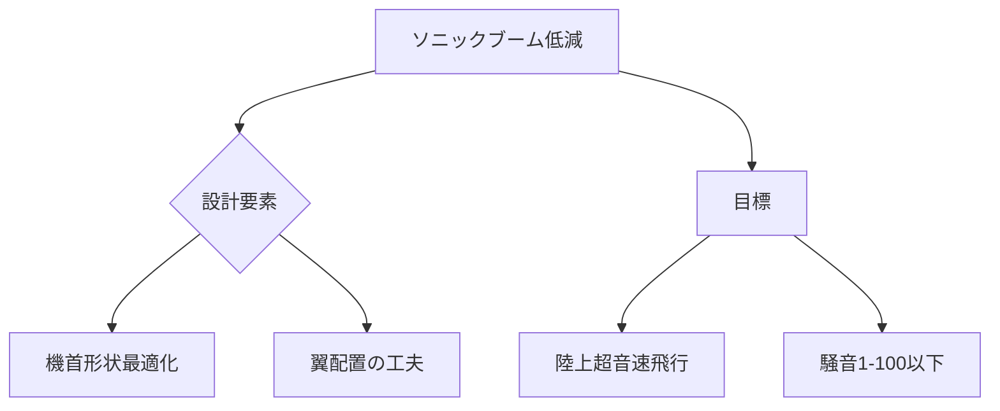

# T19-12-01 ソニックブーム低減技術・静粛超音速機（SST）

## Summary（5つの要点）
1. **技術的目標**: 超音速飛行時に発生する**衝撃波（ソニックブーム）**の地上到達時の騒音レベルを、従来の航空機（コンコルド）の1/100以下（ドアを閉める音程度）にまで低減する。
2. **空力設計の最適化**: 機体の**機首形状、主翼の配置、胴体の断面形状**を綿密に設計し、衝撃波の波形を分離・拡散させることで、ブームのエネルギーを弱める（**ロー・ブーム設計**）。
3. **実証機**: NASAの**X-59 QueSST**（Quiet Supersonic Technology）が、このロー・ブーム設計の有効性を実証するための試験飛行を行っており、陸上超音速飛行の実現を担う。
4. **規制緩和の前提**: ソニックブームが原因で禁止されている**陸上での超音速飛行**を可能にするための国際的な騒音基準（FAA, ICAO）の策定において、この技術の確立が不可欠となる。
5. **数値流体力学（CFD）**: 衝撃波の発生と伝播をシミュレーションするための**高精度なCFD解析技術**が、騒音低減設計の根幹を担う。

#### 概念図

---
### 日本の立ち位置・強み弱みのSummary
### 強み
1. JAXAによる**低ソニックブーム設計**に関する長年の基礎研究と、風洞実験ノウハウ。
2. **超音速流体解析**や**CFDシミュレーション**における高い技術力。
### 弱み
1. NASA X-59のような**大規模な実証機開発**と、その飛行試験データの収集において、米国に依存している。
2. **機体全体のシステムインテグレーション**における主導権が、Boom Supersonicや米国のOEM企業に集中している。
