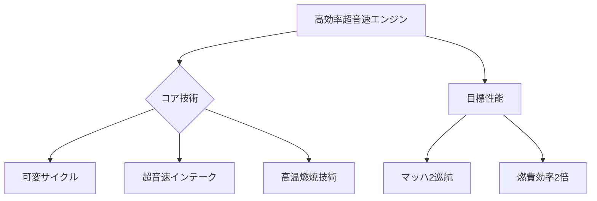

# T19-12-02 高効率超音速エンジン

## Summary（5つの要点）
1. **課題の解決**: 超音速飛行と亜音速飛行（特に離着陸時）の**燃費と騒音の特性**が大きく異なるため、両方のフェーズで高い効率を維持する技術が必要。
2. **可変サイクルエンジン**: 飛行速度に応じて、エンジンの**空気流量、バイパス比、圧縮比**などを変更し、亜音速と超音速の両方で効率を最適化する（例: GE、Rolls-Royceが開発中）。
3. **超音速インテーク**: 超音速気流を亜音速（エンジン入口）まで効率よく減速・圧縮し、エンジン性能を最大化する**可変形状の吸気口**の制御技術。
4. **低燃費化**: コンコルドの約2倍の燃費効率、または同等以下の燃費を達成し、**運航コスト**と**CO2排出量**を大幅に削減する。
5. **日本の参画**: IHI、川崎重工が、超音速エンジンの主要部品（タービン、コンプレッサー）や、**高温・高圧燃焼技術**に関する国際共同開発に参画している。

#### 概念図

---
### 日本の立ち位置・強み弱みのSummary
### 強み
1. **IHI**などによる、既存の旅客機エンジン開発で培われた**高温・高効率部品**の設計・製造技術。
2. **超音速風洞実験**と、エンジン性能評価に関するノウハウ。
### 弱み
1. 可変サイクルエンジンなどの**革新的アーキテクチャ**に関する設計の主導権が、GE、RRなどの海外エンジンメーカーに集中している。
2. 超音速飛行に特化した**次世代エンジンの国内開発プロジェクト**が、まだ小規模である。
