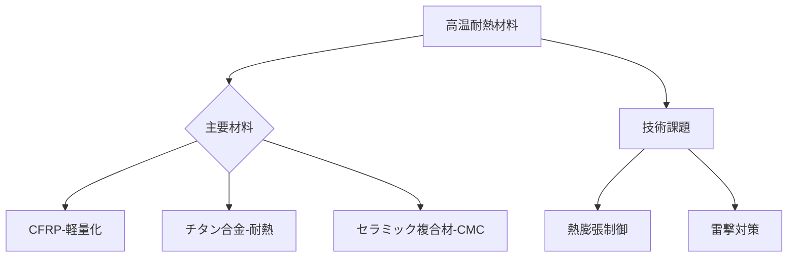

# T19-12-03 炭素繊維複合材・高温耐熱材料

## Summary（5つの要点）
1. **材料選択の理由**: 超音速飛行時には、空気との摩擦により機体表面が**200℃以上**に加熱される（**空力加熱**）ため、高い耐熱性と軽量性を両立する材料が必要。
2. **CFRPの進化**: 従来の超音速機（コンコルド）が主にアルミ合金だったのに対し、次世代機は**CFRP（炭素繊維複合材）**を多用し、機体を大幅に軽量化し燃費を改善する。
3. **耐熱複合材の適用**: エンジン近傍や特に加熱が激しい機体部位には、**チタン合金、ニッケル超合金**、さらには耐熱性の高い**セラミック複合材（CMC）**が適用される。
4. **日本の強み**: **東レ、三菱ケミカル**が製造する高性能な炭素繊維は、超音速旅客機の機体構造材として不可欠であり、日本の素材メーカーがグローバルサプライチェーンで中心的な役割を果たす。
5. **課題**: CFRPは高温下での**強度低下**や、機体外装の**熱膨張率**を考慮した設計、そして雷撃対策のための**導電性**付与技術が重要となる。

#### 概念図

---
### 日本の立ち位置・強み弱みのSummary
### 強み
1. 航空機グレードの**炭素繊維と複合材**の製造・加工技術で世界をリード。
2. **チタン合金**の精密加工、溶接技術が優れている。
### 弱み
1. 高温耐熱材料を用いた**超音速機体構造の設計・認証経験**が、欧米のOEM企業に比べて不足している。
2. CFRPと金属材料の**異種材接合技術**のさらなる高度化が求められる。
