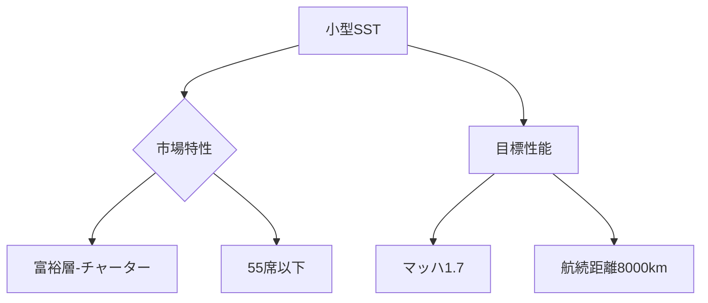

# T19-12-04 ビジネスジェット型・小型超音速機

## Summary（5つの要点）
1. **市場参入戦略**: 初期市場として、座席数**10～50人程度**の小型超音速機を開発し、**富裕層や企業向けのチャーター便**から運航を開始することでリスクを低減する。
2. **主要開発機**: **Boom Overture**（55席、マッハ1.7）が、開発を積極的に進めており、大手航空会社からの受注を獲得している。
3. **航続距離と速度**: マッハ1.4～2.0の巡航速度で、ニューヨーク・ロンドン間などを**従来の半分の時間**で結ぶ航続距離（7000～8000km）の実現を目指す。
4. **経済性**: 小型化により、機体製造コストと運航コストをコンコルドよりも大幅に抑え、**商業的な採算性**を確保することが目標。
5. **技術的成熟**: 既に存在する**既存のエンジン技術の改良**や、低ブーム設計の適用に注力し、技術的なリスクを抑えて早期の市場投入を目指す戦略がとられている。

#### 概念図

---
### 日本の立ち位置・強み弱みのSummary
### 強み
1. **航空機部品の製造技術**と、**複合材の成形技術**は小型機にも適用可能。
2. **富裕層向けサービス**や**高品質なカスタマーサポート**に関するノウハウ。
### 弱み
1. **機体全体の設計・開発**における主導権を握る**OEM（最終組立メーカー）**が日本に不在。
2. 小型超音速機の**国際的な認証プロセス**や、運航サポート体制の構築が課題。
