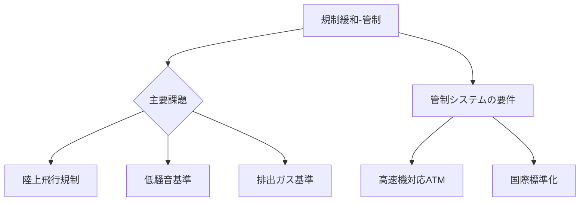

# T19-12-05 超音速飛行の規制緩和・航空管制

## Summary（5つの要点）
1. **規制の現状**: 現在、米国を含む多くの国で**陸上での超音速飛行はソニックブーム規制により禁止**されており、超音速旅客機の商業運航にはこの規制緩和が必須である。
2. **国際機関の動向**: ICAO（国際民間航空機関）やFAA（米国連邦航空局）、EASA（欧州航空安全機関）が、**低ブーム技術**を前提とした**新しい騒音基準**と**排出ガス基準**の策定を進めている。
3. **陸上飛行の解禁**: ソニックブーム低減技術（T19-12-01）の有効性が認められれば、**特定のルートや時間帯での陸上超音速飛行が解禁**される可能性が高く、これが市場の鍵となる。
4. **航空管制システムの改修**: 超音速機は巡航高度が高く、速度変化も大きいため、既存の**航空管制システム（ATM）**を、超音速機の飛行計画と運行に安全に対応できるように改修する必要がある。
5. **規制目標**: 2030年代の商業運航開始を目指し、各国政府および国際機関が**2030年頃まで**に主要な規制整備を完了させることを目標としている。

#### 概念図

---
### 日本の立ち位置・強み弱みのSummary
### 強み
1. JAXAによる**低ソニックブーム技術**の基礎研究で、国際的な技術基準策定に貢献できる潜在力。
2. ICAOやアジア地域の**航空管制システム**の専門家育成に貢献できる。
### 弱み
1. **超音速機の運航ノウハウ**や**規制対応経験**が、過去にコンコルドを運航していた欧州や、開発を主導する米国に比べて少ない。
2. 陸上飛行の規制緩和において、**国内の環境基準**との調整が必要であり、時間がかかる可能性がある。
