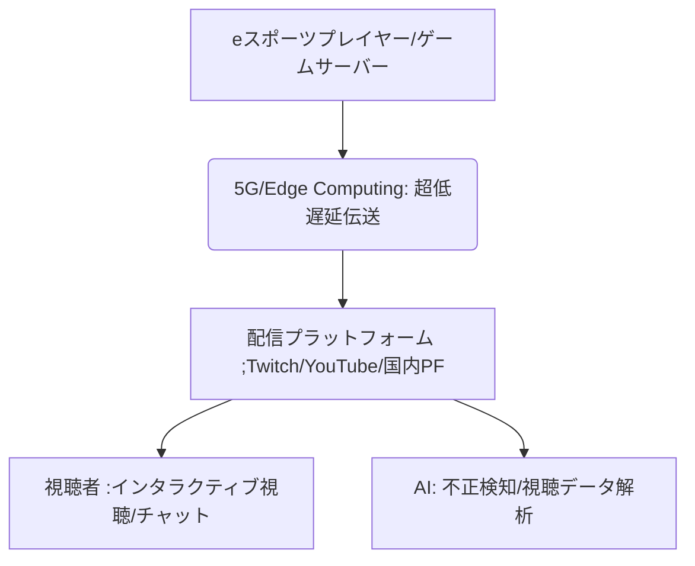

# T5-01-01 eスポーツ配信・対戦プラットフォーム

## Summary（5つの要点）

1. 超低遅延ストリーミング: 5G/Beyond 5G、エッジコンピューティングを活用し、映像配信とプレイヤーの入力の遅延をミリ秒単位で削減。これによりリアルタイムな双方向のインタラクションを実現する `(1)`。
2. インタラクティブ配信機能: 観客がチャット、投票、投げ銭だけでなく、特定の選手の視点に切り替えたり、ゲーム内のイベントに影響を与えたりする双方向の視聴を標準化。
3. クラウドゲーミング基盤: 高い処理能力を要求されるゲームをクラウドで実行し、あらゆるデバイス（PC、スマホ、VR）へのストリーミングを可能とする（Google Stadia、NVIDIA GeForce NOWなど）。
4. AIによる不正検知（チート対策）: プレイヤーの操作ログやゲーム画面をAIが常時解析し、チートや不正行為をリアルタイムで検知・排除することで公平性を担保。
5. 4K/8K高精細映像配信: 大画面での観戦体験を向上させるため、HEVCやAV1などの高効率符号化技術と広帯域通信を利用した超高精細映像の安定配信。

#### 概念図

---

### 技術評価表（定量的な視点）
| 評価項目 | 評価 | 根拠 |
| :--- | :--- | :--- |
| 導入コスト | ⭐⭐⭐☆☆ | 配信基盤の構築、通信インフラ投資が必要 |
| 技術成熟度 | ⭐⭐⭐⭐☆ | 基本的な配信は確立。超低遅延、VR連携は進化途上 |
| 日本の競争力 | ⭐⭐⭐⭐☆ | 通信インフラ（NTT/KDDI）とコンテンツIPに強み |
| 市場性 | ⭐⭐⭐⭐⭐ | 世界eスポーツ市場は継続的に拡大中 |
| 品質保証の重要性 | ⭐⭐⭐⭐⭐ | 遅延は視聴体験と公平性に直結するため重要 |

---

## 日本の立ち位置・強み弱みのSummary

### 強み：日本企業や研究機関が持つ独自の技術、優位性などを箇条書きで記述。

* ゲームコンテンツIP: 世界的に人気の高い対戦型ゲームIP（任天堂、ソニー、カプコンなど）を保有。
* 通信インフラ技術: 5Gの整備が進み、世界でも高水準な低遅延・高帯域の通信環境。
* AIによる画像解析: ゲーム画面やプレイヤーの操作を解析する画像認識AIの技術。

### 弱み：日本が抱える規制、標準化の遅れ、海外依存などを箇条書きで記述。

* 海外プラットフォームへの依存: Twitch、YouTube Gamingなど海外の大手プラットフォームが市場を支配し、国内の独自PFが苦戦。
* プロライセンス制度の未熟: eスポーツのプロ選手の地位や待遇に関する制度の整備が遅れ。
* 技術開発人材の不足: クラウドゲーミングや低遅延配信技術に特化したエンジニアの育成が急務。

---

## 技術ロードマップ（短期/中期/長期）

### 短期目標（～2027年）

* 5G通信を活用したモバイルeスポーツの低遅延配信を標準化し、遅延を100ms以下に抑制。
* AIによる不正ツール利用検知の精度を99%に向上させ、プラットフォームの信頼性を確保。
* 複数視点配信（自由視点映像）機能を主要タイトルに導入。

### 中期目標（2028年～2031年）

* Beyond 5G/6Gを利用し、VR/ARデバイス経由で試合を観戦する「没入型観戦」を実用化。
* AIが視聴者の興味に応じてハイライトを自動生成し、パーソナライズされた観戦体験を提供。
* クラウド上で動作する「コンソール品質のゲーム」の低遅延プレイを実現。

### 長期目標（2032年～2035年）

* 試合の展開をAIが予測し、観客がその予測に対して介入できる「超双方向eスポーツ」を実現。
* 完全に分散化されたブロックチェーンベースの対戦プラットフォームを構築し、運営の透明性と公平性を最大化。

### 📚 参照リンク

1. [IEEE Communications Magazine: Ultra-Reliable Low-Latency Communication in 5G for eSports](https://ieeexplore.ieee.org/document/8916321)
2. [ACM CHI: Interactive Streaming in Esports](https://dl.acm.org/doi/full/10.1145/3313831.3376518)
3. [総務省: 5G/Beyond 5G時代におけるeスポーツの振興](https://www.soumu.go.jp/menu_seisaku/ictseisaku/esports/index.html)
