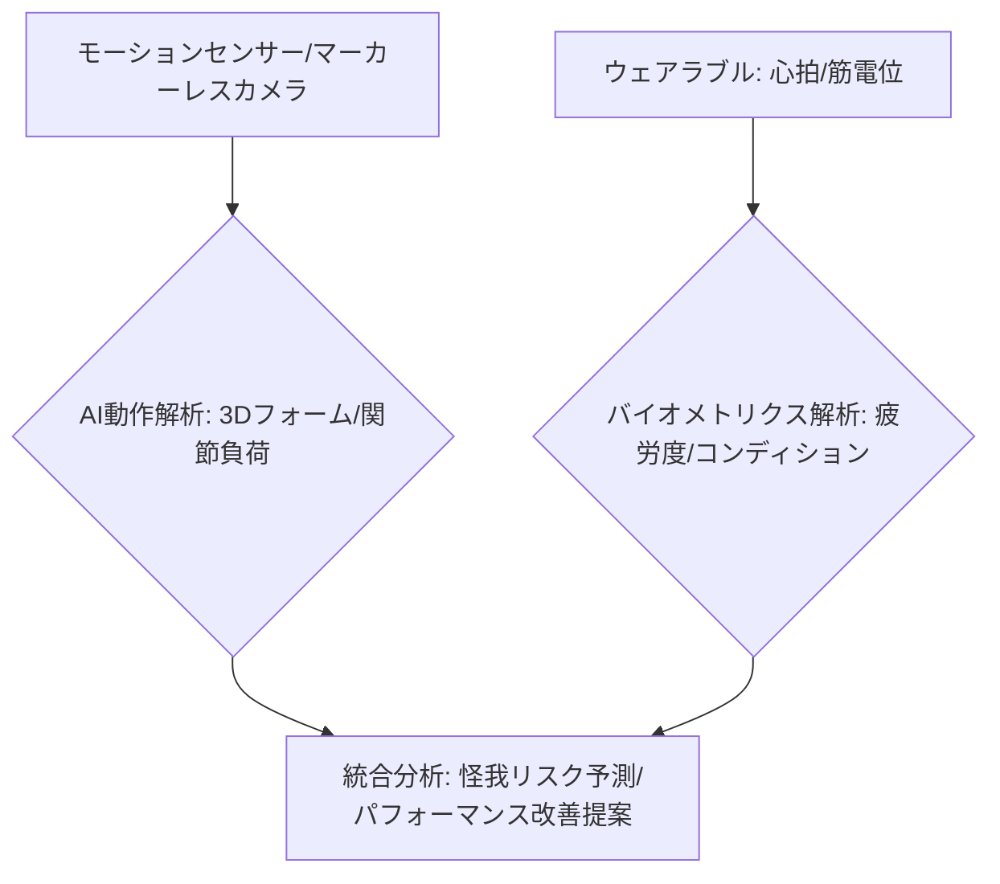

# T5-01-02 モーションキャプチャ・バイオメトリクス計測システム

## Summary（5つの要点）

1. マルチモーダルデータ融合: 光学式、慣性センサー式に加え、マーカーレス（画像認識AI）技術を統合し、屋内外を問わず高精度な動作キャプチャを実現 `(1)`。
2. バイオメトリクスとの連携: 心拍数、血中酸素濃度、筋電位などの生体データをウェアラブルデバイスから取得し、動作データと統合して疲労度やコンディションを科学的に評価。
3. リアルタイムフォーム解析: AIが動作データを解析し、理想フォームとの差や非効率な動作をリアルタイムで抽出し、コーチや選手に視覚的にフィードバック。
4. 怪我リスク予測: 関節への負荷、疲労蓄積、フォームの異常を時系列で分析し、オーバーユース障害や突発的な怪我の発生確率を予測。
5. 軽量・装着感の低減: センサーの小型化、高感度化により、装着によるパフォーマンスへの影響を最小限に抑え、実試合環境での計測を可能とする（例：Sony mocopi）。

#### 概念図

---

### 技術評価表（定量的な視点）
| 評価項目 | 評価 | 根拠 |
| :--- | :--- | :--- |
| 導入コスト | ⭐⭐⭐☆☆ | 光学式は高額。マーカーレスは低コスト化が進展 |
| 技術成熟度 | ⭐⭐⭐⭐☆ | モーションキャプチャは確立。マーカーレスの精度向上が課題 `(1)` |
| 日本の競争力 | ⭐⭐⭐⭐⭐ | 高精度なセンサー、光学技術、計測機器に強み |
| 市場性 | ⭐⭐⭐⭐⭐ | プロから一般まで幅広い層でのトレーニング需要増 |
| 品質保証の重要性 | ⭐⭐⭐⭐⭐ | 動作解析の微細な誤差が怪我予防の失敗に繋がる |

---

## 日本の立ち位置・強み弱みのSummary

### 強み：日本企業や研究機関が持つ独自の技術、優位性などを箇条書きで記述。

* 高性能センサー技術: ジャイロセンサー、加速度計など慣性センサーの小型化・高精度化技術（村田製作所、TDKなど）。
* 光学・画像解析技術: ソニー、キヤノンなどカメラ技術を応用したマーカーレスモーションキャプチャ（Sony mocopi）。
* スポーツ科学研究の蓄積: 大学や国立スポーツ科学センター（JISS）での動作解析、怪我予防に関する知見。

### 弱み：日本が抱える規制、標準化の遅れ、海外依存などを箇条書きで記述。

* データプラットフォームの分断: 計測された動作データと生体データを統合し、競技を横断して利用できる共通プラットフォームの標準化が遅れ。
* AIモデルの汎用性不足: 特定の競技や動作に特化したAI解析モデルは存在するが、様々なスポーツに適用できる汎用的なモデルの開発が課題。
* 個人情報保護の制約: 生体データの医療情報との連携に対する法規制やプライバシーの懸念。

---

## 技術ロードマップ（短期/中期/長期）

### 短期目標（～2027年）

* マーカーレス方式による主要なスポーツの動作キャプチャ精度を光学式と同等の誤差±1cm以内に向上。
* ウェアラブルセンサーから取得したバイタルデータをAIで解析し、疲労度を客観的にスコアリングする機能を標準搭載。
* 競技の特性に合わせた個別の怪我リスク予測モデルを開発し、プロチームでの実証を開始。

### 中期目標（2028年～2031年）

* ミリ波レーダーなど非接触のセンサーを利用し、トレーニングウェアなしで全身の高精度モーションキャプチャを実現。
* AIが解析結果に基づき、リアルタイムで「次に何を改善すべきか」を音声やARでコーチに提示するシステムを導入。
* 一般消費者向けの安価なホームトレーニングシステムに応用し、市民ランナーのフォーム改善を支援。

### 長期目標（2032年～2035年）

* 動作の癖や身体特性をAIが完全に理解し、怪我リスクをゼロに抑えた究極の個別最適トレーニングプログラムを自動生成。
* ナノセンサーや生体埋め込みチップから分子レベルのコンディションデータを取得し、超精密医学と連携。

### 📚 参照リンク

1. [Sensors: Review of Markerless Motion Capture Systems in Sport](https://www.ncbi.nlm.nih.gov/pmc/articles/PMC8754117/)
2. [MDPI Sports: Integration of Biometric Data in Athlete Monitoring Systems](https://www.mdpi.com/2075-4663/9/5/65)
3. [JISS: スポーツにおける動作解析の最前線](https://www.jpnsport.go.jp/jiss/)
