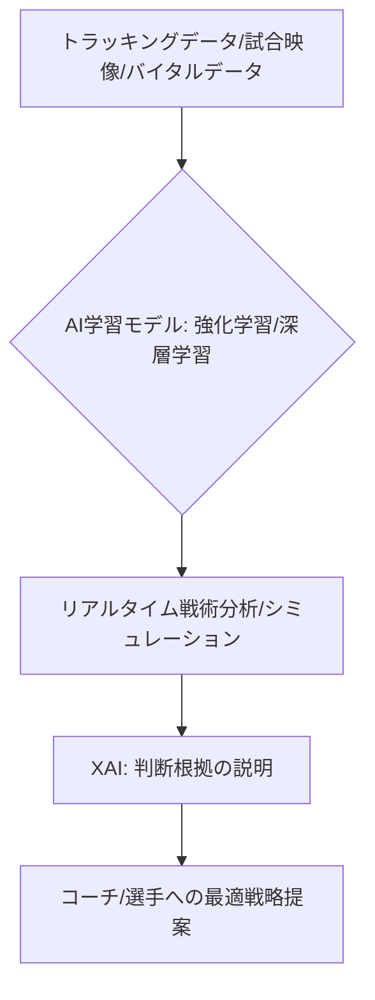

# T5-01-03 AI戦術分析・パフォーマンス予測システム

## Summary（5つの要点）

1. マルチモーダルデータ解析: 試合映像、選手位置情報（トラッキングデータ）、バイオメトリクスデータ（T5-01-02）、過去の戦術データなど、異なる種類のデータを統合し、AIが複合的に解析。
2. リアルタイム戦術提案: 試合中にAIが相手チームの戦術パターンや選手交代の影響をリアルタイムで評価し、コーチに最適な戦術変更（フォーメーション変更、交代選手）を提案。
3. Explainable AI（XAI）の導入: AIが提案した戦術判断の根拠を、人間が理解できる形で説明する（例：「相手の右サイドの疲労度が高いため、左サイドへの攻撃を強化すべき」）。
4. 個人パフォーマンス予測: 選手の直前のコンディションや相手選手との相性を考慮し、次の試合での得点率、走行距離などの個人パフォーマンスを高精度で予測 `(1)`。
5. シミュレーションベースのトレーニング: AIが過去の試合データから特定の局面を抽出・再現し、VR/ARシステム（T5-01-04）と連携して選手の判断力を集中的に鍛錬。

#### 概念図

---

### 技術評価表（定量的な視点）
| 評価項目 | 評価 | 根拠 |
| :--- | :--- | :--- |
| 導入コスト | ⭐⭐⭐⭐☆ | 高精度なトラッキングシステムとAIサーバーのコスト |
| 技術成熟度 | ⭐⭐⭐☆☆ | 基礎分析は実用。リアルタイム予測、XAIは発展途上 `(1)` |
| 日本の競争力 | ⭐⭐⭐☆☆ | データスタジアムなど先行事例あるが、海外勢の規模に劣後 |
| 市場性 | ⭐⭐⭐⭐⭐ | プロスポーツチームの勝利に直結する技術 |
| 品質保証の重要性 | ⭐⭐⭐⭐⭐ | 判断ミスが試合の勝敗に影響するため重要 |

---

## 日本の立ち位置・強み弱みのSummary

### 強み：日本企業や研究機関が持つ独自の技術、優位性などを箇条書きで記述。

* 野球、サッカーなど人気競技のデータ分析実績: データスタジアム、データキューブなどの国内サービス提供企業。
* 画像認識AI技術: ソニー、パナソニックなど高精度なカメラ技術を活用したトラッキングシステムの開発。
* 強化学習の研究: AI囲碁、将棋などで培われた複雑な局面判断を行う強化学習技術。

### 弱み：日本が抱える規制、標準化の遅れ、海外依存などを箇条書きで記述。

* AI人材の不足: スポーツアナリティクスに特化したデータサイエンティスト、AIエンジニアの育成が遅れ。
* トラッキングデータの標準化不足: 競技やリーグごとにトラッキングデータの形式が異なり、横断的なAI学習が困難。
* コーチ側のリテラシー: AIの提案を適切に理解し、活用できるコーチや監督のデータリテラシー向上が課題。

---

## 技術ロードマップ（短期/中期/長期）

### 短期目標（～2027年）

* 主要なプロスポーツでAIによるリアルタイムな相手戦術分析と確率ベースの戦術選択肢の提示を実用化。
* AIが検出した潜在的な怪我リスクと疲労度を基に、出場可否を判断するロジックを導入。
* XAIの初期機能として、AIの判断根拠を視覚化するダッシュボードを開発。

### 中期目標（2028年～2031年）

* AIが人間の介入なしに、試合中の戦術変更や選手交代のタイミングを自律的に決定し、コーチをサポート。
* 他の競技やレベルのデータも含め、地球上の全スポーツを対象とした汎用的なパフォーマンス予測モデルを構築。
* AIが選手の感情や心理状態を分析し、メンタルな側面からパフォーマンスを予測。

### 長期目標（2032年～2035年）

* AIがコーチや監督の役割の大部分を代替し、人間とAIが共同でチーム運営を行う「AI共同監督システム」を確立。
* AIが観客の応援や熱狂を解析し、それを戦術に取り込む「ファンフィードバックシステム」を実現。

### 📚 参照リンク

1. [Nature Scientific Reports: Predicting Football Match Outcomes using Machine Learning](https://www.nature.com/articles/s41598-021-99881-2)
2. [MIT Sloan Sports Analytics Conference: Advances in Player Tracking and Tactical Analysis](http://www.sloansportsconference.com/)
3. [日本スポーツアナリスト協会: スポーツにおけるデータ分析の現状と課題](https://www.jsaa.net/)
