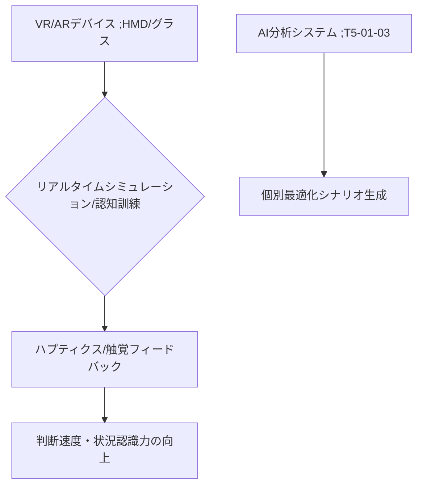

# T5-01-04 VR/ARスポーツトレーニングシステム

## Summary（5つの要点）

1. 実戦状況シミュレーション: VRヘッドセットやARグラスを使用し、現実の試合状況を忠実に再現。相手選手の動きや球の軌道を再現し、特にゴールの決定や打者の選球など判断系スキルの反復訓練に有効 `(1)`。
2. 認知機能トレーニング: 判断速度、状況認識能力、周辺視野の活用など、競技に必要な認知機能を集中的に訓練。脳の活動データを計測し、訓練効果を定量化。
3. ハプティクス・触覚フィードバック: VR空間内でボールを捕まえる、バットを振るなどの動作に対し、触覚デバイスを介して物理的な抵抗や振動を与え、没入感とリアリティを向上。
4. 個人データに基づくシナリオ生成: T5-01-03のAI分析と連携し、選手の弱点や対戦相手の癖に合わせたトレーニングシナリオを自動生成。
5. 怪我リスクゼロの反復練習: 高負荷な動作や危険な状況を仮想空間内で何度でも安全に繰り返し練習可能。身体への負担を軽減しつつスキル向上を図る。

#### 概念図

---

### 技術評価表（定量的な視点）
| 評価項目 | 評価 | 根拠 |
| :--- | :--- | :--- |
| 導入コスト | ⭐⭐⭐☆☆ | 高性能HMDと専用空間設備のコスト |
| 技術成熟度 | ⭐⭐⭐⭐☆ | 基礎トレーニングは実用化。ハプティクス連携は進化途上 `(1)` |
| 日本の競争力 | ⭐⭐⭐⭐☆ | ゲーム、VRコンテンツ制作に強み。ハードは海外依存 |
| 市場性 | ⭐⭐⭐⭐⭐ | プロからアマチュア、教育分野まで幅広い応用 |
| 品質保証の重要性 | ⭐⭐⭐⭐⭐ | シミュレーションのリアリティが訓練効果に直結 |

---

## 日本の立ち位置・強み弱みのSummary

### 強み：日本企業や研究機関が持つ独自の技術、優位性などを箇条書きで記述。

* ゲームコンテンツ開発力: 高品質なグラフィックとゲームシステムを実現する開発スタジオが豊富。
* VR/ARコンテンツ制作の実績: ソニーPSVRなどコンシューマ向けVRの開発ノウハウ。
* ハプティクス技術: 触覚フィードバックデバイスに関する研究（T8-01-04と連携）で国際的な評価。

### 弱み：日本が抱える規制、標準化の遅れ、海外依存などを箇条書きで記述。

* VR/ARヘッドセットの海外依存: Meta Quest、Apple Vision Proなど主要なHMDハードウェアは海外メーカーが主導。
* 身体運動を伴うVRの安全ガイドライン不足: 激しい運動に伴う転倒事故などの防止に関する標準化が遅れ。
* スポーツ科学とITの融合人材不足: スポーツの専門家とVR/ARエンジニアを繋ぐ人材が不足。

---

## 技術ロードマップ（短期/中期/長期）

### 短期目標（～2027年）

* 主要なプロチームで、VRヘッドセットを利用した認知トレーニング（判断速度、状況認識）を標準メニュー化。
* ARグラスを利用し、現実の練習場に仮想の相手選手や情報を表示するシステムを導入。
* ハプティクスグローブを利用し、野球やゴルフなどのスイング軌道に対するフィードバックを実現。

### 中期目標（2028年～2031年）

* AIが選手の脳波や視線データを解析し、集中力が最大に高まるタイミングで訓練を行う「脳科学的最適化トレーニング」を実現。
* VR/ARシステムのコストを大幅に削減し、家庭でのフィットネス、リハビリにも本格的に普及。
* スポーツに特化した軽量、高解像度、広視野のARグラスを開発。

### 長期目標（2032年～2035年）

* VR空間内で生成されたトレーニングの成果が現実のパフォーマンスに直結する「スキル転移率99%」を達成。
* 脳とVRシステムを直接接続するBMI（Brain-Machine Interface）技術を利用し、思考だけでトレーニングを行うシステムを研究。

### 📚 参照リンク

1. [Frontiers in Sports and Active Living: The Use of Virtual Reality in Sport-Specific Decision-Making Training](https://www.frontiersin.org/articles/10.3389/fspor.2022.923168/full)
2. [ACM CHI: Haptic Feedback Devices for Enhanced Sport Training](https://dl.acm.org/doi/full/10.1145/3313831.3376518)
3. [NEDO: VR/ARを活用したスポーツトレーニングに関する研究開発](https://www.nedo.go.jp/activities/ZZJP_100140.html)
