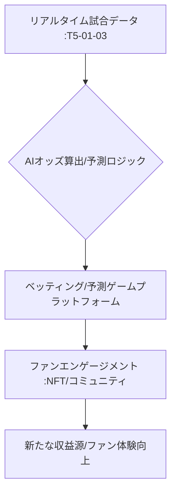

# T5-01-05 スポーツベッティング・ファンエンゲージメントプラットフォーム

## Summary（5つの要点）

1. リアルタイムインプレイベッティング: 試合中の微細なイベント（次のプレーの結果、次の得点者など）に対して賭けを行う機能。AIがリアルタイムでオッズを算出・更新。
2. ゲーミフィケーションと予測ゲーム: 法的制約の少ない国では、観客が試合展開を予測してポイントを競うファンタジースポーツや予測ゲームを提供し、ファンの参加度を高める `(1)`。
3. ブロックチェーンとNFT: ファントークン、NFTチケット、デジタルコレクタブル（Sorareなど）を発行し、ファンに所有権とコミュニティへの参加権を提供。取引の透明性とセキュリティを確保。
4. 高度なデータビジュアライゼーション: リアルタイムのトラッキングデータを活用し、試合中の戦術分析や選手のパフォーマンスを観客に視覚的に提供。観戦体験を深化。
5. 倫理的な責任あるギャンブル対策: 依存症防止、未成年者保護のための規制と技術（生体認証、利用制限機能）の導入。日本では法規制への対応が最も重要な課題。

#### 概念図

---

### 技術評価表（定量的な視点）
| 評価項目 | 評価 | 根拠 |
| :--- | :--- | :--- |
| 導入コスト | ⭐⭐⭐⭐☆ | プラットフォームとセキュリティ基盤の構築コスト |
| 技術成熟度 | ⭐⭐⭐⭐☆ | 海外では実用化。国内では法規制が足かせ |
| 日本の競争力 | ⭐⭐⭐☆☆ | 技術的優位性あるが、法規制でビジネス化が遅延 |
| 市場性 | ⭐⭐⭐⭐⭐ | グローバルで数十兆円規模の市場を形成 |
| 品質保証の重要性 | ⭐⭐⭐⭐⭐ | 取引の公平性とセキュリティ、倫理的な対策が必須 |

---

## 日本の立ち位置・強み弱みのSummary

### 強み：日本企業や研究機関が持つ独自の技術、優位性などを箇条書きで記述。

* ブロックチェーン技術: NFTやファントークン発行に必要なブロックチェーン基盤技術の研究（NTT、富士通など）。
* データ解析技術: 競馬、競艇など既存の公営ギャンブルで培われたオッズ算出ロジックのノウハウ。
* IPコンテンツ: アニメ、eスポーツなど熱狂的なファンを抱えるコンテンツを活用したNFT展開力。

### 弱み：日本が抱える規制、標準化の遅れ、海外依存などを箇条書きで記述。

* スポーツベッティングの法規制: 公営競技を除き原則禁止されており、新規参入や技術の応用が極めて困難。
* 暗号資産の税制課題: NFTの発行、取引に関する税制面の障壁がファンの参加を抑制。
* 倫理的な議論の遅れ: スポーツ賭博の合法化に関する社会全体での議論とルール作りが遅延。

---

## 技術ロードマップ（短期/中期/長期）

### 短期目標（～2027年）

* 法的制約の少ない予測ゲーム、ファンタジースポーツを中心に展開し、ユーザー数を獲得。
* NFTやファントークンを利用したファンコミュニティ機能を主要スポーツで導入。
* AIを活用し、試合中の微細なイベントの発生確率を高精度で予測する技術を開発。

### 中期目標（2028年～2031年）

* ブロックチェーンを利用した「責任あるギャンブル」の国際標準に準拠した透明性の高いプラットフォームを開発。
* VR/AR空間内でベッティングやファン交流が可能な「没入型ファンハブ」を提供。
* 法規制が緩和された場合に備え、リアルタイムオッズ算出システムを国内データで検証・最適化。

### 長期目標（2032年～2035年）

* スポーツの運営や意思決定の一部をファントークン保有者の投票で行うDAO（分散型自律組織）化を実現。
* AIが観客の熱狂度を解析し、それに応じてコンテンツやサービスを提供する「感情連動型エンゲージメント」を実現。

### 📚 参照リンク

1. [DraftKings: Corporate Governance and Responsible Gaming](https://www.draftkings.com/about/corporate-governance)
2. [MDPI Gaming: Gamification of Sports Betting and Fan Engagement](https://www.mdpi.com/2073-4336/12/3/59)
3. [金融庁: 暗号資産・ブロックチェーンに関する規制の方向性](https://www.fsa.go.jp/)
