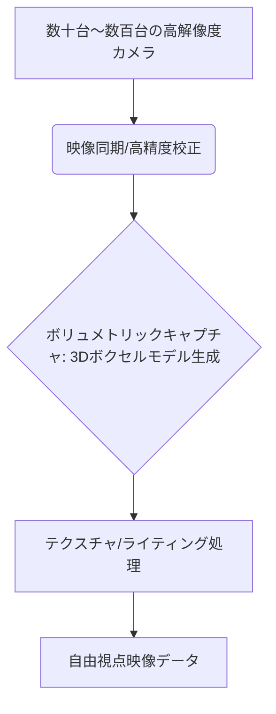

# T5-02-01 多視点カメラシステム・ボリュメトリックキャプチャ

## Summary（5つの要点）

1. 高密度カメラアレイ: スタジアム、コンサート会場などに数十から数百台の高解像度カメラを配置し、被写体をあらゆる角度から同時に撮影 `(1)`。
2. ボリュメトリックデータ生成: 複数のカメラから得られた映像を基に、被写体と背景を含む空間全体を「ボクセル（体積ピクセル）」で構成された3Dモデルとして再構築（ボリュメトリックキャプチャ）。
3. 同期と校正の精度: 全カメラのシャッターをナノ秒単位で同期させる技術と、カメラの位置、レンズ歪みを高精度に校正し、3D空間の歪みを最小限に抑える。
4. テクスチャ・ライティング処理: 3Dモデルにリアルな質感を与えるテクスチャ合成と、照明の影響を再現するライティング処理（T5-02-02と連携）。
5. エンタメへの応用拡大: スポーツの「決定的瞬間の多角度リプレイ」だけでなく、VTuberライブ、ファッションショーなどライブエンタメへの応用が加速。

#### 概念図

---

### 技術評価表（定量的な視点）
| 評価項目 | 評価 | 根拠 |
| :--- | :--- | :--- |
| 導入コスト | ⭐⭐☆☆☆ | カメラ、サーバー設備の導入と維持管理に膨大なコスト |
| 技術成熟度 | ⭐⭐⭐⭐☆ | プロスポーツでは実用化。一般への普及はコストが課題 `(1)` |
| 日本の競争力 | ⭐⭐⭐⭐⭐ | キヤノンのFreeViewpoint、NHKの8K技術などで世界をリード |
| 市場性 | ⭐⭐⭐⭐☆ | 高い付加価値を生む次世代コンテンツ市場を創出 |
| 品質保証の重要性 | ⭐⭐⭐⭐⭐ | カメラ位置、同期の僅かな誤差が3D再構成の破綻に直結 |

---

## 日本の立ち位置・強み弱みのSummary

### 強み：日本企業や研究機関が持つ独自の技術、優位性などを箇条書きで記述。

* カメラ・レンズ技術: キヤノン、ソニーなど世界的なカメラメーカーが高解像度、高フレームレートカメラ技術を保有。
* 8K映像技術: NHKが長年培ってきた8K映像、自由視点映像に関する研究開発実績。
* ボリュメトリックスタジオの運用ノウハウ: ソニーなどがボリュメトリックビデオスタジオの運用を行い、コンテンツ制作に応用。

### 弱み：日本が抱える規制、標準化の遅れ、海外依存などを箇条書きで記述。

* AIレンダリング基盤の海外依存: Intel True Viewなど海外プラットフォームが先行し、コア技術の多くを海外に依存。
* データ転送インフラの整備: 数百台のカメラからの膨大なデータを処理する広帯域ネットワークの整備が課題。
* コンテンツ制作コスト: システムの導入、運用、コンテンツ制作のコストが高く、汎用的な応用が難しい。

---

## 技術ロードマップ（短期/中期/長期）

### 短期目標（～2027年）

* 高密度カメラアレイを主要なプロスポーツスタジアムに導入し、試合後の「神視点リプレイ」コンテンツを標準提供。
* AIを活用し、カメラ校正とボリュメトリックデータ生成の自動化率を90%に向上。
* VRヘッドセットで視聴できる「コートサイド体験」コンテンツの制作を開始。

### 中期目標（2028年～2031年）

* 小型で安価なカメラとAIを組み合わせ、学校の体育館など一般施設への導入コストを大幅に削減（T5-02-03と連携）。
* ボリュメトリックデータを圧縮し、5G環境でリアルタイム配信できる「準リアルタイム自由視点映像」を実現。
* ライブコンサートや舞台公演での「自由視点ライブ」を商用化。

### 長期目標（2032年～2035年）

* ボリュメトリックデータをリアルタイムでレンダリングし、遅延を100ms以内に抑えた「完全リアルタイム自由視点ライブ」を実現。
* AIが観客の視線追跡に基づき、必要な部分だけを高解像度で生成する「アダプティブレンダリング」を実現。

### 📚 参照リンク

1. [Intel: True View Volumetric Video Technology](https://www.intel.com/content/www/us/en/sports/true-view.html)
2. [Canon: FreeViewpoint Video System Overview](https://global.canon/ja/v-cinema/movie/volumetric-video-technology.html)
3. [NHK技研: 8K自由視点映像とメディア技術](https://www.nhk.or.jp/strl/publica/rd/rd173/A2.html)
