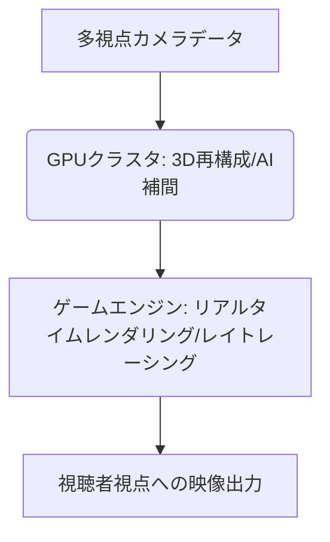

# T5-02-02 リアルタイム3D再構成・レンダリング技術

## Summary（5つの要点）

1. GPUクラスタによる並列処理: 多視点データ（T5-02-01）から3Dモデルを再構成する膨大な計算を、高性能GPUクラスタで超並列的に実行し、リアルタイム処理を実現 `(1)`。
2. AIベースの高速補間・ノイズ除去: 撮影データの欠損部分やノイズを深層学習モデルが補間し、人の手を介さずに高品質な3Dモデルを生成。
3. Neural Radiance Fields (NeRF) 応用: 光の放射場をニューラルネットワークで表現するNeRFを活用し、非常に少ないデータからも高品質な3D空間を高速に再構成する（T5-02-03と連携）。
4. ゲームエンジン統合レンダリング: 再構成された3D空間をUnreal Engine、Unityなどのゲームエンジンに取り込み、レイトレーシングなど最新のレンダリング技術で視聴者の視点に合わせた映像を描画。
5. 遅延1秒以内の実現: データ入力から視聴者への映像出力までの遅延を最小限に抑え、視聴者の視点操作に即座に応答できるインタラクティブな視聴を実現する（T5-02-04と連携）。

#### 概念図

---

### 技術評価表（定量的な視点）
| 評価項目 | 評価 | 根拠 |
| :--- | :--- | :--- |
| 導入コスト | ⭐⭐⭐☆☆ | 高性能GPUサーバー、高速ネットワークの初期投資が必要 |
| 技術成熟度 | ⭐⭐⭐☆☆ | 基礎技術は確立。NeRFのリアルタイム化は発展途上 `(1)` |
| 日本の競争力 | ⭐⭐⭐☆☆ | GPUハードウェアは海外依存。ゲームエンジンの応用力に強み |
| 市場性 | ⭐⭐⭐⭐⭐ | メタバース、自動運転、産業シミュレーションなど横断的な需要 |
| 品質保証の重要性 | ⭐⭐⭐⭐⭐ | 処理落ち、レンダリング品質の低下は没入感を大きく損なう |

---

## 日本の立ち位置・強み弱みのSummary

### 強み：日本企業や研究機関が持つ独自の技術、優位性などを箇条書きで記述。

* ゲームエンジンの応用力: スクウェア・エニックス、任天堂などゲーム開発で培った3Dグラフィック表現のノウハウ。
* GPU向け並列処理アルゴリズム: スーパーコンピュータ開発で培われた大規模並列計算技術。
* コンテンツ制作技術: 高品質な3Dモデル、アニメーション制作を行うクリエイターの層の厚さ。

### 弱み：日本が抱える規制、標準化の遅れ、海外依存などを箇条書きで記述。

* コア技術（GPU、ゲームエンジン）の海外依存: NVIDIA、Epic Games、Unityなど米国企業が技術を主導。
* 超大規模GPUクラスタの導入遅れ: データセンターでの大規模コンピューティングリソースの整備が海外に比べ遅延。
* NeRFなど最新AI技術の応用に関する研究人材の不足。

---

## 技術ロードマップ（短期/中期/長期）

### 短期目標（～2027年）

* NeRFやGaussian Splattingなど最新の3D再構成技術をGPU上で動作させるリアルタイムパイプラインを開発。
* 既存のゲームエンジンに多視点カメラデータの取り込みとレンダリングを連携させるプラグインを提供。
* AIによるレンダリング品質の自動最適化（解像度、フレームレートの動的制御）を実現。

### 中期目標（2028年～2031年）

* 視聴者の端末性能に応じてレンダリング負荷を分散させるエッジコンピューティング型レンダリングを標準化（T5-02-04と連携）。
* NeRFによる3D再構成の処理を数分から数秒に短縮し、「ライブ」に近い形で利用を可能に。
* 現実のスポーツ選手の動きとシミュレーションを統合し、「もしあの時別の選択をしていたら」を再現する「パラレルワールドリプレイ」を実現。

### 長期目標（2032年～2035年）

* 量子コンピューティングや次世代AIチップを利用し、遅延ゼロ、実写と区別のつかないリアルタイムボリュメトリックレンダリングを実現。
* AIが観客の視線や感情に合わせた最適な「物語」を描画するパーソナライズされた映像体験を提供。

### 📚 参照リンク

1. [NVIDIA: Omniverse Platform and Real-time Simulation](https://www.nvidia.com/en-us/omniverse/)
2. [ACM SIGGRAPH: Advances in Real-time Volumetric Rendering](https://www.siggraph.org/)
3. [Unity Technologies: High Definition Render Pipeline (HDRP) for Sports](https://unity.com/ja/solutions/industries/media-entertainment/sports)
