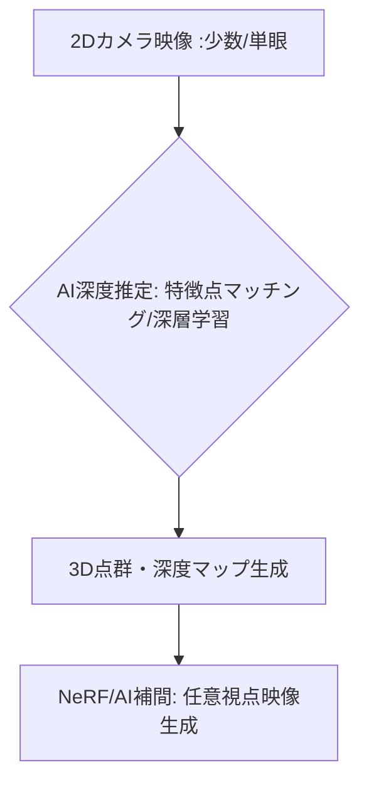

# T5-02-03 AI深度推定・3D空間理解技術

## Summary（5つの要点）

1. 単眼・少数カメラでの3D再構成: 最低限のカメラ（場合によってはスマホ単眼カメラ）で撮影した2D映像から、AIが特徴点を抽出し、視差情報を推定することで深度マップ（奥行き情報）を高精度に生成 `(1)`。
2. NeRF（Neural Radiance Fields）の活用: 数枚の写真や動画から、その場の「光の放射場」を学習し、任意の視点からの高品質な映像を生成（T5-02-02と連携）。
3. 3Dセマンティックセグメンテーション: AIが再構成された3D空間内の「人」「ボール」「観客席」などの物体を識別し、意味情報を付与。自由視点映像の編集、配信を効率化。
4. モバイル・エッジでの処理: クラウドに頼らず、スマホやARグラス内のチップでリアルタイムに深度推定を行い、AR合成の精度を向上。
5. コスト削減と普及の加速: 高額な多視点カメラシステム（T5-02-01）が不要になることで、自由視点映像の制作コストを大幅に低減し、一般への普及を促進。

#### 概念図

---

### 技術評価表（定量的な視点）
| 評価項目 | 評価 | 根拠 |
| :--- | :--- | :--- |
| 導入コスト | ⭐⭐⭐⭐⭐ | 既存のカメラ、スマホを活用でき、大幅に低コスト |
| 技術成熟度 | ⭐⭐⭐☆☆ | 基礎研究は進展。リアルタイム、高解像度化が課題 `(1)` |
| 日本の競争力 | ⭐⭐⭐⭐☆ | 画像認識AIに強み。モバイルへの応用力が高い |
| 市場性 | ⭐⭐⭐⭐⭐ | VR/ARコンテンツ、自動運転など幅広い産業に応用 |
| 品質保証の重要性 | ⭐⭐⭐⭐☆ | 深度推定の誤差が3D再構成の不自然さに繋がる |

---

## 日本の立ち位置・強み弱みのSummary

### 強み：日本企業や研究機関が持つ独自の技術、優位性などを箇条書きで記述。

* 画像認識AI技術: 自動車、ロボティクス分野で培われた高精度な画像解析、3D認識の技術。
* ゲーム・アニメの3Dモデリング技術: 少ないカメラからの情報で高品質なモデルを生成する補間技術。
* モバイル・エッジデバイス: ソニーなどのイメージセンサー、モバイルプロセッサ技術。

### 弱み：日本が抱える規制、標準化の遅れ、海外依存などを箇条書きで記述。

* AI基盤技術の海外依存: Google ARCore、Meta Depth APIなど海外プラットフォームが市場を支配。
* NeRFなど最新の学術研究成果の産業応用の遅れ。
* スポーツの動きなど複雑な環境下での深度推定の精度向上が課題。

---

## 技術ロードマップ（短期/中期/長期）

### 短期目標（～2027年）

* スマホ、コンシューマ向けカメラを利用し、NeRFによる静止画からの高品質な3D空間再構成を数分で実現。
* AI深度推定を利用したARグラスでのスポーツ観戦（仮想の選手データ表示など）を実証。
* AIによる人物の動きの深度推定の精度を95%に向上。

### 中期目標（2028年～2031年）

* AI深度推定と5Gを連携させ、ライブイベントを数台のカメラで撮影し、リアルタイムに自由視点映像を生成・配信。
* AIが撮影環境（光、天候）に応じて自動で推定モデルを調整するアダプティブ深度推定を実用化。
* 家庭用ゲーム機、スマートテレビにAI深度推定チップを搭載し、自由視点映像の視聴を標準化。

### 長期目標（2032年～2035年）

* カメラを意識せずに日常空間で起きる事象を常時3D再構成し、メタバースと現実空間をシームレスに統合。
* AIが深度、動き、意味情報を統合し、人間が見たい視点を予測して先読みレンダリングを行うシステムを実現。

### 📚 参照リンク

1. [Google AI Blog: Multi-view Stereo for Depth Estimation](https://ai.googleblog.com/2021/04/multi-view-stereo-for-depth-estimation.html)
2. [Meta Reality Labs: AI-Powered Depth Sensing](https://www.metarealitylabs.com/)
3. [CVPR: Deep Learning for Single Image Depth Estimation Review](https://openaccess.thecvf.com/content_CVPR_2020/html/Bhat_A_Closer_Look_at_Learned_Depth_Estimation_CVPR_2020_paper.html)
