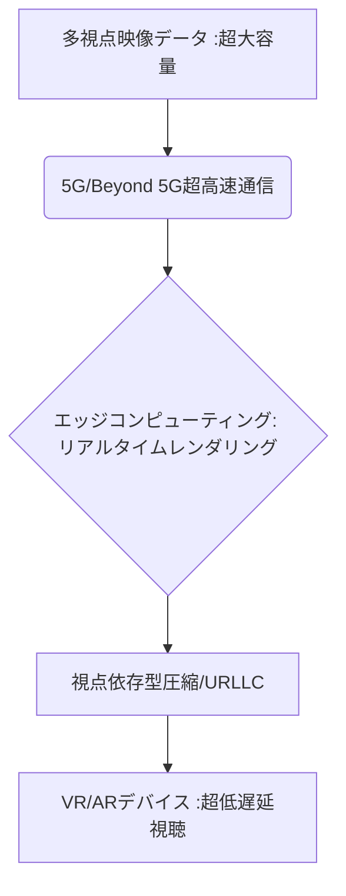

# T5-02-04 5G/Beyond 5G 超低遅延配信技術

## Summary（5つの要点）

1. 超大容量通信の確保: 自由視点映像は通常の映像の10倍～100倍のデータ量となるため、5GのSub-6/ミリ波、将来的にはBeyond 5Gのテラヘルツ帯を利用し、ギガビット級の通信速度を実現 `(1)`。
2. エッジコンピューティングとの連携: 全レンダリングをクラウド側で行うと遅延が発生するため、視聴者に近い「エッジサーバー」でリアルタイムレンダリングやデータ処理を行い、遅延を最小限に抑制（T5-02-02と連携）。
3. 視点依存型データ圧縮: 視聴者が現在見ている視点周りのデータを高解像度、低遅延で配信し、他の領域のデータは圧縮率を上げることで、全体のデータ量を最適化。
4. URLLC（超信頼低遅延通信）の適用: 視聴者の視点操作の信号（制御データ）に対してURLLCを適用し、操作から映像反映までの遅延を数十ミリ秒に抑える。
5. ネットワークスライシングの活用: 自由視点映像配信に必要な「高帯域・低遅延」の品質を他の通信から分離し、安定的に確保。

#### 概念図

---

### 技術評価表（定量的な視点）
| 評価項目 | 評価 | 根拠 |
| :--- | :--- | :--- |
| 導入コスト | ⭐⭐⭐⭐☆ | 5G/Beyond 5G基地局、エッジサーバーの設備投資が必要 |
| 技術成熟度 | ⭐⭐⭐☆☆ | 5Gは確立。Beyond 5G、エッジレンダリングは実証段階 `(1)` |
| 日本の競争力 | ⭐⭐⭐⭐⭐ | NTTドコモ、KDDIなど通信キャリアが世界をリード |
| 市場性 | ⭐⭐⭐⭐⭐ | VR/AR、自動運転、産業IoTなど幅広い分野で必須 |
| 品質保証の重要性 | ⭐⭐⭐⭐⭐ | 遅延は酔い（VR酔い）や視聴体験の破綻に直結 |

---

## 日本の立ち位置・強み弱みのSummary

### 強み：日本企業や研究機関が持つ独自の技術、優位性などを箇条書きで記述。

* Beyond 5G/6Gの研究開発: 総務省と通信キャリアが連携し、次世代通信に関する世界をリードする技術を保有。
* エッジコンピューティング技術: IoTやAIの社会実装を見据えた分散処理、低遅延ネットワークの設計ノウハウ。
* 高効率映像符号化技術: MPEGやHEVCなどの国際標準化に貢献した映像圧縮技術。

### 弱み：日本が抱える規制、標準化の遅れ、海外依存などを箇条書きで記述。

* 5Gエリア整備の遅れ: 都市部を除く地方での5Gカバレッジの整備が海外に比べ遅延。
* エッジサーバーの分散配置コスト: 全国的なエッジコンピューティング基盤を構築するための投資コストが高額。
* URLLCの実証事例不足: 産業用IoTや自動運転に比べ、エンターテインメント分野でのURLLCの実証事例が少ない。

---

## 技術ロードマップ（短期/中期/長期）

### 短期目標（～2027年）

* 主要なスポーツスタジアムの5Gカバレッジを100%に達成し、自由視点映像の準リアルタイム配信を可能にする。
* エッジサーバーを利用し、自由視点映像のレンダリングを行い、クラウド利用時の遅延を半分に削減。
* 視聴者の視点操作の反応速度を100ms以内に抑えるプロトコルを標準化。

### 中期目標（2028年～2031年）

* Beyond 5G/6Gの試験運用を開始し、複数ユーザーが同時に4K品質の自由視点映像を遅延ゼロで視聴できる環境を構築。
* AIを利用し、視点依存型のデータ圧縮の効率を50%向上させ、配信コストを低減。
* 家庭用VRデバイスへの自由視点映像の安定配信を実現。

### 長期目標（2032年～2035年）

* テラヘルツ帯を利用した6Gネットワークを本格展開し、現実空間の全てをデジタルツインとしてリアルタイム配信。
* AIがネットワーク状況を常時監視し、遅延や画質をユーザーごとに最適化する「自律分散型配信システム」を実現。

### 📚 参照リンク

1. [NTT DOCOMO: 5G Evolution and 6G/Beyond 5G White Paper](https://www.nttdocomo.co.jp/english/binary/pdf/corporate/technology/rd/beyond_5g_whitepaper.pdf)
2. [IEEE Access: Edge Computing for Real-time Volumetric Video Streaming](https://ieeexplore.ieee.org/document/8977119)
3. [総務省: 5G/Beyond 5G時代の映像配信技術の動向](https://www.soumu.go.jp/)
