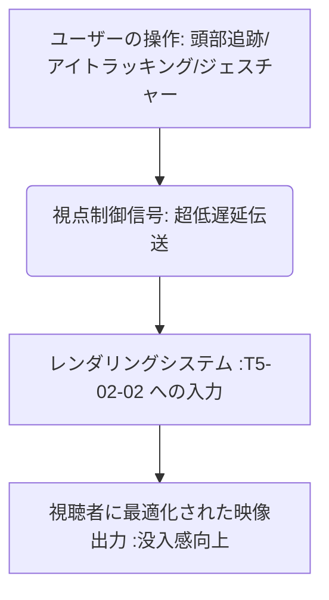

# T5-02-05 視点制御インタフェース（スマホ、VRゴーグル、ジェスチャー）

## Summary（5つの要点）

1. XRデバイスの頭部追跡（ヘッドトラッキング）: VRゴーグルを装着した視聴者の頭の向きをリアルタイムに追跡し、向いた方向に映像を描画。直感的で高い没入感を提供 `(1)`。
2. アイトラッキングとジェスチャー認識: 視聴者の目線を検出し、見ている場所を選択肢としたり、手のジェスチャー（ピンチ、スワイプ）で空間内を移動、ズームを行うコントローラーレスな操作を実現。
3. スマホ・タブレットの直感操作: タッチパネルのスワイプ、ピンチイン・アウトで視点移動、ズームを行い、既存のデバイスでも手軽に自由視点映像を体験。
4. UI/UXの空間的統合: 映像内の情報パネル（選手名、データ）を空間に固定し、視点を変えても追従させるなど、3D空間に最適化したユーザーインターフェースを設計。
5. 視点操作の遅延低減: 操作から映像反映までの処理を超低遅延通信（T5-02-04）と連携させ、違和感のない滑らかな操作体験を提供。

#### 概念図

---

### 技術評価表（定量的な視点）
| 評価項目 | 評価 | 根拠 |
| :--- | :--- | :--- |
| 導入コスト | ⭐⭐⭐☆☆ | VR/ARデバイスの普及が前提。デバイスコストが課題 |
| 技術成熟度 | ⭐⭐⭐⭐☆ | ヘッドトラッキングは確立。アイトラッキングとジェスチャーは進化途上 `(1)` |
| 日本の競争力 | ⭐⭐⭐☆☆ | VRハードウェアは海外依存。UI/UXの応用力に強み |
| 市場性 | ⭐⭐⭐⭐⭐ | メタバース、XR市場の拡大に伴い需要が増加 |
| 品質保証の重要性 | ⭐⭐⭐⭐⭐ | 操作の遅延や誤認識がVR酔いや利用挫折に繋がる |

---

## 日本の立ち位置・強み弱みのSummary

### 強み：日本企業や研究機関が持つ独自の技術、優位性などを箇条書きで記述。

* ゲーム開発で培われたUI/UX設計ノウハウ: 直感的で使いやすいインターフェースを設計する能力。
* VRコンテンツ制作実績: ソニーPSVRなどの家庭用VRで豊富なコンテンツ開発経験。
* ジェスチャー認識AI: パナソニックなどの産業用ロボット、センサー技術を応用。

### 弱み：日本が抱える規制、標準化の遅れ、海外依存などを箇条書きで記述。

* VR/ARヘッドセットの海外依存: Apple Vision Pro、Meta Questなど海外製デバイスが市場を支配。
* 操作の標準化の遅れ: XRデバイスの乱立に伴い、操作インターフェースの統一規格が未確立。
* アイトラッキング・生体情報のプライバシー保護: 視線データを含む生体情報の利用に関する法規制、倫理的課題。

---

## 技術ロードマップ（短期/中期/長期）

### 短期目標（～2027年）

* VRゴーグルでの自由視点映像視聴に対し、頭部追跡とハンドジェスチャー（ピンチ、ポインティング）を標準操作として確立。
* スマートフォンで視聴する際に、端末を傾ける操作で視点移動を行う「シースルー操作」を実現。
* アイトラッキングを利用し、見ている選手に関する情報を自動表示。

### 中期目標（2028年～2031年）

* ジェスチャーとアイトラッキングを融合させた「視線と指の協調操作」を実用化し、コントローラーが完全に不要な操作を実現。
* AIが視聴者の操作履歴、視線データから次に見たい視点を予測し、操作を先読みする機能を導入。
* 脳の活動（脳波）を利用し、視点操作を行うBMI（Brain-Machine Interface）の基礎研究を応用。

### 長期目標（2032年～2035年）

* 思考や意図を直接検出し、映像システムに反映させる「意図操作型インタフェース」を確立。
* AIが視聴者の感情を解析し、熱狂度に応じて映像のズーム、視点切替を自動制御。

### 📚 参照リンク

1. [Apple: Vision Pro Spatial Computing Framework](https://developer.apple.com/visionos/spatial-computing/)
2. [Meta Reality Labs: Hand Tracking and UI/UX Design](https://www.metarealitylabs.com/)
3. [CHI Conference: User Experience and Viewpoint Control in Volumetric Video](https://dl.acm.org/doi/full/10.1145/3313831.3376518)
