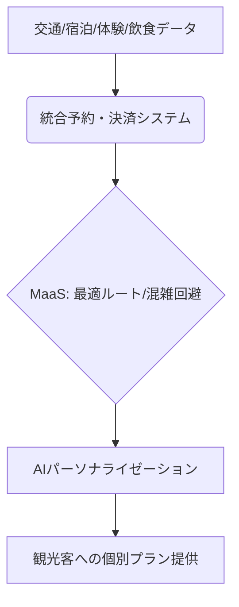

# T5-03-01 観光DXプラットフォーム（MaaSと統合）

## Summary（5つの要点）

1. 統合予約・決済システム: 交通（電車、バス、タクシー）、宿泊、体験、飲食サービスを単一のプラットフォームで一元管理し、予約から決済までを完結させる `(1)`。
2. MaaS（Mobility as a Service）統合: 観光客の位置データや移動履歴を収集し、AIによる最適ルート提案、混雑のリアルタイム回避、乗り継ぎ案内を提供。
3. パーソナライズド観光プラン: 観光客の属性、嗜好（T5-03-04のアーカイブデータを利用）、滞在時間に基づき、AIが個別に最適な観光ルートや体験を自動生成。
4. 地域事業者のデータ連携: 観光プラットフォームと地域の小売店、交通事業者、宿泊施設がAPIで連携し、リアルタイムで在庫、価格、サービス情報を共有。
5. データ駆動の地域活性化: プラットフォーム上で収集した移動データ、消費データを分析し、地域の観光戦略立案（T5-03-05の需要予測と連携）や新規サービス開発に活かす。

#### 概念図

---

### 技術評価表（定量的な視点）
| 評価項目 | 評価 | 根拠 |
| :--- | :--- | :--- |
| 導入コスト | ⭐⭐⭐⭐☆ | 地域の事業者間の連携、データ基盤構築に高い初期投資 |
| 技術成熟度 | ⭐⭐⭐☆☆ | MaaSの概念は確立。地域全体の完全統合は発展途上 `(1)` |
| 日本の競争力 | ⭐⭐⭐⭐⭐ | 鉄道網や地域交通との連携で独自の強み。JR系が先行 |
| 市場性 | ⭐⭐⭐⭐⭐ | インバウンド回復と地域経済活性化の鍵 |
| 品質保証の重要性 | ⭐⭐⭐⭐⭐ | 予約・決済のミスやルート案内の誤りは顧客満足度に直結 |

---

## 日本の立ち位置・強み弱みのSummary

### 強み：日本企業や研究機関が持つ独自の技術、優位性などを箇条書きで記述。

* MaaSの実証実績: JR各社、沖縄県など、既存交通網を活かしたMaaSアプリの開発、運用ノウハウ。
* 交通インフラの信頼性: 世界トップクラスの定時運行、安全性を誇る交通システム。
* きめ細かいサービス設計力: 観光客のニーズに応じた高度なパーソナライゼーションの実現。

### 弱み：日本が抱える規制、標準化の遅れ、海外依存などを箇条書きで記述。

* 地域事業者のITリテラシー格差: 中小の宿泊・飲食店がプラットフォーム連携に消極的な場合がある。
* データ連携の壁: 交通、宿泊、体験サービスの企業間でデータ標準化が進まず、API連携の障壁が高い。
* 個人情報保護への過度な配慮: 移動データや消費履歴の活用に対する規制が厳しく、利用が制限される。

---

## 技術ロードマップ（短期/中期/長期）

### 短期目標（～2027年）

* 主要観光地において、交通・宿泊・体験の3要素を統合したMaaSプラットフォームを導入し、観光消費額の5%増を達成。
* AIによる「ゴール設定型」観光ルートの自動生成機能（T5-03-05と連携）を実装。
* 地域の中小事業者向けの安価なAPI連携ツールを提供し、連携率を50%に向上。

### 中期目標（2028年～2031年）

* プラットフォーム上での「デジタル地域通貨」の発行、決済を標準化し、地域内での観光消費の完結を図る。
* AIがリアルタイムで混雑度を予測・可視化し、プッシュ通知で混雑回避を促す「動的ディスパッチ」を実現。
* T5-03-02と連携し、AR体験と交通チケットのバンドル販売を標準化。

### 長期目標（2032年～2035年）

* 観光客の「感情」や「疲労度」をセンシングし、旅程を動的に変更する「感性適応型MaaS」を実用化。
* 全国の観光DXプラットフォーム間のデータ連携が完了し、日本全体をシームレスに旅行できる環境を構築。

### 📚 参照リンク

1. [JR東日本: Beyond MaaS の推進](https://www.jreast.co.jp/press/2021/20210217_mg00.pdf)
2. [国土交通省: 日本版MaaS推進・支援事業](https://www.mlit.go.jp/sogoseisaku/transport/sosei_transport_fr_000085.html)
3. [西日本旅客鉄道: 地域一体型観光MaaS「setowa」](https://www.westjr.co.jp/press/article/2020/06/page_16147.html)
