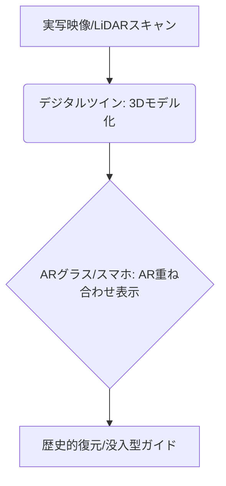

# T5-03-02 AR/VR観光体験・デジタルツイン観光地

## Summary（5つの要点）

1. ARによる文化財の復元・可視化: 現地でスマホやARグラスを通し、現存しない歴史的建造物や失われた街並みを現実の風景に重ねて表示する `(1)`。
2. VRを活用した遠隔地観光・事前体験: 高精細な360度映像やデジタルツインを活用し、行く前に魅力を伝える「誘客」や、移動が難しい人向けの「仮想観光」を実現。
3. デジタルツイン（3D空間再現）: ドローン空撮、レーザースキャン（LiDAR）で観光地全体を精密に3Dデータ化。観光客は事前に混雑状況や店舗の位置を確認し、旅程を計画（T5-03-01と連携）。
4. 位置情報AR（VPS）の利用: GPSだけでなく、カメラ映像を基に自己位置を高精細に特定し、数センチメートル精度でARコンテンツを現実空間に定着。Nianticの技術が応用される。
5. 没入型観光ガイド: AIキャラクター（T5-03-03と連携）や歴史上の人物がARで出現し、多言語で観光地の説明や対話的なガイドを行う。

#### 概念図

---

### 技術評価表（定量的な視点）
| 評価項目 | 評価 | 根拠 |
| :--- | :--- | :--- |
| 導入コスト | ⭐⭐⭐⭐☆ | 高精細な3Dスキャン、VRコンテンツ制作に高額な費用がかかる |
| 技術成熟度 | ⭐⭐⭐⭐☆ | ARガイドは実用化。デジタルツインのリアルタイム更新は課題 `(1)` |
| 日本の競争力 | ⭐⭐⭐⭐⭐ | 文化財デジタル化に関する研究、ゲーム・ARコンテンツ制作に強み |
| 市場性 | ⭐⭐⭐⭐⭐ | 観光・教育・文化財保護において需要が高い |
| 品質保証の重要性 | ⭐⭐⭐⭐☆ | AR表示の位置ずれ、VR映像のカクつきは観光体験を損なう |

---

## 日本の立ち位置・強み弱みのSummary

### 強み：日本企業や研究機関が持つ独自の技術、優位性などを箇条書きで記述。

* 文化財デジタル化の実績: 京都・奈良などの寺社仏閣において高精細な3Dデータ化が進展（T5-03-04と連携）。
* ゲーム・XRコンテンツ制作力: 世界的なゲーム会社の技術と、アニメ、マンガなどのIPを活用したコンテンツ力。
* VPS（Visual Positioning Service）技術: Nianticと日本企業が連携し、都市空間での高精度なARマップを構築。

### 弱み：日本が抱える規制、標準化の遅れ、海外依存などを箇条書きで記述。

* 高価なARグラスの普及遅れ: 観光客への貸出しなど、デバイス普及の課題。
* デジタルツインの標準化不足: 自治体、企業ごとにデータ形式が異なり、広域連携が難しい。
* 文化財のデータ公開への慎重論: 盗難や悪用防止のため、データのオープン化が制限される場合がある。

---

## 技術ロードマップ（短期/中期/長期）

### 短期目標（～2027年）

* 観光地の主要な施設において、ARグラスやスマホで利用可能な「時間軸AR」（過去の様子の復元）を導入。
* 地域観光のデジタルツイン（3Dモデル）を完成させ、事前の観光ルート計画に利用できるように公開。
* VR映像を活用した「地域体験キャンペーン」を海外で展開し、誘客効果を検証。

### 中期目標（2028年～2031年）

* ARグラスの軽量化・安価化に伴い、観光地でのレンタルサービスを標準化。コントローラーレスの操作を実現。
* デジタルツインと観光DXプラットフォーム（T5-03-01）を完全統合。現地の混雑状況や天候に応じてARガイドが動的に変化。
* 地域住民が自らARコンテンツを制作・配信できる簡易ツールを普及させる。

### 長期目標（2032年～2035年）

* デジタルツイン上で、観光客がAIキャラクターと一緒に観光できる「コンパニオンAI」を実現。
* 現実と仮想が完全に融合したMR（複合現実）観光エリアを創出。スマホやグラスなしでも観光体験が増強される。

### 📚 参照リンク

1. [Niantic: Lightship ARDK and Visual Positioning System (VPS)](https://www.nianticlabs.com/ja/blog/lightship-ardk/)
2. [Google Earth VR for Tourism and Education](https://www.blog.google/products/earth/google-earth-vr-now-free-steam/)
3. [文化庁: 文化遺産を活かした地域活性化](https://www.bunka.go.jp/)
