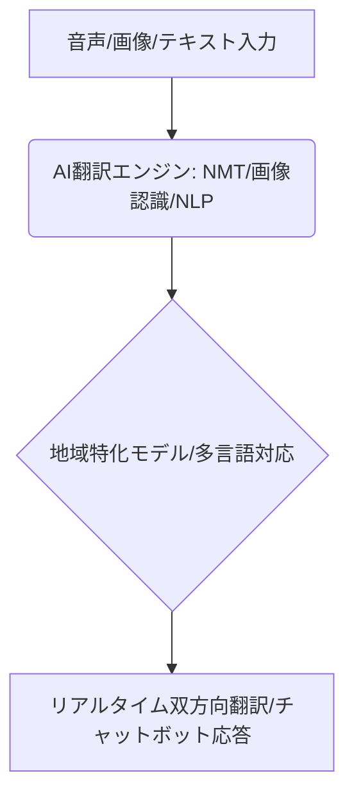

# T5-03-03 多言語AI翻訳・観光案内ボット

## Summary（5つの要点）

1. リアルタイム音声翻訳システム: 観光客と地域の人々の会話を数秒以内に双方向で翻訳。NTTドコモの「はなして翻訳」や「ポケトーク」などの携帯デバイス、スマホアプリが実例 `(1)`。
2. 画像・メニュー翻訳AI: 道路看板、飲食店のメニュー、観光ガイドの文字をカメラで撮影するだけで、AIが文字を認識して瞬時に翻訳。旅行中の不便を解消。
3. 観光案内チャットボット: AIが自然言語処理（NLP）を駆使し、観光客の質問に対し24時間365日、多言語で正確に回答。事業者の人手不足を補う。
4. 地域特化型翻訳モデル: 地方の方言、特有の観光用語、食材名など、地域に特化したデータを学習させ、汎用モデルでは難しい精度の高い翻訳を実現。
5. 交通機関への統合: 駅やバス停のデジタルサイネージ、車内アナウンスと翻訳システムを連携させ、移動中の不安を軽減。

#### 概念図

---

### 技術評価表（定量的な視点）
| 評価項目 | 評価 | 根拠 |
| :--- | :--- | :--- |
| 導入コスト | ⭐⭐⭐☆☆ | 翻訳デバイス、ボットシステムの導入に初期費用がかかる |
| 技術成熟度 | ⭐⭐⭐⭐☆ | NMT（ニューラル機械翻訳）により高精度化が進み実用レベル `(1)` |
| 日本の競争力 | ⭐⭐⭐⭐⭐ | 通信キャリア、専用デバイスメーカーが世界をリード |
| 市場性 | ⭐⭐⭐⭐⭐ | インバウンド復活に伴い、観光業界で必須のインフラ化 |
| 品質保証の重要性 | ⭐⭐⭐⭐⭐ | 観光案内の翻訳精度の誤りは大きな問題に繋がる |

---

## 日本の立ち位置・強み弱みのSummary

### 強み：日本企業や研究機関が持つ独自の技術、優位性などを箇条書きで記述。

* 専用翻訳デバイス（ポケトーク）の開発力: 携帯性、使いやすさでグローバル市場で優位性。
* 通信キャリアの技術力: NTTドコモなどが開発する高速・低遅延の音声翻訳サービス。
* 日本語の特殊性への対応: 日本語特有の同音異義語、敬語などに対応するAI翻訳アルゴリズムの研究。

### 弱み：日本が抱える規制、標準化の遅れ、海外依存などを箇条書きで記述。

* フラットフォームの海外依存: Google翻訳、DeepLなど、基幹翻訳エンジンの多くを海外に依存。
* 地域データの不足: 地域特化型AIの学習に必要な、地域ごとの方言や固有名詞データの収集が遅れ。
* 人とAIの協調システム不足: 最終的な意味の確認や微妙なニュアンスの翻訳における人間の介入システムの研究が少ない。

---

## 技術ロードマップ（短期/中期/長期）

### 短期目標（～2027年）

* 全国の主要観光地、大手飲食店でAI翻訳デバイスの導入を完了。対応言語数を100以上に拡大。
* 観光DXプラットフォーム（T5-03-01）に観光案内チャットボットを統合し、24時間多言語での問い合わせ対応を実現。
* 地域特化型のAI翻訳モデルを開発し、翻訳精度を90%以上に向上。

### 中期目標（2028年～2031年）

* ARグラス（T5-03-02と連携）を通し、話し相手の言語をリアルタイムで字幕表示する「透視型翻訳」を実用化。
* 音声のトーンや表情を分析し、感情を含めて翻訳できる「感情適応型翻訳」AIを導入。
* 通信環境に依存せず、オフラインでも高精度な翻訳が可能な携帯デバイスを普及させる。

### 長期目標（2032年～2035年）

* 脳波を利用し、思考を直接別言語に翻訳する「思考翻訳」（BMI）の基礎技術を観光応用へ展開。
* AIが観光客の「日本語学習段階」を理解し、教育的な効果も含めて翻訳のレベルを動的に変更する。

### 📚 参照リンク

1. [NTTドコモ: リアルタイム音声翻訳サービス「はなして翻訳」](https://www.nttdocomo.co.jp/biz/service/hanashite_honyaku/)
2. [ソースネクスト: POCKETALK（ポケトーク）](https://www.sourcenext.com/product/pocketalk/)
3. [Google: Lensによる画像翻訳機能](https://lens.google/)
