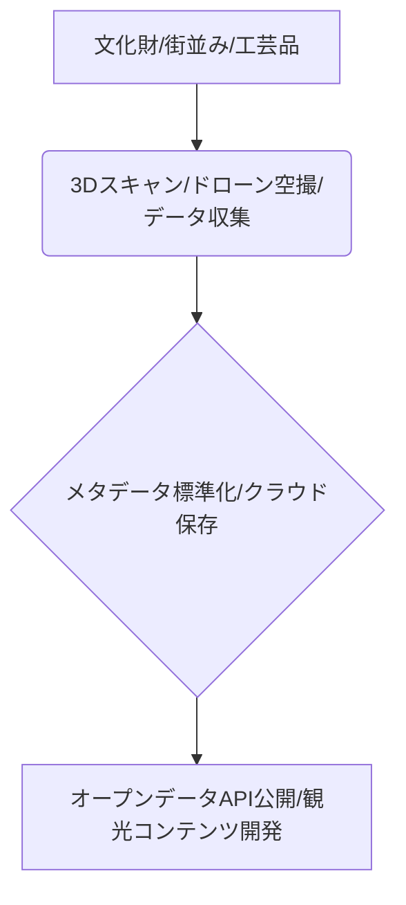

# T5-03-04 地域資源デジタルアーカイブ・オープンデータ化

## Summary（5つの要点）

1. 高精細な3Dスキャン・空撮: 文化財、建造物などをレーザースキャン（LiDAR）やドローン空撮で3Dデータ化。観光地のデジタルツイン（T5-03-02）の基盤データとなる `(1)`。
2. メタデータ標準化と一元管理: 地域の歴史、文化、食などの情報について、分類や形式を標準化したメタデータを付与。国立国会図書館などのデータベースと連携させ、横断的な検索を可能に。
3. オープンデータとAPI公開: 著作権やプライバシーに配慮したデータをオープンデータとして公開。開発者向けにAPIを提供し、観光アプリや新規ビジネス創出を促進。
4. 永久保存と災害対策: データを安全なクラウド上にバックアップし、有形文化財が災害で損壊した際の復元（デジタルリストア）に備える。
5. AIによるデータ解析・価値抽出: デジタル化された文書や画像をAIが解析し、歴史的な事実や新たな観光コンテンツの種となる「潜在的な価値」を抽出。

#### 概念図

---

### 技術評価表（定量的な視点）
| 評価項目 | 評価 | 根拠 |
| :--- | :--- | :--- |
| 導入コスト | ⭐⭐⭐⭐☆ | 高精細スキャン機器、データベース構築に大きな投資が必要 |
| 技術成熟度 | ⭐⭐⭐☆☆ | スキャン技術は成熟。オープンデータの品質・活用が課題 `(1)` |
| 日本の競争力 | ⭐⭐⭐⭐☆ | 文化庁やNII（国立情報学研究所）が主導し、着実に進展 |
| 市場性 | ⭐⭐⭐⭐☆ | 観光、教育、文化財保護、研究など幅広い分野に波及 |
| 品質保証の重要性 | ⭐⭐⭐⭐⭐ | データの精度、信頼性が文化財の歴史的価値を左右する |

---

## 日本の立ち位置・強み弱みのSummary

### 強み：日本企業や研究機関が持つ独自の技術、優位性などを箇条書きで記述。

* 文化財デジタル化への意識の高さ: 災害の多い国として、文化財保存への関心が高い。
* データ共有基盤の整備: 文化庁の「文化遺産オンライン」など、データ一元化の取り組み。
* 3Dスキャン・計測技術の高度化: キヤノン、ソニーなどの高精度な計測・カメラ技術。

### 弱み：日本が抱える規制、標準化の遅れ、海外依存などを箇条書きで記述。

* 地域データの標準化遅れ: 自治体ごとにデータの形式やメタデータが異なり、全国的な統合が難しい。
* オープンデータへの慎重論: 商用利用や二次利用に対する懸念から、データ公開が進まない場合がある。
* API提供とデベロッパーコミュニティの不足: 公開されたデータを活用した新規コンテンツ開発が海外に比べて少ない。

---

## 技術ロードマップ（短期/中期/長期）

### 短期目標（～2027年）

* 全国の文化財、重要観光地の3Dデータ化を完了し、デジタルアーカイブに格納。
* 観光DXプラットフォーム（T5-03-01）と連携するための地域資源データの標準APIを設定。
* 地域住民がスマホで簡易に3Dスキャンし、データを格納できる「市民参加型アーカイブ」を開始。

### 中期目標（2028年～2031年）

* 公開されたデータを利用した「地域コンテンツ開発コンテスト」を定期開催し、観光アプリ開発を促進。
* AIがデジタルアーカイブから「観光客が興味を持つ特徴」を抽出し、観光ルートや案内ボット（T5-03-03）にフィードバック。
* 地域特産品の「デジタル双子」をアーカイブ化し、ECサイトやVRショッピングで利用。

### 長期目標（2032年～2035年）

* AIが地域資源データに基づき、観光客一人ひとりの趣味に合わせた「完全自動生成型観光ガイド」を提供。
* デジタルツイン上での「仮想地域コミュニティ」を構築し、実際に訪れる前に地域との関わりを持つ場を提供。

### 📚 参照リンク

1. [国立情報学研究所: 文化財とデジタルアーカイブ技術](https://www.nii.ac.jp/sp/news/2021/0401.html)
2. [文化庁: 文化遺産オンライン](https://bunka.nii.ac.jp/)
3. [国土地理院: 3D都市モデル（PLATEAU）](https://www.mlit.go.jp/plateau/)
