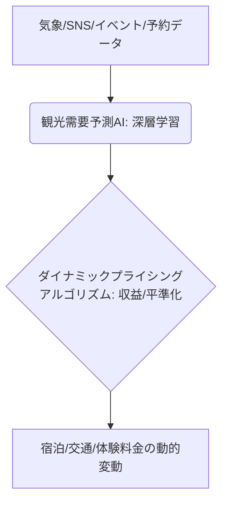

# T5-03-05 ダイナミックプライシング・観光需要予測AI

## Summary（5つの要点）

1. 多変量データに基づくAI予測: 過去の観光客数、宿泊履歴、気象情報、イベント情報、SNS投稿などの多様なデータをAIが学習し、観光需要を高精度に予測 `(1)`。
2. ダイナミックプライシングの実施: AIの需要予測に基づき、宿泊施設や観光体験の料金をリアルタイムで変動させる。需要が高い時期は値上げ、低い時期は割引して収益を最大化。
3. 繁閑差の平準化効果: 安価なオフシーズンへの誘導を行い、観光客を分散。観光地の混雑を緩和し、持続可能な観光を実現（T5-03-01と連携）。
4. 個別の観光客への最適提供: 個人の購入履歴、予約タイミングなどを考慮し、一人ひとりに最適化した価格やパッケージを提供（プライスパーソナライゼーション）。
5. 地域全体への適用: 航空会社やホテルなどの大手だけでなく、地域の小規模な飲食店、体験施設へもAI予測モデルを展開し、地域全体の収益力を底上げ。

#### 概念図

---

### 技術評価表（定量的な視点）
| 評価項目 | 評価 | 根拠 |
| :--- | :--- | :--- |
| 導入コスト | ⭐⭐⭐☆☆ | AIモデル開発、システム統合には専門家とデータ基盤が必要 |
| 技術成熟度 | ⭐⭐⭐⭐☆ | 航空・ホテル業界では成熟。地域観光全体への適用は発展途上 `(1)` |
| 日本の競争力 | ⭐⭐⭐⭐☆ | 楽天トラベル、じゃらんなどのOTAが日本市場で優位性 |
| 市場性 | ⭐⭐⭐⭐⭐ | 収益改善、人手不足解消のため、観光業界全体で導入進む |
| 品質保証の重要性 | ⭐⭐⭐⭐☆ | 価格設定の誤りは顧客信頼を損なう。AIの公平性・透明性が重要 |

---

## 日本の立ち位置・強み弱みのSummary

### 強み：日本企業や研究機関が持つ独自の技術、優位性などを箇条書きで記述。

* 大型OTA（オンライン旅行代理店）のデータ基盤: 楽天トラベル、じゃらんが宿泊・観光データを大量に保有。
* 気象データの精度: 日本気象協会などによる高精度な天気予測と観光需要の相関分析。
* 地域DX推進への政府支援: 観光庁などがダイナミックプライシング導入への実証実験を支援。

### 弱み：日本が抱える規制、標準化の遅れ、海外依存などを箇条書きで記述。

* 地域小規模事業者への普及遅れ: ダイナミックプライシングの導入はコスト、人材面で大手に限定される。
* データ連携の壁: 交通、宿泊、飲食、体験の分野横断的なデータ共有が進まない。
* 顧客の「公平性」への不信感: 価格が変動することへの消費者の理解が不足している。

---

## 技術ロードマップ（短期/中期/長期）

### 短期目標（～2027年）

* 大手OTAや鉄道会社において、AIによる予測精度90%以上のダイナミックプライシングを標準導入。
* 観光DXプラットフォーム（T5-03-01）に需要予測AIを統合し、混雑予測と分散案内を実現。
* 地域の観光関連事業者向けに、簡易に導入できるAI需要予測サービスを提供。

### 中期目標（2028年～2031年）

* 地域全体のダイナミックプライシングを統合管理する「地域観光収益最適化システム」を構築。
* AIがSNSから観光客の「満足度」をリアルタイムで分析し、価格にフィードバックする「感情適応型プライシング」を実現。
* 予測AIとMaaSを連携させ、閑散期に観光客を誘導するための「超割引モバイルチケット」を動的に発行。

### 長期目標（2032年～2035年）

* 観光客の「脳波や生体情報」から「最適支払意欲」を検出し、完全にパーソナライズされた価格を提供。
* 地域の農業・漁業などの一次産業から情報を得て、食材の在庫や旬に応じた料金を飲食店が自動設定できる「供給側連動型プライシング」を実現。

### 📚 参照リンク

1. [楽天トラベル: ダイナミックプライシング導入ガイド](https://www.rakuten.co.jp/travel/info/dp/dp_guide.html)
2. [観光庁: ダイナミックプライシング導入のガイドライン](https://www.mlit.go.jp/kankocho/)
3. [じゃらんリサーチセンター: AIによる観光需要予測](https://www.recruit-lifestyle.co.jp/)
