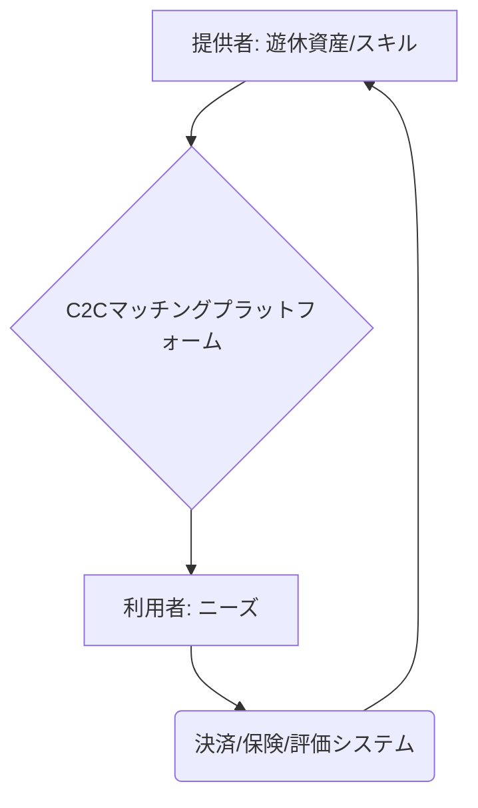

# T5-04-01 C2Cマッチングプラットフォーム（資産シェア）

## Summary（5つの要点）

1. 遊休資産の有効活用: 個人が保有する車、住宅（民泊）、空きスペース、モノなどを、必要とする他者とマッチングさせ、資産の稼働率を向上させる `(1)`。
2. 信頼構築システム: ユーザー間の安心・安全な取引のために、厳格な本人確認（T5-04-02と連携）、相互評価レビュー、通報機能を搭載。
3. 安全な決済と保険: 決済エスクロー（T5-04-05）、オンデマンド保険（T5-04-04）を統合し、物損や事故リスクに対して自動で対応。
4. 多様なシェアリング領域: 民泊（Airbnb）、ライドシェア（Uber）、スキルシェア（TimeTicket）、物品フリーマーケット（メルカリ）など、複数の分野に展開。
5. 地域活性化への貢献: 地域住民の遊休資産を収益化し、観光DXプラットフォーム（T5-03-01）と連携して観光客の受入れを拡大。

#### 概念図

---

### 技術評価表（定量的な視点）
| 評価項目 | 評価 | 根拠 |
| :--- | :--- | :--- |
| 導入コスト | ⭐⭐⭐☆☆ | プラットフォーム開発は高額。利用者はスマホで簡便 |
| 技術成熟度 | ⭐⭐⭐⭐⭐ | Airbnb、Uberなどの世界的事例で成熟 `(1)` |
| 日本の競争力 | ⭐⭐⭐☆☆ | 規制が厳しく、世界的プラットフォームの日本市場への影響が大きい |
| 市場性 | ⭐⭐⭐⭐⭐ | 若年層を中心に利用が拡大。地域の空き家問題解決への期待 |
| 品質保証の重要性 | ⭐⭐⭐⭐⭐ | 安全性・信頼性が直接顧客満足度に結びつく |

---

## 日本の立ち位置・強み弱みのSummary

### 強み：日本企業や研究機関が持つ独自の技術、優位性などを箇条書きで記述。

* フリーマーケットの強さ: メルカリなど、物品シェア分野での独自のマッチングアルゴリズムと安心取引のノウハウ。
* 地域に根ざしたアプリ: 地方の観光体験やスキルシェアに特化したニッチなプラットフォームが登場。
* 高いユーザーマナー意識: シェアリングに対するユーザーのリスク回避意識が高く、品質の高い取引が期待できる。

### 弱み：日本が抱える規制、標準化の遅れ、海外依存などを箇条書きで記述。

* 法規制の壁: 民泊新法、道路運送法など、シェアリングに対する規制が厳格で、事業展開の足かせに。
* ライドシェアの停滞: 運賃設定やドライバー管理などの規制が、海外のような大規模なライドシェア普及を阻害。
* 地域データの未共有: 地域の空き家、遊休資産データがオープン化されておらず、プラットフォーム構築の障壁に。

---

## 技術ロードマップ（短期/中期/長期）

### 短期目標（～2027年）

* シェアリング事業者向けに、T5-04-04のオンデマンド保険APIの標準化と導入を完了。
* 地域特化型C2Cプラットフォームを全国20以上の地域で実証導入し、地域経済効果を測定。
* T5-04-02の分散型IDシステムを導入し、ユーザーの信頼性をプラットフォーム間で共有する体制を試行。

### 中期目標（2028年～2031年）

* ライドシェアの規制緩和を受け、日本版の大規模ライドシェアプラットフォームを全国で展開。
* AIによる「シェアリング資産価格決定」機能を標準化し、遊休資産の収益最適化を実現。
* T5-04-03のIoTスマートロックを住宅・空きスペースシェアの必須設備とし、無人管理を普及させる。

### 長期目標（2032年～2035年）

* 全てのシェアリングプラットフォームがブロックチェーン上の分散型IDと評価システムに統合され、信頼のコストがほぼゼロになる。
* シェアリングエコノミーがGDPの5%を占め、地域の遊休資産が残らない社会を実現。

### 📚 参照リンク

1. [Airbnb Japan: 民泊事業の現状](https://www.airbnb.jp/)
2. [内閣府: シェアリングエコノミーの動向](https://www.cao.go.jp/)
3. [メルカリ: フリマアプリによるC2C取引](https://www.mercari.com/jp/)
