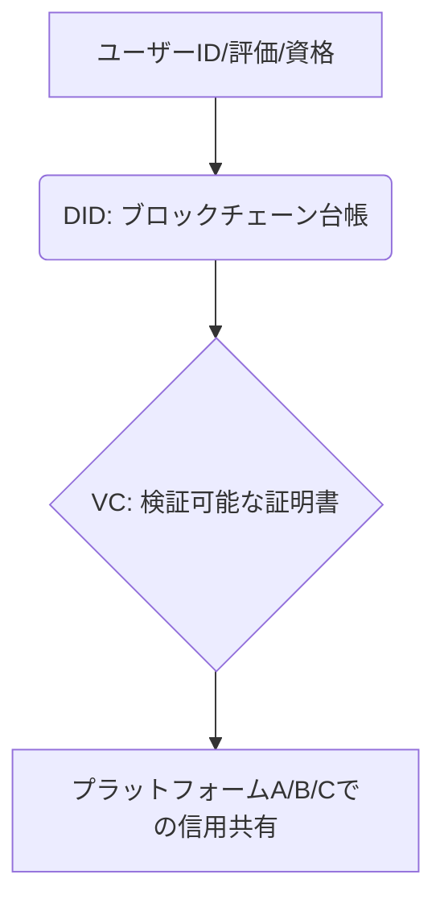

# T5-04-02 分散型ID・評価システム（ブロックチェーン活用）

## Summary（5つの要点）

1. 分散型ID（DID）の導入: 特定の管理主体に依存せず、個人が自らのIDを管理・制御できるブロックチェーンベースのID技術。プライバシーを保護しつつ本人確認を実現 `(1)`。
2. レピューテーションの移植: シェアリングプラットフォーム間でユーザーの評価（星の数やトラブル履歴）をDIDに紐づけて共有。初回利用時の信頼構築のハードルを低減。
3. 検証可能な資格証明（VC）: 運転免許、資格、学歴、身元確認などの情報を改ざん不可能なデータとしてIDに格納し、必要な情報だけを選択的に提示。
4. 個人情報の安全な利用: KYC（顧客確認）やシェアリングの取引履歴をブロックチェーン上に暗号化して記録。プラットフォームの統合的データベース依存を排除。
5. スマートコントラクトと連携: DIDの評価に基づき、自動でオンデマンド保険（T5-04-04）の料率を変更するなど、信用度に応じたサービス提供を実現。

#### 概念図

---

### 技術評価表（定量的な視点）
| 評価項目 | 評価 | 根拠 |
| :--- | :--- | :--- |
| 導入コスト | ⭐⭐⭐⭐☆ | ブロックチェーン基盤構築、ID標準化の初期費用が大きい |
| 技術成熟度 | ⭐⭐⭐☆☆ | W3Cの標準化は進展中。日本での実用化は一部試験的 `(1)` |
| 日本の競争力 | ⭐⭐⭐☆☆ | 技術研究は進むが、法規制と「マイナンバー」依存で普及が遅れ |
| 市場性 | ⭐⭐⭐⭐⭐ | Web3、DXにおける「信頼の基盤」として必須 |
| 品質保証の重要性 | ⭐⭐⭐⭐⭐ | IDの改ざんや情報漏洩は社会的信用を失う |

---

## 日本の立ち位置・強み弱みのSummary

### 強み：日本企業や研究機関が持つ独自の技術、優位性などを箇条書きで記述。

* 金融・大手IT企業のブロックチェーン研究: NTTや富士通などがエンタープライズ向けDIDの開発に着手。
* 公的ID（マイナンバー）との連携可能性: 公的IDをDIDの起点として活用するための技術的検討が進む。
* 精緻なKYCノウハウ: 金融分野で培った厳格な本人確認の知識がDIDの信頼性確保に役立つ。

### 弱み：日本が抱える規制、標準化の遅れ、海外依存などを箇条書きで記述。

* 法的位置づけの不明確さ: DIDが日本の法律上どのように扱われるかの整備が遅れ。
* マイナンバー依存とDIDの衝突: 一元管理型の公的IDへの依存が強く、分散型IDの概念普及の障壁に。
* プラットフォーム間の連携の遅れ: 各シェアリング事業者が自社システムに固執し、評価データの共有に消極的。

---

## 技術ロードマップ（短期/中期/長期）

### 短期目標（～2027年）

* シェアリングエコノミー協会によるDID・レピューテーション共有の実証実験を完了。
* 特定の地域（例: 福岡市）で、DIDを利用した身元確認とIoTスマートロック（T5-04-03）の連携を試行。
* W3CのDID・VC標準に準拠した日本語エンジンの開発。

### 中期目標（2028年～2031年）

* 主要なシェアリングプラットフォーム（民泊、カーシェア）でDIDに基づくレピューテーション共有が標準化。
* 公的機関（自治体、運転免許管理センター）がVCを発行し、DIDを通じて利用できるようになる。
* ブロックチェーン上の評価に応じて、T5-04-04の保険料が自動変動するシステムを導入。

### 長期目標（2032年～2035年）

* ID、評価、資格が完全に分散化され、個人情報をプラットフォームに提供せずにサービスを利用できる「ゼロ知識証明」シェアリング社会を実現。
* DIDが日本経済の「デジタル身分証」として機能し、金融、医療、行政などの全分野に普及。

### 📚 参照リンク

1. [W3C: Decentralized Identifiers (DIDs) v1.0](https://www.w3.org/TR/did-core/)
2. [内閣官房: デジタル社会に向けたIDのあり方に関する検討会](https://www.cas.go.jp/jp/seisaku/it/)
3. [一般社団法人日本ブロックチェーン協会](https://jba-web.jp/)
