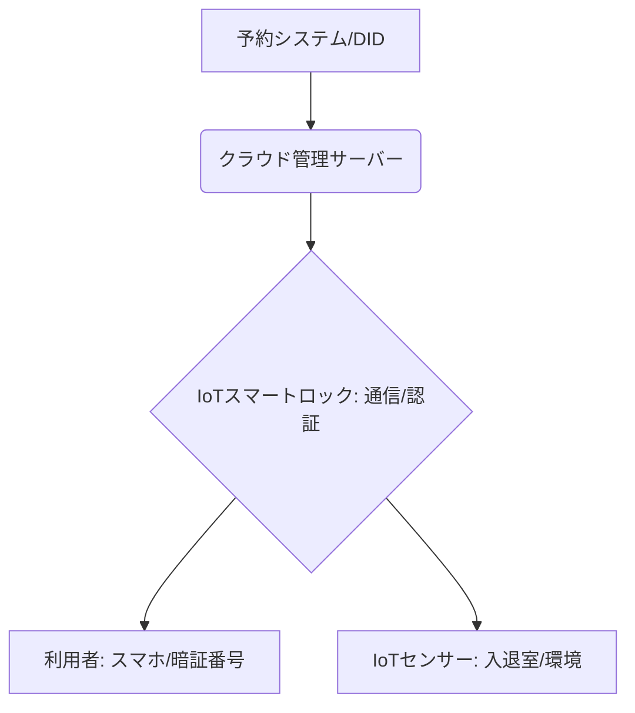

# T5-04-03 IoTスマートロック・無人管理システム

## Summary（5つの要点）

1. キーレス・自動解錠: スマートフォンアプリや一時的な暗証番号により、鍵の受け渡しなしで施錠・解錠を実現。民泊、カーシェア、無人オフィスの必須ツール `(1)`。
2. 遠隔管理・権限制御: 管理者はネットワークを通じてロックの状態をリアルタイムで監視し、利用時間に応じて特定ユーザーにのみ入室権限を付与・自動抹消。
3. IoTセンサーとの統合: 入退室記録の管理だけでなく、室内の温度、湿度、照明、電力消費をIoTセンサーで管理し、省エネと不正利用防止を両立。
4. 自動チェックイン: 宿泊業において、顔認証や分散型ID（T5-04-02）と連携し、法定の本人確認を含むセルフチェックインを完全に無人化。
5. 保安・防犯機能: 不正開錠試行、ドアの閉め忘れなどを検知して管理者に自動通知。遠隔で警備会社と連携して安全性を確保。

#### 概念図

---

### 技術評価表（定量的な視点）
| 評価項目 | 評価 | 根拠 |
| :--- | :--- | :--- |
| 導入コスト | ⭐⭐⭐☆☆ | スマートロック本体は安価化。IoT設定、管理システムに費用 |
| 技術成熟度 | ⭐⭐⭐⭐☆ | 民生用では成熟。ホテル、ビル管理への統合が課題 `(1)` |
| 日本の競争力 | ⭐⭐⭐⭐☆ | 日本メーカーも多数参入。鍵の精密製造技術に強み |
| 市場性 | ⭐⭐⭐⭐⭐ | シェアリング経済の拡大に伴い、無人化・省人化の必須インフラ |
| 品質保証の重要性 | ⭐⭐⭐⭐⭐ | セキュリティの根幹。通信不良やバッテリー切れは重大な障害 |

---

## 日本の立ち位置・強み弱みのSummary

### 強み：日本企業や研究機関が持つ独自の技術、優位性などを箇条書きで記述。

* 高い製品品質・信頼性: 日本の鍵メーカーの高い品質管理基準がスマートロックにも適用される。
* 通信技術との融合: 通信キャリアが開発するSiM内蔵型IoTデバイスとの連携。
* 民泊法対応のノウハウ: 法定の宿泊者名簿管理を自動化するシステムの開発で先行。

### 弱み：日本が抱える規制、標準化の遅れ、海外依存などを箇条書きで記述。

* IoTデバイスの電波法規制: 海外製の安価なデバイスの導入における技術基準適合の課題。
* 既存建物への導入難度: 日本の住宅に多い「引き戸」や複雑な鍵の形状に対応するスマートロックの設計。
* データ連携の不足: スマートロックからの入退室データとシェアリングプラットフォームの予約データのシームレスな連携が不足。

---

## 技術ロードマップ（短期/中期/長期）

### 短期目標（～2027年）

* 住宅・スペースシェアの事業者に対し、IoTスマートロック導入の補助金・税制優遇を設置し、導入率を50%に向上。
* 顔認証やDIDを用いた無人チェックインの法的フレームワークを整備。
* カーシェアにおいて、車両の状態（燃料残量、損傷）も自動でレポートするIoT管理システムを標準化。

### 中期目標（2028年～2031年）

* AIによる「不正利用予測」機能をスマートロックシステムに統合。異常な入退室パターンを自動で検知。
* スマートロックからのデータに基づき、T5-04-04の保険が「利用実態」に応じて自動で料金を変更するシステムを実現。
* スマートロック、IoTセンサーのデータを地域の観光DXプラットフォームと連携させ、観光地の混雑状況をリアルタイムで把握。

### 長期目標（2032年～2035年）

* IoTシステムがシェア資産の「劣化度」を自動で予知保全（PdM）し、修理手配までを完全に自動化。
* 鍵、ID、決済が体内に埋め込まれた「バイオハック」と連携し、ユーザーは何も持たずにシェア空間を利用できるようになる。

### 📚 参照リンク

1. [国土交通省: 民泊におけるITを活用したフロント業務の実施](https://www.mlit.go.jp/)
2. [ソニー: Qrio Lockによるスマートロック技術](https://qrio.me/lock/)
3. [ソフトバンク: スマートロックとIoTプラットフォームの連携](https://www.softbank.jp/)
