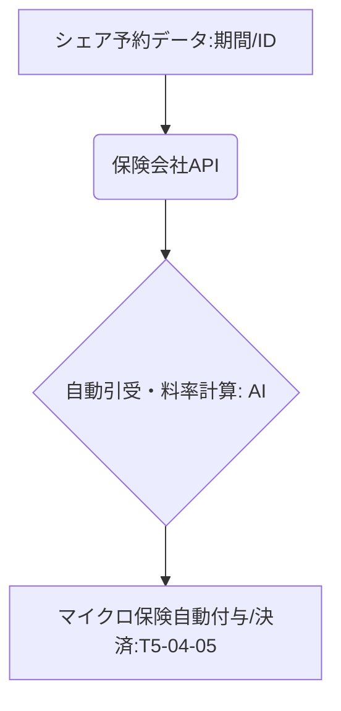

# T5-04-04 オンデマンド保険・マイクロ保険技術

## Summary（5つの要点）

1. 利用時間のみの保険適用: シェアリングサービスの「利用単位」（例: カーシェアの運転中、民泊の宿泊期間）に合わせ、短期間・小口の保険を自動で付保する `(1)`。
2. APIによる瞬時な契約: シェアリングプラットフォームの予約データを保険会社のAPIと連携。ユーザーの意識せずに保険契約・解約を自動で完結。
3. マイクロ保険の実現: 従来の年間契約型ではなく、数百円から数千円単位の極めて小さな保険料を設定。コスト効率的なリスクヘッジを提供。
4. データに基づく料率決定: ユーザーの信頼度（T5-04-02）、運転データ（カーシェア）、利用実績などに基づき、AIが保険料率を動的に決定。
5. トラブル時の自動対応: IoTスマートロックの異常検知（T5-04-03）やカーシェアの衝突検知システムと連携し、事故発生時に自動で保険会社へ通報・請求手続きを開始。

#### 概念図

---

### 技術評価表（定量的な視点）
| 評価項目 | 評価 | 根拠 |
| :--- | :--- | :--- |
| 導入コスト | ⭐⭐⭐⭐☆ | 保険会社のレガシーシステム改修、API開発に高額な費用 |
| 技術成熟度 | ⭐⭐⭐⭐☆ | 損保ジャパンなどが実用化。マイクロ保険の法的整備が課題 `(1)` |
| 日本の競争力 | ⭐⭐⭐⭐⭐ | 損保ジャパン、三井住友海上などの大手がインシュアテックで世界をリード |
| 市場性 | ⭐⭐⭐⭐⭐ | シェアリングエコノミーの成長に伴い、必須のリスク分散インフラ |
| 品質保証の重要性 | ⭐⭐⭐⭐⭐ | 保険金支払の適切性と自動化の信頼性が重要 |

---

## 日本の立ち位置・強み弱みのSummary

### 強み：日本企業や研究機関が持つ独自の技術、優位性などを箇条書きで記述。

* 大手損保会社の技術力: 損保ジャパンの「1日自動車保険」やシェアリング専用保険の実績。
* プラットフォーム事業者との緊密な連携: OTA、カーシェア事業者とのAPI連携における安心・安全の設計。
* データ分析に基づくリスク評価: 日本の交通事故データなどの精緻な分析に基づく料率決定。

### 弱み：日本が抱える規制、標準化の遅れ、海外依存などを箇条書きで記述。

* 法規制への対応遅れ: マイクロ保険やP2P保険などの新しい形態への法的整備が遅れ。
* データ活用の制限: 個人情報保護に対する厳格な規制が、ユーザーデータを利用した動的料率決定を制限する。
* レガシーシステムの重荷: 多くの保険会社が古いシステムを抱えており、APIを用いた柔軟な連携が難しい。

---

## 技術ロードマップ（短期/中期/長期）

### 短期目標（～2027年）

* 主要シェアリングプラットフォームの全てが、T5-04-04のオンデマンド保険APIを実装し、保険カバー率を100%に。
* 保険業界において、AIを用いた自動引受け・料率設定のガイドラインを策定。
* DID（T5-04-02）の信頼度に応じて保険料が変動するシステムの実証実験を開始。

### 中期目標（2028年～2031年）

* IoTスマートロック（T5-04-03）などのセンサーデータに基づき、事故を予測して料率を変動させる「予測型プライシング」を実現。
* マイクロ保険のデータを利用し、地域ごとのリスク分布を可視化し、地域リスク対策に活用。
* P2P（個人間）保険の法的整備を完了し、シェアリングコミュニティ内での相互扶助を実現。

### 長期目標（2032年～2035年）

* 全てのシェアリング取引がブロックチェーン上のスマートコントラクトで自動管理され、保険金支払も条件達成で瞬時に実行される社会に。
* 個人の「リスクプロファイル」をAIが完全に理解し、生活全体をカバーする「個人最適化されたワンパッケージ保険」を実現。

### 📚 参照リンク

1. [損保ジャパン: シェアリングエコノミー保険](https://www.sompo-japan.co.jp/share-insurance/)
2. [金融庁: インシュアテックの最新動向](https://www.fsa.go.jp/)
3. [三井住友海上: APIを活用した保険サービスの開発](https://www.ms-ins.com/)
