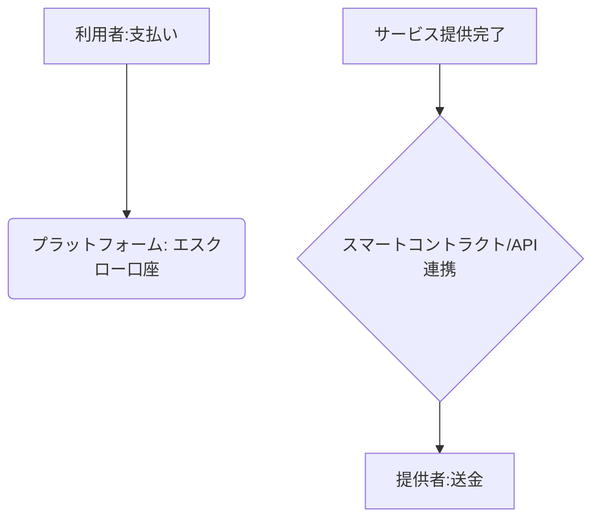

# T5-04-05 シェアリングエコノミー決済・エスクロー技術

## Summary（5つの要点）

1. エスクロー（仲介保証）結済: 取引の安全性を確保するため、ユーザーからの支払いをプラットフォームが一時預かり（信託）、サービス完了確認後に提供者へ送金する `(1)`。
2. 多様な決済手段への対応: クレジットカード、デジタルウォレット（T16-01-01と連携）、銀行振込など、複数の決済手段を統合。国際的なユーザーの利便性を向上。
3. スマートコントラクトによる自動決済: ブロックチェーン上で「サービス提供完了」の条件が満たされると、予め定められた契約に基づき決済が自動的に実行される。
4. ステーブルコイン・仮想通貨の活用: 国際的なシェアリング取引において、送金手数料を抑え、速度を向上させるためにステーブルコインを活用した国際送金を実現。
5. 料金配分の自動化: シェアリング料金からプラットフォーム手数料、保険料（T5-04-04）、税金などを自動で計算・差し引き、残額を提供者に送金するシステム。

#### 概念図

---

### 技術評価表（定量的な視点）
| 評価項目 | 評価 | 根拠 |
| :--- | :--- | :--- |
| 導入コスト | ⭐⭐⭐⭐☆ | 決済プロバイダーの手数料、ブロックチェーン連携の初期開発費用 |
| 技術成熟度 | ⭐⭐⭐⭐⭐ | クレジットカード・銀行送金エスクローは完全に成熟 `(1)`。スマートコントラクトは発展途上 |
| 日本の競争力 | ⭐⭐⭐☆☆ | 決済インフラは海外（Stripe、PayPal）に依存。
| 市場性 | ⭐⭐⭐⭐⭐ | シェアリングの成長と国際化に伴い、安全な決済は必須 |
| 品質保証の重要性 | ⭐⭐⭐⭐⭐ | 送金ミス、エスクローの不正は信頼を直接損なう |

---

## 日本の立ち位置・強み弱みのSummary

### 強み：日本企業や研究機関が持つ独自の技術、優位性などを箇条書きで記述。

* 安心・安全な取引文化: メルカリなどのエスクロー機能を通して培った、ユーザー保護を優先する安全な取引設計。
* 銀行間ネットワークの整備: 全銀システムなど、国内送金インフラの高い信頼性。
* 仮想通貨法規制の先進性: 世界に先駆けて仮想通貨（暗号資産）を法制化し、決済手段としての認識を広げる基盤。

### 弱み：日本が抱える規制、標準化の遅れ、海外依存などを箇条書きで記述。

* クレジットカードへの依存: 多くのプラットフォームが国際的なクレジットカードプロバイダーに依存し、手数料が高止まり。
* ステーブルコインの普及遅れ: 厳格な法規制（資金決済法）により、日本円にペッグしたステーブルコインの国内発行・活用が進まない。
* スマートコントラクトの法的認識不足: スマートコントラクトで自動実行された決済の法的効力に関する判例・整備が不足。

---

## 技術ロードマップ（短期/中期/長期）

### 短期目標（～2027年）

* シェアリングプラットフォームの全てで、エスクロー機能付きの統合決済システムを導入。
* ステーブルコインを用いた国際送金の法的・技術的実証実験を完了。
* T5-04-02のDIDと連携し、信頼度の低いユーザーに対しては必ずエスクローを適用するなどのリスク管理を実施。

### 中期目標（2028年～2031年）

* 日本円ペッグのステーブルコインを日本国内で発行・普及させ、シェアリングの主要決済手段として利用。
* サービス完了の「客観的証拠」（IoTのデータなど）に基づき、スマートコントラクトが決済を自動実行するシステムを標準化。
* T5-04-04のオンデマンド保険料を自動で差し引いて、提供者への送金を完全に自動化。

### 長期目標（2032年～2035年）

* シェアリング取引に関する金銭の流れが完全にブロックチェーン上で透明化され、法的・税務上の手続きも自動で完結する社会を実現。
* スマートコントラクトが個人の「信用資産」と連携し、担保なしで大きな資産のシェアリングが可能になる。

### 📚 参照リンク

1. [Stripe: オンライン決済とエスクロー機能](https://stripe.com/jp/payments)
2. [金融庁: 資金決済法と暗号資産・ステーブルコイン規制](https://www.fsa.go.jp/)
3. [一般社団法人日本仮想通貨ビジネス協会](https://jcba.or.jp/)
