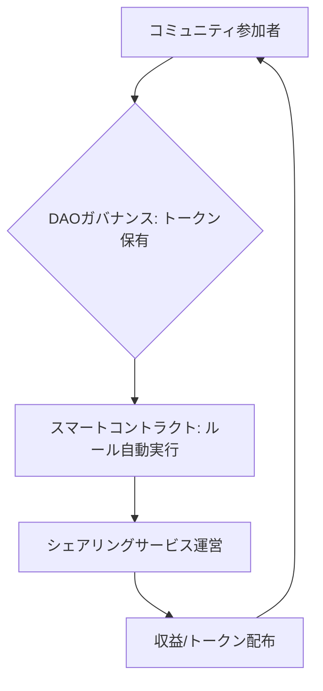

# T5-04-06 (参考) DAOによるシェアリングコミュニティ

## Summary（5つの要点）

1. プラットフォームの分散化: 現在のシェアリングプラットフォーム（Airbnb、Uber）の管理者権限を排除し、そのサービス利用者（提供者と利用者）に運営権限を分散させる「分散型自律組織（DAO）」への移行 `(1)`。
2. トークンによるガバナンス: 参加者はトークンを保有することで議決権を得る。プラットフォームの手数料率、ルール変更、収益の使い道などをコミュニティの投票で決定。
3. 透明性の高い運営: DAOの運営ルール（スマートコントラクト）と財務（ブロックチェーン）が公開され、不正や恣意的な運営を防止。
4. 信頼構築の自律化: DID（T5-04-02）やスマートコントラクトと連携し、評価の付与やトラブル時の仲裁もコミュニティの合意に基づき自律的に行われる。
5. トークン経済圏の形成: シェアリングにより得たトークンをコミュニティ内での決済（T5-04-05）や、別のDAOで利用するなど、新しい経済圏を形成。

#### 概念図

---

### 技術評価表（定量的な視点）
| 評価項目 | 評価 | 根拠 |
| :--- | :--- | :--- |
| 導入コスト | ⭐⭐⭐⭐☆ | ブロックチェーン上に運営システムを構築するコストが高い |
| 技術成熟度 | ⭐⭐☆☆☆ | 基礎技術は存在するが、大規模な運営実績は少ない `(1)` |
| 日本の競争力 | ⭐⭐⭐☆☆ | 技術開発は進むが、法的整備で海外に後れをとる |
| 市場性 | ⭐⭐⭐⭐☆ | Web3の流れに伴い、将来的な主流プラットフォームの形態として期待 |
| 品質保証の重要性 | ⭐⭐⭐⭐⭐ | コントラクトのバグが資金流出に直結する |

---

## 日本の立ち位置・強み弱みのSummary

### 強み：日本企業や研究機関が持つ独自の技術、優位性などを箇条書きで記述。

* コミュニティ主導型サービスの実績: 地域ネットワークやNPOなど、共同体運営に関するノウハウ。
* 精密なスマートコントラクト設計: 日本のソフトウェア開発における高い信頼性要求が設計に活かされる。
* 地域活性化DAOの実証: 地域通貨や地域課題解決に特化した小規模DAOの実験が始まっている。

### 弱み：日本が抱える規制、標準化の遅れ、海外依存などを箇条書きで記述。

* DAOの法的位置づけ不明確: DAOが「法人」として認められないため、大きな資金や契約を扱うことが難しい。
* トークン課税の問題: DAOで得たトークンの取り扱い（雑所得課税）が活動の障壁となる。
* ブロックチェーン人材の不足: スマートコントラクトを安全に開発・監査できるエンジニアが不足。

---

## 技術ロードマップ（短期/中期/長期）

### 短期目標（～2027年）

* シェアリングエコノミー協会、経産省などが連携し、DAOの法的ガイドラインおよび課税の整備に着手。
* 地域特化型シェアリングサービスにおいて、一部の運営権限（ルール設定）をユーザーに分散するDAOを試行導入。
* DID（T5-04-02）に基づくDAOへの参加制限（信頼度の高いユーザーのみ）を実現。

### 中期目標（2028年～2031年）

* シェアリングDAOが一般法人と同等の法的地位を獲得し、大規模な資金調達・管理が可能になる。
* AirbnbやUberのような大型プラットフォームの一部機能（紛争解決、手数料設定）がDAOに移管される。
* DAOの運営費用や配当がT5-04-05のスマートコントラクトで自動実行される。

### 長期目標（2032年～2035年）

* 地域の遊休資産がすべてDAOによって管理され、中央集権的な企業を介さずに資源が分散的に循環する「DAOシェアリング社会」が実現。
* DAOが自律的に「新規ビジネスアイデア」を創出し、必要な資金をスマートコントラクトで自動調達する。

### 📚 参照リンク

1. [a16z Crypto: DAOのガバナンスと課題](https://a16zcrypto.com/dao-governance/)
2. [経済産業省: Web3.0時代のビジネスとDAO](https://www.meti.go.jp/)
3. [一般社団法人日本DAO協会](https://daa.or.jp/)
