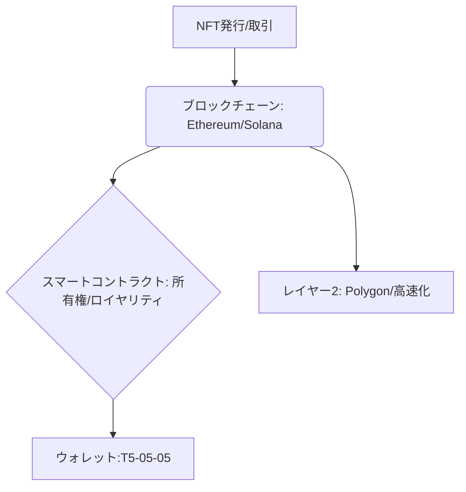

# T5-05-01 ブロックチェーン基盤技術（Ethereum、Polygon、Solana等）

## Summary（5つの要点）

1. **NFTの記録媒体**: **NFTの所有権、メタデータのハッシュ値、取引履歴などを改ざん不可能な形で永久的に保存する基盤インフラ** `(1)`。
2. **イーサリアムの優位性と課題**: **Ethereumが現在のNFT市場の大半を占めるが、ネットワーク混雑時に高額な「ガス代（手数料）」が発生するのが大きな障壁**。
3. **スケール拡大解決策**: **Polygon、Optimism、Arbitrumなどの「レイヤー2」技術や、Solana、Flowなどの「高速アルトチェーン」が低コスト・高速取引を実現**。
4. **自動ロイヤリティ支払い**: **スマートコントラクト（ERC-721、ERC-1155）により、二次流通時に自動でクリエイターへロイヤリティを支払う機能（T5-05-04）を実現**。
5. **日本企業の独自チェーン**: **LINE、楽天などが日本の規制やユーザーニーズに合わせ、独自のコンソーシアム型チェーンを構築し、NFTの普及を図る**。

#### 概念図

---

### 技術評価表（定量的な視点）
| 評価項目 | 評価 | 根拠 |
| :--- | :--- | :--- |
| 導入コスト | ⭐⭐⭐☆☆ | **レイヤー2の普及でガス代は低下傾向。開発費用は依然高め** `(1)` |
| 技術成熟度 | ⭐⭐⭐⭐☆ | **Ethereumは成熟。レイヤー2、Solanaは成長中で安定性向上中** |
| 日本の競争力 | ⭐⭐⭐☆☆ | **基盤チェーンは海外依存。LINE、楽天の独自チェーンは国内に強み** |
| 市場性 | ⭐⭐⭐⭐⭐ | **デジタル資産の所有権、Web3経済圏の必須インフラ** |
| 品質保証の重要性 | ⭐⭐⭐⭐⭐ | **スマートコントラクトのバグは資金・資産流出に直結** |

---

## 日本の立ち位置・強み弱みのSummary

### 強み：日本企業や研究機関が持つ独自の技術、優位性などを箇条書きで記述。

* **コンソーシアム型チェーンの実績**: **LINEのブロックチェーンなど、大手企業間で信頼性の高いネットワーク構築に強み**。
* **コンテンツ資産の豊富さ**: **アニメ、ゲーム、マンガなど、NFT化に適したIP（知的財産）資産が世界トップレベル**。
* **金融監督庁との関係性**: **規制対応を前提とした開発が進み、ユーザー保護に重点を置いたプラットフォームが多い**。

### 弱み：日本が抱える規制、標準化の遅れ、海外依存などを箇条書きで記述。

* **仮想通貨税制の課題**: **NFT取引に伴う仮想通貨の「雑所得課税」が、企業・個人の活動の障壁に（T16-01関連）**。
* **メインネットの海外依存**: **EthereumやSolanaなどの基盤チェーンの開発、標準化では主導権を取れていない**。
* **日本円にペッグしたステーブルコインの普及遅れ**: **NFT取引に必要な安定した基軸通貨の導入が規制により遅延（T5-04-05関連）**。

---

## 技術ロードマップ（短期/中期/長期）

### 短期目標（～2027年）

* **NFT取引に関する税制（法人税、個人課税）を整備し、企業が安心してNFTを発行・運用できる環境を確立**。
* **レイヤー2ソリューションや高速アルトチェーンの利用を主流とし、NFTミント・取引のガス代を1円未満に抑制**。
* **LINE、楽天などのユーザー基盤を活かし、スマホアプリからのNFT発行・管理（T5-05-05）を簡易化**。

### 中期目標（2028年～2031年）

* **日本の主要IP（アニメ、ゲーム）をNFT化し、グローバルNFT市場でトップ5の取引高を占める（T5-05-03）**。
* **スマートコントラクトによるロイヤリティ支払い（T5-05-04）が日本の著作権法で正式に認められ、著作権管理の新たな標準となる**。
* **レイヤー2チェーンの相互運用性を確立し、異なるチェーン間でNFTを容易に移動できるようになる**。

### 長期目標（2032年～2035年）

* **物理的資産（不動産、株式、地域資産）のNFT化（RWA: Real World Assets）が進み、金融市場・不動産市場がブロックチェーンに大きく移行**。
* **NFTが個人のデジタルID（DID）やシェアリング評価と統合され、「信用のトークン化」が実現**。

### 📚 参照リンク

1. [Ethereum Foundation: What is Ethereum?](https://ethereum.org/ja/)
2. [Polygon: Scaling Ethereum for NFTs](https://polygon.technology/)
3. [LINE Blockchain/DOSI: 日本発のNFTエコシステム](https://dosi.world/)
