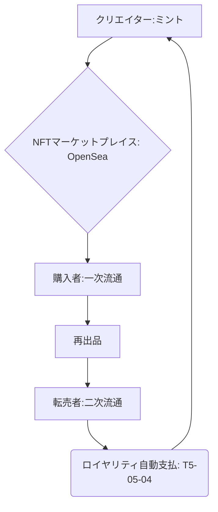

# T5-05-02 NFTマーケットプレイス

## Summary（5つの要点）

1. **デジタル資産の流通ハブ**: **NFT（デジタルアート、ゲームアイテム、コレクタブルズ）の発行、販売、転売の場を提供。OpenSeaが世界最大** `(1)`。
2. **クリエイターへの直接還元**: **仲介業者を介さず、クリエイターが直接ユーザーにNFTを販売（ミント）し、最大限の収益を得る**。
3. **二次流通ロイヤリティ**: **NFTがユーザー間で転売されるたびに、スマートコントラクトに基づきクリエイターに自動でロイヤリティが支払われる（T5-05-04と連携）**。
4. **日本のプラットフォーム**: **Coincheck NFT、楽天NFT、Adam byGMOなど、日本の規制に準拠した日本円建てのマーケットが登場**。
5. **ユーザー体験の改善**: **ガス代の低減（T5-05-01）、メタバースウォレット（T5-05-05）とのシームレスな連携により、一般ユーザーの利用ハードルを下げる**。

#### 概念図

---

### 技術評価表（定量的な視点）
| 評価項目 | 評価 | 根拠 |
| :--- | :--- | :--- |
| 導入コスト | ⭐⭐⭐⭐☆ | **既存マーケットの利用は低コスト。自社開発は高額** |
| 技術成熟度 | ⭐⭐⭐⭐☆ | **OpenSeaの安定運用で成熟。日本円対応は途上** `(1)` |
| 日本の競争力 | ⭐⭐⭐☆☆ | **海外プラットフォームが優勢。日本特有のコンテンツで差別化** |
| 市場性 | ⭐⭐⭐⭐⭐ | **デジタルコンテンツ経済の核心。ブランド企業の参入が増加** |
| 品質保証の重要性 | ⭐⭐⭐⭐⭐ | **セキュリティ、詐欺対策、著作権侵害対策が信頼の根幹** |

---

## 日本の立ち位置・強み弱みのSummary

### 強み：日本企業や研究機関が持つ独自の技術、優位性などを箇条書きで記述。

* **コンテンツ力を活用したマーケット**: **アニメ、ゲームIPを活用した日本独自のコレクタブルズ市場で強み**。
* **安心・安全な規制準拠**: **大手金融機関（Coincheck）系のマーケットが、日本の厳格な法規制に準拠して運営**。
* **日本円建て取引の実現**: **日本円を直接使用してNFTを購入できるマーケットが登場し、一般ユーザーの利用を促進**。

### 弱み：日本が抱える規制、標準化の遅れ、海外依存などを箇条書きで記述。

* **グローバル市場との分断**: **日本円建てのマーケットは利便性が高い反面、海外の主流マーケット（仮想通貨建て）との流動性の共有が難しい**。
* **二次流通ロイヤリティの課題**: **海外マーケットではロイヤリティ支払いを排除する動きもあり、技術的・法的整備が課題**。
* **流動性の不足**: **海外の大型マーケットに比べ、取引量と参加者数が少なく、価格発見機能が低い**。

---

## 技術ロードマップ（短期/中期/長期）

### 短期目標（～2027年）

* **日本の主要マーケットがT5-05-01のレイヤー2チェーンに対応し、取引手数料と時間を大幅に削減**。
* **NFTの出品・購入に関するガイドライン（詐欺対策、著作権確認）を日本NFT協会などが策定**。
* **T5-05-05のウォレットとの連携を強化し、マーケットプレイスにウォレットが統合されたようなユーザー体験を実現**。

### 中期目標（2028年～2031年）

* **メタバース資産（T5-05-03）の専門マーケットプレイスが成長し、ゲーム間の相互運用性を担う取引所として機能**。
* **NFTを担保とした金融（NFT Fi）サービスと統合。マーケットプレイス内でNFTを貸し出し・借り入れできるようになる**。
* **T5-05-04の知的財産権管理システムと完全に連携し、著作権侵害のNFTを自動で排除する機能を実装**。

### 長期目標（2032年～2035年）

* **NFTマーケットが地域特化型DAO（T5-04-06）の資金調達・ガバナンスの場として機能し、新しい社会経済圏を形成**。
* **物理的資産のNFT（RWA）化を専門とするマーケットが登場し、不動産や貴金属の小口化・流動性を向上させる**。

### 📚 参照リンク

1. [OpenSea: World's First and Largest NFT Marketplace](https://opensea.io/)
2. [日本暗号資産ビジネス協会: NFTに関するガイドライン](https://jcba.or.jp/)
3. [Coincheck NFT: 日本国内の主要NFTマーケット](https://nft.coincheck.com/)
