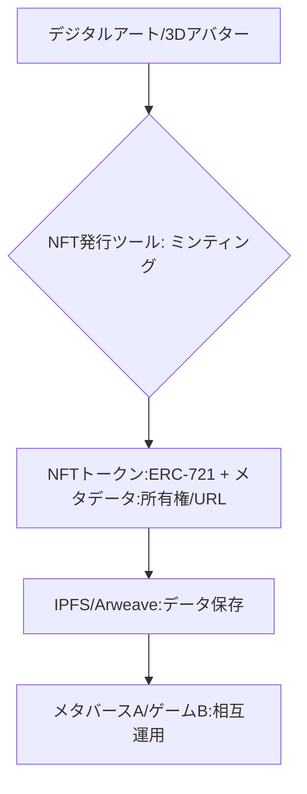

# T5-05-03 デジタルアート・メタバース資産NFT化技術

## Summary（5つの要点）

1. **デジタル資産の所有権証明**: **デジタルアート、音楽ファイル、動画などの「ファイルそのもの」ではなく、それに紐づく「唯一無二の所有権」をNFTで証明** `(1)`。
2. **メタバースアセットの標準化**: **メタバース内のアバター、衣装、土地（Land）などの3DモデルをNFT化。VR SNS「cluster」などで実用化**。
3. **ゲームアイテムの経済圏拡大**: **ゲーム内で獲得した武器やアイテムをNFT化し、ゲーム外のマーケットプレイス（T5-05-02）で販売・交換できる「Play to Earn」の基盤**。
4. **相互運用性の実現**: **異なるメタバースやゲーム間で同じNFTアバターやアイテムを使用できるようにする技術標準（例: VRMフォーマットとの連携）**。
5. **フラクショナルNFT化**: **高額なNFTを小口化し、複数のユーザーが部分的に所有できるようにする技術。投資対象としての流動性を向上**。

#### 概念図

---

### 技術評価表（定量的な視点）
| 評価項目 | 評価 | 根拠 |
| :--- | :--- | :--- |
| 導入コスト | ⭐⭐⭐☆☆ | **NFT化のツールは簡易化。3Dモデル制作に人件費** |
| 技術成熟度 | ⭐⭐⭐⭐☆ | **ERC-721などの標準は成熟。相互運用性は発展途上** `(1)` |
| 日本の競争力 | ⭐⭐⭐⭐⭐ | **アニメ・ゲームのコンテンツ制作力は世界最高水準**。
| 市場性 | ⭐⭐⭐⭐⭐ | **メタバース（T8-01）の拡大と共に資産化が進む**。
| 品質保証の重要性 | ⭐⭐⭐☆☆ | **メタデータの恒久性（ファイル保存）が課題** |

---

## 日本の立ち位置・強み弱みのSummary

### 強み：日本企業や研究機関が持つ独自の技術、優位性などを箇条書きで記述。

* **高品質なコンテンツ制作力**: **世界的に人気の高いアニメ、ゲーム、キャラクターのIPをNFT化する潜在力**。
* **VRMなどの3Dアバター標準**: **日本発の3Dアバター標準フォーマットが、メタバース間の相互運用性の基盤として機能**。
* **ゲーム会社のNFT参入**: **Square Enix、Bandai Namcoなどの大手ゲーム会社がNFT・ブロックチェーンゲームに本格参入**。

### 弱み：日本が抱える規制、標準化の遅れ、海外依存などを箇条書きで記述。

* **ゲーム内NFTの景品表示法**: **NFTが「景品」と見なされる場合の規制が不明確で、ゲーム会社が慎重になっている**。
* **メタデータの保存課題**: **NFTの本体（画像ファイルなど）が中央集権的なサーバーに保存されている場合、サーバー停止による「NFTの消滅」リスク**。
* **海外プラットフォームへの依存**: **NFTの発行・取引は依然として海外のブロックチェーン（Ethereum、Solana）に依存**。

---

## 技術ロードマップ（短期/中期/長期）

### 短期目標（～2027年）

* **NFTのメタデータをIPFSやArweaveなどの分散型ストレージに保存することを標準化し、恒久性を確保**。
* **メタバース間のアバター・アイテムの移行に関する技術標準（ERC-721とVRMの連携ガイドライン）を日本コミュニティが主導して策定**。
* **大手ゲーム会社がPlay to Earn型ゲームを発表し、実際にNFTアイテムの経済圏を構築**。

### 中期目標（2028年～2031年）

* **NFT化されたメタバース資産が、T8-01の主要メタバースプラットフォーム間間で90%以上の相互運用性を実現**。
* **ブランド企業が物理的な商品とNFTを一体化した「デジタルツイン」を発行することが一般化**。
* **音楽NFT、映画NFTなど、コンテンツのフラクショナルNFT化が進み、一般投資家がコンテンツIPに投資できるようになる**。

### 長期目標（2032年～2035年）

* **日常生活で利用する身分証明（DID）、学歴、職務経歴などの「個人の信用」がNFT化され、Web3社会の基盤となる**。
* **ゲーム会社がブロックチェーンゲームの開発に完全に移行し、NFTアイテムの取引市場がゲーム市場の中心を担う**。

### 📚 参照リンク

1. [CryptoPunks & BAYC: NFT Collectible History](https://larvalabs.com/)
2. [Cluster: VR SNSとNFTアバターの連携](https://cluster.mu/en)
3. [VRMコンソーシアム: 3Dアバターの標準フォーマット](https://vrm.dev/)
