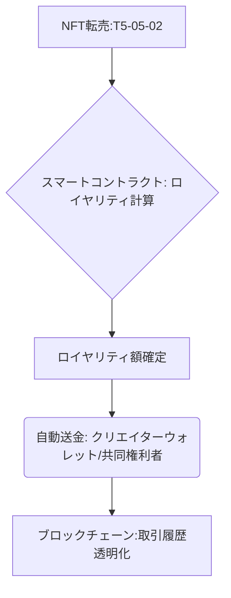

# T5-05-04 知的財産権管理・ロイヤリティ自動配分システム

## Summary（5つの要点）

1. **NFTへの権利情報記録**: **NFTのメタデータに著作権者、ライセンス条件、ロイヤリティ率などの知的財産権情報を記録**。
2. **スマートコントラクトによる自動執行**: **NFTがマーケットプレイス（T5-05-02）で転売された際、契約条件に従いロイヤリティ収益が自動的にクリエイターのウォレット（T5-05-05）へ送金される** `(1)`。
3. **透明性と即時性**: **ブロックチェーン上でロイヤリティの流れが完全に透明化され、従来の管理団体を介すより遥かに早く、即時的に配分される**。
4. **複数の権利者への自動分配**: **共同制作（例: 作曲家、作詞家、プロデューサー）の場合、定められた割合に従い収益が自動で複数のウォレットに分割送金される**。
5. **物理的資産への応用**: **NFTを物理的なコレクタブルズ（トレーディングカード、限定商品）の真贋証明・権利証明として利用**。

#### 概念図

---

### 技術評価表（定量的な視点）
| 評価項目 | 評価 | 根拠 |
| :--- | :--- | :--- |
| 導入コスト | ⭐⭐⭐⭐☆ | **スマートコントラクト開発・監査に高度な人材が必要** |
| 技術成熟度 | ⭐⭐⭐☆☆ | **NFTの二次流通ロイヤリティは実用化。著作権法上の整備が途上** `(1)` |
| 日本の競争力 | ⭐⭐⭐☆☆ | **JASRACなど既存団体の影響が大きく、新技術導入に慎重** |
| 市場性 | ⭐⭐⭐⭐⭐ | **クリエイター経済圏の発展に必須。トラックの透明性が強み** |
| 品質保証の重要性 | ⭐⭐⭐⭐⭐ | **ロイヤリティ配分の間違いは法的紛争に直結** |

---

## 日本の立ち位置・強み弱みのSummary

### 強み：日本企業や研究機関が持つ独自の技術、優位性などを箇条書きで記述。

* **IP・コンテンツの価値**: **アニメ・音楽など、世界的な強みを持つ日本のIPに対し、ロイヤリティ自動配分は極めて有効**。
* **信頼性の高い開発**: **ブロックチェーンの高い信頼性要求に対し、日本のソフトウェア開発の品質管理能力が活かされる**。
* **既存IPへのNFT応用研究**: **既存の著作権管理団体やIPホルダーがNFTの仕組みを利用する研究を開始**。

### 弱み：日本が抱える規制、標準化の遅れ、海外依存などを箇条書きで記述。

* **著作権管理団体との関係**: **JASRACなどの既存の管理団体が既得権益を持ち、ブロックチェーンへの移行が遅れる可能性**。
* **法的フレームワークの不足**: **スマートコントラクトによるロイヤリティ支払いの法的有効性、税務上の取り扱いが不明確**。
* **権利関係の複雑さ**: **日本のコンテンツは権利者が複数にわたることが多く、NFT化するための合意形成に時間がかかる**。

---

## 技術ロードマップ（短期/中期/長期）

### 短期目標（～2027年）

* **NFTマーケットプレイス（T5-05-02）がロイヤリティ自動配分機能を標準で実装し、ロイヤリティを支払わない取引を原則禁止**。
* **NFTに関する知的財産権の登録・管理システムの法的有効性に関する政府ガイドラインを策定**。
* **音楽、アートの分野で、複数の権利者への分配を自動化するスマートコントラクトの実証実験を完了**。

### 中期目標（2028年～2031年）

* **NFTに関する著作権管理を担う「分散型管理団体（DMO）」が日本で法人格を得て設立**。
* **物理的なコンテンツ（漫画、映画）の利用許諾もNFTベースで行われ、ブロックチェーン上でロイヤリティが管理されるようになる**。
* **ロイヤリティ収益の自動分配と連携した税務申告システムを開発し、クリエイターの申告負担を軽減**。

### 長期目標（2032年～2035年）

* **NFTがIP管理の世界標準となり、世界中のコンテンツの流通・収益配分がブロックチェーン上で自律的に行われる「ロイヤリティ・オートノミー社会」を実現**。
* **著作権、特許権、商標権など全ての知的財産権がNFT化され、分割不可能な所有権として取引・管理される**。

### 📚 参照リンク

1. [WIPO: Blockchain and Intellectual Property](https://www.wipo.int/portal/en/index.html)
2. [Royal: 音楽ロイヤリティのトークン化事例](https://royal.io/)
3. [文化庁: 著作権法とブロックチェーン技術](https://www.bunka.go.jp/)
