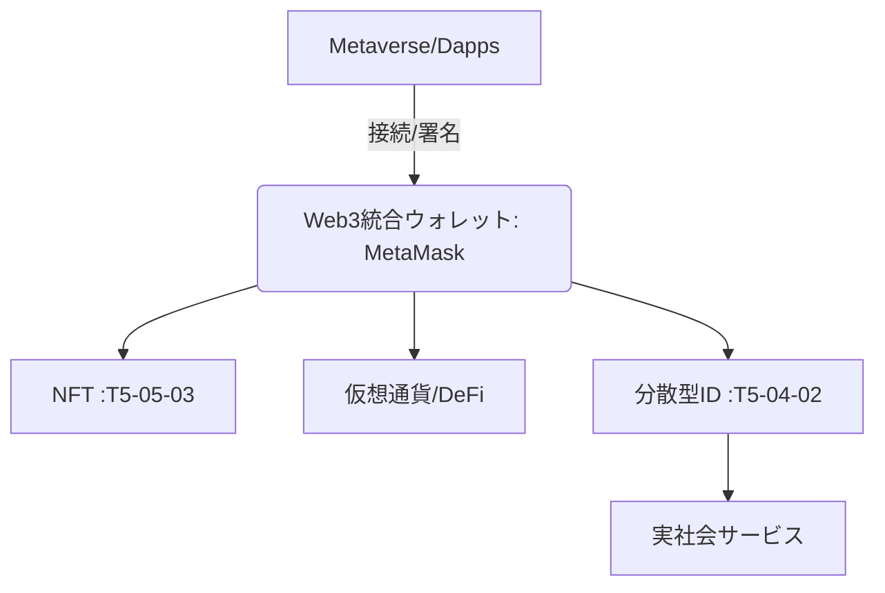

# T5-05-05 メタバース・Web3統合ウォレット

## Summary（5つの要点）

1. **デジタル資産の一元管理**: **NFT（T5-05-03）、仮想通貨（Ether、Polygonなど）、および分散型ID（T5-04-02）を統合的に保管・管理するソフトウェア（ウォレット）** `(1)`。
2. **ブロックチェーンへの接続**: **Dapps（分散型アプリ）やNFTマーケットプレイス（T5-05-02）への接続、取引への署名を行うためのインターフェースとして機能**。
3. **個人の自己主権型ID**: **ウォレットが個人のデジタルアイデンティティの基点となり、ユーザーは自らの情報（ID、資格、評価）を管理・提示できる（セルフソブリンID）**。
4. **メタバース相互運用の基盤**: **異なるメタバースプラットフォームに移動する際も、同じウォレットを使用することでNFTアバターやアイテムを持ち運ぶ（ローミング）ことを可能に**。
5. **日本の規制への対応**: **日本の資金決済法や犯罪収益移転防止法などの規制に対応した「カストディアルウォレット」の開発や、法的整備が課題**。

#### 概念図

---

### 技術評価表（定量的な視点）
| 評価項目 | 評価 | 根拠 |
| :--- | :--- | :--- |
| 導入コスト | ⭐⭐☆☆☆ | **ユーザー側の導入コストは低いが、セキュリティコストは高い** |
| 技術成熟度 | ⭐⭐⭐⭐☆ | **MetaMaskなどは成熟。日本の規制対応型は途上** `(1)` |
| 日本の競争力 | ⭐⭐⭐☆☆ | **主要ウォレットは海外製（MetaMask）。日本の規制対応で独自化を図る** |
| 市場性 | ⭐⭐⭐⭐⭐ | **Web3への必須エントリーポイント。金融、IDの統合へ** |
| 品質保証の重要性 | ⭐⭐⭐⭐⭐ | **セキュリティの最終防衛線。秘密鍵（シードフレーズ）の紛失・漏洩は資産喪失に直結** |

---

## 日本の立ち位置・強み弱みのSummary

### 強み：日本企業や研究機関が持つ独自の技術、優位性などを箇条書きで記述。

* **金融機関によるカストディ（保管）技術**: **仮想通貨交換業者や銀行系企業による高度な資産保管・管理システム**。
* **公的IDとの連携への期待**: **マイナンバーカードなどの公的IDをDIDとしてウォレットに統合する検討が進む**。
* **ユーザー支援の充実**: **日本語による秘密鍵の保管ガイドラインなど、安心して使用するための情報提供が行われている**。

### 弱み：日本が抱える規制、標準化の遅れ、海外依存などを箇条書きで記述。

* **自由度の高いウォレットへの規制**: **非カストディアルウォレットの個人間送金に対する法的整備が進まず、利用が制限される可能性**。
* **ユーザーのセキュリティ意識**: **秘密鍵を自ら管理する「自己主権型」に対する理解が低く、紛失・盗難のリスクが高い**。
* **メタバース標準の遅れ**: **海外製ウォレットがメタバース間の相互運用性の標準を握っているため、日本のプラットフォームは追従せざるを得ない**。

---

## 技術ロードマップ（短期/中期/長期）

### 短期目標（～2027年）

* **金融庁と連携し、非カストディアルウォレットの利用を前提とした規制（トラベルルールなど）を整備**。
* **日本の主要NFTマーケット（T5-05-02）が主要な海外製ウォレットと完全に連携し、日本円建て取引を可能に**。
* **IoTデバイス（スマートウォッチ、指紋センサー）を活用したウォレットの二段階認証・生体認証を標準化**。

### 中期目標（2028年～2031年）

* **ウォレットがT5-04-02のDIDと完全に統合され、「ウォレットID」が日常生活のデジタル身分証として機能**。
* **ハードウェアウォレット（秘密鍵を物理的に保管）の日本産業規格を策定し、国産ハードウェアウォレットの開発を推進**。
* **銀行口座とNFT資産がウォレット内で連携し、税務申告や資産管理（T16-04-01）が自動化される**。

### 長期目標（2032年～2035年）

* **個人のウォレットが生体情報（指紋、網膜）と完全に紐づき、ウォレットアプリを介さずに取引への署名が可能となる「インプラント型Web3インターフェース」を実現**。
* **全てのメタバース、ゲームがウォレットローミングに対応し、デジタル資産の国境なき移動が完全に普及**。

### 📚 参照リンク

1. [MetaMask: The leading Web3 wallet](https://metamask.io/)
2. [自民党Web3プロジェクトチーム: Web3の推進に向けた提言](https://www.jimin.jp/news/policy/203498.html)
3. [金融庁: 暗号資産に関する制度整備について](https://www.fsa.go.jp/)
