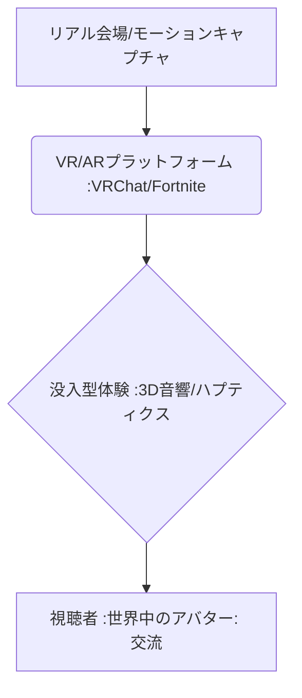

# T5-06-01 没入型VR/ARライブエンターテインメント

## Summary（5つの要点）

1. **空間を超えた体験**: **コンサート、演劇、スポーツ観戦をVR/AR技術で提供**。物理的な場所の制約を受けず、自宅から没入感の高い体験が可能。
2. **グローバルな集結**: **バーチャル会場に世界中のファンがアバターとして集結**し、リアルタイムでの交流や、アーティストとのインタラクションを実現。
3. **先行事例**: **Fortnite（トラヴィス・スコット バーチャルコンサート1200万人参加）、Roblox、VRChat**などが大規模なライブエンターテインメントを成功させている。
4. **日本の強み**: **VTuberライブ、バーチャルマーケット**など、日本のアニメ・キャラクター文化を活かしたバーチャルイベントが先行し、高品質なコンテンツを提供。
5. **必要技術**: **リアルタイム3Dレンダリング（T8-01-01）、モーションキャプチャ、低遅延ストリーミング、3D音響（空間音響）**が没入感の鍵。

#### 概念図

---

### 技術評価表（定量的な視点）
| 評価項目 | 評価 | 根拠 |
| :--- | :--- | :--- |
| 導入コスト | ⭐⭐⭐☆☆ | **大規模ライブには専用サーバとハイクオリティな3Dモデル制作が必要** |
| 技術成熟度 | ⭐⭐⭐⭐☆ | **プラットフォームは成熟。リアルタイムモーションキャプチャの安定性が向上** |
| 日本の競争力 | ⭐⭐⭐⭐⭐ | **VTuber、アニメIP、高品質な3Dアバター文化で世界をリード** |
| 市場性 | ⭐⭐⭐⭐⭐ | **エンタメ、教育、企業のイベント利用で市場拡大が確実** |
| 品質保証の重要性 | ⭐⭐⭐⭐⭐ | **遅延、サーバーダウン、描画の乱れは没入感を即座に損なう** |

---

## 日本の立ち位置・強み弱みのSummary

### 強み：日本企業や研究機関が持つ独自の技術、優位性などを箇条書きで記述。

* **VTuber文化の世界的優位性**: **ホロライブ、にじさんじなど、VTuberを核としたバーチャルライブでの高い集客力とノウハウ**。
* **高品質なコンテンツIP**: **ゲーム、アニメ、音楽IPをバーチャル空間で展開する際のコンテンツの多様性と魅力**。
* **アバター技術の標準化**: **VRMなど日本発のアバターフォーマットが、メタバースでの相互運用性を促進（T5-05-03関連）**。

### 弱み：日本が抱える規制、標準化の遅れ、海外依存などを箇条書きで記述。

* **プラットフォームの海外依存**: **VRChat、Roblox、Meta Horizon Worldsなど、大規模プラットフォームは米国勢が支配**。
* **HMDハードウェアの不在**: **Meta Quest、Apple Vision Proに対抗する国産の高性能なVR/ARヘッドマウントディスプレイが未確立**。
* **ネットワークインフラの課題**: **多数の参加者によるリアルタイムでのデータ通信を支えるエッジコンピューティングや5Gインフラの最適化が途上**。

---

## 技術ロードマップ（短期/中期/長期）

### 短期目標（～2027年）

* **VR/ARデバイスの軽量化・高性能化（T8-01関連）**が進み、一般ユーザーの利用率が50%を突破。
* **ハプティクス（触覚）フィードバックデバイス**との連携を強化し、振動や温度を体験に統合。
* **VTuberライブでの同時参加者数**が現在の数十万人規模から**100万人規模**に拡大。

### 中期目標（2028年～2031年）

* **現実のスポーツ観戦**に**ARオーバーレイ**が普及し、選手のスタッツや軌跡がリアルタイムで視覚化される。
* **メタバース（T8-01）の相互運用性**が確立し、異なるプラットフォーム間で同じアバターやチケットが利用可能に。
* **匂いや味覚をデジタルで再現する技術**が開発され、五感全てで没入体験を提供する実験を開始。

### 長期目標（2032年～2035年）

* **VRライブがリアルライブの収益を上回る**主要なエンターテインメント形態として定着。
* **ブレイン・マシン・インターフェース（BMI）**が導入され、思考や感情が直接アバターの表現に反映される超没入型体験が実現。

### 📚 参照リンク

1. [VRChat: バーチャルソーシャルVRプラットフォーム](https://www.vrchat.com/)
2. [Fortnite: バーチャルコンサートの成功事例](https://www.epicgames.com/fortnite/)
3. [クラスター株式会社: 日本発のメタバースプラットフォーム](https://cluster.mu/ja)
