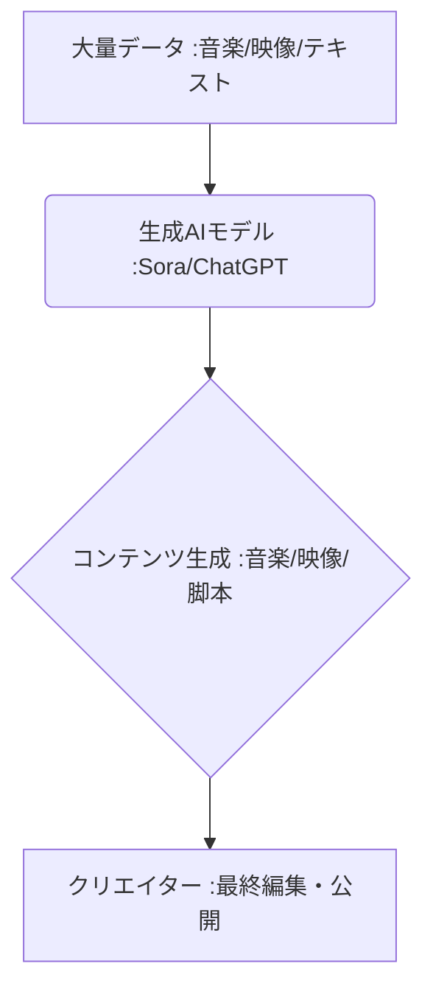

# T5-06-02 AI生成コンテンツ（音楽、映像、脚本）

## Summary（5つの要点）

1. **制作の民主化**: **Stable Diffusion、Midjourney、ChatGPT、Soraなどの生成AI**により、プロンプト入力だけで高品質な音楽、イラスト、動画、脚本を自動生成。
2. **クリエイター支援**: 制作の初期段階や反復作業（例：背景イラスト、BGM作成）をAIが担い、**クリエイターは創造性が必要な部分に集中**できる。
3. **AIによるヒット**: AIが作曲した楽曲がヒットチャート入り（例：Holly Herndon）、AIが書いた小説が文学賞の候補になるなど、**AI自身の作品が市場を持つ**。
4. **課題（著作権・権利）**: **学習データセットの適法性、AI生成物の著作権の帰属、クリエイターの権利保護**が世界的に大きな課題となっている。
5. **必要技術**: **大規模言語モデル（LLM）、拡散モデル（Diffusion Model）、GAN（敵対的生成ネットワーク）**など、高度な深層学習アルゴリズム。

#### 概念図

---

### 技術評価表（定量的な視点）
| 評価項目 | 評価 | 根拠 |
| :--- | :--- | :--- |
| 導入コスト | ⭐⭐⭐⭐⭐ | **クラウドサービス利用により、個人でも低コストで導入可能** |
| 技術成熟度 | ⭐⭐⭐⭐☆ | **短期間で驚異的に進化。特に映像生成（Sora）はブレイクスルー** |
| 日本の競争力 | ⭐⭐⭐☆☆ | **基盤モデルは米国が先行。アニメ・ゲームへの応用力で強み** |
| 市場性 | ⭐⭐⭐⭐⭐ | **エンタメ、広告、教育など全産業で必須のツールとなる** |
| 品質保証の重要性 | ⭐⭐⭐☆☆ | **「偽情報（フェイク）」生成リスク、著作権侵害リスクの管理** |

---

## 日本の立ち位置・強み弱みのSummary

### 強み：日本企業や研究機関が持つ独自の技術、優位性などを箇条書きで記述。

* **アニメ・ゲーム特化AI**: **日本のコンテンツに特化した画像生成AI（例：二次元イラスト）の開発で世界的な優位性**。
* **クリエイター文化との融合**: **AIを「ツール」として活用し、人間とAIが協調して制作を行うノウハウの蓄積**。
* **日本語LLMの開発**: **日本語の機微を理解し、小説や脚本を生成する大規模言語モデルの研究開発**。

### 弱み：日本が抱える規制、標準化の遅れ、海外依存などを箇条書きで記述。

* **基盤モデルの海外依存**: **Sora、ChatGPT、Midjourneyなど、最先端の基盤モデルは米国企業が開発**。
* **著作権法の国際的な不均衡**: **著作権法の「非享受目的」利用の解釈が海外と異なり、日本のAI開発が制約を受ける懸念**。
* **学習データセットの質・量**: **AI学習に必要な質の高い日本語コンテンツのデータセット化が遅延**。

---

## 技術ロードマップ（短期/中期/長期）

### 短期目標（～2027年）

* **AI生成コンテンツの著作権に関する国際的なガイドライン**を、日本政府や業界団体が主導して策定。
* **音楽、映像制作のプロフェッショナル向けAIツール**が普及し、制作期間が平均30%以上短縮。
* **AI生成物か否かを識別する電子透かし技術（ウォーターマーク）**が標準搭載される。

### 中期目標（2028年～2031年）

* **AIが企画から脚本、主要な映像アセットまでを一貫して自動生成**する「AIスタジオ」が設立。
* **AI生成コンテンツのロイヤリティ自動配分システム（T5-05-04）**が実装され、学習元クリエイターへの還元が実現。
* **AIが感情認識AI（T5-06-04）と連携**し、視聴者の反応に応じた即時的なシナリオ変更や結末の調整を実現。

### 長期目標（2032年～2035年）

* **AIが人間を完全に凌駕する**創造性を持つコンテンツを生成し、エンタメ産業の構造が根本から変化。
* **個人が自身の思考や夢を直接出力**し、AIがコンテンツ化する「ブレイン・コンテンツ」が一般化。

### 📚 参照リンク

1. [OpenAI Sora: Text-to-Video Generation](https://openai.com/sora)
2. [Stable Diffusion WebUI](https://github.com/AUTOMATIC1111/stable-diffusion-webui)
3. [文化庁: 著作権法とAIに関する検討状況](https://www.bunka.go.jp/)
