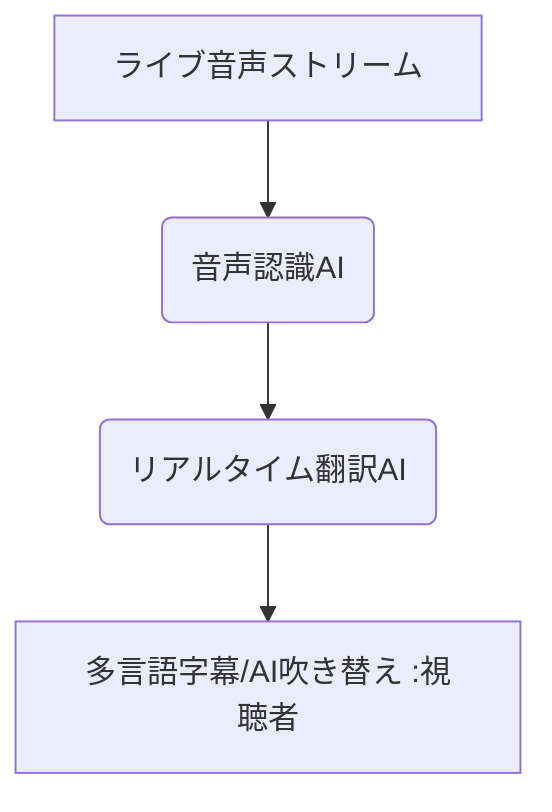

# T5-06-03 リアルタイム翻訳・字幕生成（多言語ライブ配信）

## Summary（5つの要点）

1. **言葉の壁の解消**: **ライブ配信中の音声入力をリアルタイムで認識し、複数の言語に翻訳して字幕表示**。コンテンツのグローバル展開を可能にする。
2. **仕組み**: **高精度な音声認識AI（ASR）**が話者の音声をテキスト化し、次に**NMT（ニューラル機械翻訳）**がそれを翻訳、視聴者に字幕として表示。
3. **先行事例**: **YouTubeの自動字幕機能、ホロライブ（VTuber）**の多言語同時配信などで実用化が進み、海外ファンとのエンゲージメントを強化。
4. **AIアナウンサー**: **合成音声技術**により、リアルタイムで多言語の音声（吹き替え）を生成することが可能になり、より自然な視聴体験を提供。
5. **必要技術**: **低遅延で高精度な音声認識**と、**話者のイントネーションや文脈を考慮した機械翻訳（コンテキスト依存翻訳）**。

#### 概念図

---

### 技術評価表（定量的な視点）
| 評価項目 | 評価 | 根拠 |
| :--- | :--- | :--- |
| 導入コスト | ⭐⭐⭐⭐☆ | **主要プラットフォームに標準搭載。カスタム開発は高額** |
| 技術成熟度 | ⭐⭐⭐⭐☆ | **主要言語での翻訳精度は高いが、専門用語やスラングに課題** |
| 日本の競争力 | ⭐⭐⭐⭐⭐ | **VTuberによる多言語配信の実績、日本語特有の文脈解析で強み** |
| 市場性 | ⭐⭐⭐⭐⭐ | **グローバル展開する全てのコンテンツに必須の機能** |
| 品質保証の重要性 | ⭐⭐⭐⭐☆ | **誤訳は誤解や炎上に直結。特に文化的な機微の翻訳精度が重要** |

---

## 日本の立ち位置・強み弱みのSummary

### 強み：日本企業や研究機関が持つ独自の技術、優位性などを箇条書きで記述。

* **VTuber配信での実績**: **VTuber文化を通じて、同時通訳技術を実戦的に磨き、配信コンテンツに最適化**。
* **日本語の文脈・表現解析技術**: **主語の省略が多い日本語に特化した、自然な表現を生成する翻訳AI技術**。
* **政府・自治体の多言語対応**: **災害情報、行政サービスにおける多言語情報提供の必要性から、実用化のニーズが高い**。

### 弱み：日本が抱える規制、標準化の遅れ、海外依存などを箇条書きで記述。

* **基盤となるAIモデルの海外依存**: **Google、Microsoftなど、大規模なNMTモデルの開発は海外勢が先行**。
* **音声認識の環境依存性**: **ライブ特有の雑音、複数の話者の同時発話に対する認識精度の維持が難しい**。
* **法的なリスク**: **公の場での誤訳が信用問題や国際紛争に発展するリスクに対する法的なフレームワークが未整備**。

---

## 技術ロードマップ（短期/中期/長期）

### 短期目標（～2027年）

* **翻訳の遅延時間（レイテンシ）**を、人間の同時通訳レベルである**2秒未満**に短縮。
* **AIアナウンサーによる多言語吹き替え**が、主要なライブ配信プラットフォームで標準機能として実装。
* **専門用語やスラング**を配信ジャンルに応じて学習・適用する**パーソナライズ翻訳**が実現。

### 中期目標（2028年～2031年）

* **話者の感情認識AI（T5-06-04）**と連携し、**感情を込めた翻訳音声**や、字幕に感情表現のマークを付加。
* **手話認識AI**との連携により、聴覚障害者向けに手話アバターによるリアルタイム通訳を実現。
* **方言や地域特有の表現**も認識・翻訳できる、地域特化型のリアルタイム翻訳サービスが普及。

### 長期目標（2032年～2035年）

* **AIが話者の意図（ユーモア、皮肉など）**を完全に理解し、**文化的背景を踏まえた超訳**をリアルタイムで提供。
* **言語学習者がAI通訳を介さずに、外国語で交流できる**ためのトレーニング機能が統合。

### 📚 参照リンク

1. [Google AI Blog: Real-Time Translation with Neural Networks](https://ai.googleblog.com/)
2. [ホロライブプロダクション: 多言語配信の取り組み](https://www.hololive.tv/)
3. [NICT: 翻訳技術の研究開発](https://www.nict.go.jp/)
