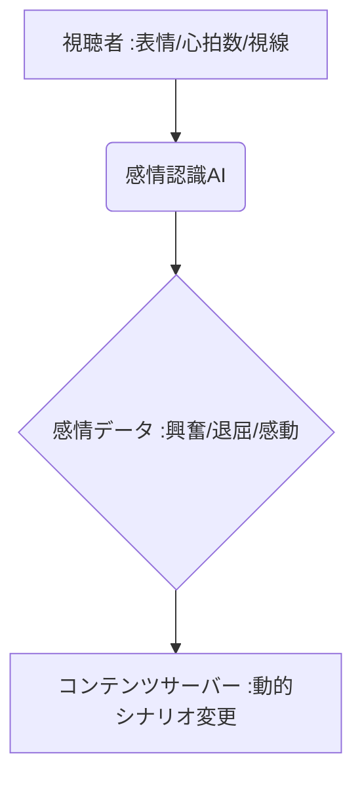

# T5-06-04 感情認識AI・視聴体験パーソナライゼーション

## Summary（5つの要点）

1. **感情のリアルタイム把握**: **カメラ、マイク、ウェアラブルデバイス**などを通じて、視聴者の**表情、心拍数、声のトーン、視線**をAIで分析し、感情状態（興奮、退屈、感動など）をリアルタイムで把握。
2. **動的コンテンツ変化**: 収集した感情データに基づき、**コンテンツの展開、音楽、カメラアングル、照明演出**などを動的に変化させる**インタラクティブ・エンターテインメント**。
3. **先行事例**: **Netflix「ブラック・ミラー: バンダースナッチ」**が、視聴者の選択によって物語が分岐するインタラクティブ作品の先駆け。
4. **エンゲージメント最大化**: **退屈な視聴者にはより刺激的な展開**を、**感動している視聴者には静かな余韻**を与えるなど、視聴者個々のエンゲージメントを最大化。
5. **プライバシー課題**: **生体情報や感情データ**という機密性の高いデータを扱うため、**プライバシー保護とセキュリティ対策**が極めて重要。

#### 概念図

---

### 技術評価表（定量的な視点）
| 評価項目 | 評価 | 根拠 |
| :--- | :--- | :--- |
| 導入コスト | ⭐⭐⭐☆☆ | **センサーやAIの設置が必要。汎用デバイス利用でコスト低下傾向** |
| 技術成熟度 | ⭐⭐⭐☆☆ | **表情認識は成熟。視線、心拍数からの複雑な感情把握は途上** |
| 日本の競争力 | ⭐⭐⭐⭐☆ | **ヒューマンインターフェース、ロボット分野での感情認識研究に強み** |
| 市場性 | ⭐⭐⭐⭐⭐ | **広告、教育、医療、エンタメの全分野でパーソナライズニーズが高い** |
| 品質保証の重要性 | ⭐⭐⭐⭐⭐ | **プライバシー保護、データ漏洩のセキュリティが最重要** |

---

## 日本の立ち位置・強み弱みのSummary

### 強み：日本企業や研究機関が持つ独自の技術、優位性などを箇条書きで記述。

* **ロボティクス研究からの応用**: **ロボットのインタラクション研究で培われた、人間の感情を推定・応答するAI技術の蓄積**。
* **ウェアラブルデバイスとの連携**: **スマートウォッチ、VR/ARデバイス（T8-01）からの心拍数、脳波データ取得技術で先行**。
* **繊細な感情表現の文化**: **アニメやゲームにおけるキャラクターの複雑な感情表現をAIで再現・分析するノウハウ**。

### 弱み：日本が抱える規制、標準化の遅れ、海外依存などを箇条書きで記述。

* **生体情報利用の規制**: **個人情報保護法、医療情報関連法による生体・感情データの収集・利用に関する規制が厳しく、データ取得が進まない**。
* **標準的なデータセットの不足**: **多様な年齢層、文化を持つ人々の感情データを集めた標準的なデータセットの整備が遅れ**。
* **消費者からの抵抗感**: **「見られている」という感覚に対する消費者からの心理的な抵抗感が、欧米に比べ高い**。

---

## 技術ロードマップ（短期/中期/長期）

### 短期目標（～2027年）

* **配信プラットフォーム**が、視聴者の**「退屈」と「興奮」の二極の感情**を検出するAIを導入し、コンテンツの離脱率低減に活用。
* **感情データの匿名化・セキュアな利用**に関する政府ガイドラインを策定。
* **VR/ARライブ（T5-06-01）**で、視聴者の熱量に応じてアーティストの演出がリアルタイムで変化する機能を実装。

### 中期目標（2028年～2031年）

* **脳波・BMI（ブレイン・マシン・インターフェース）技術**がエンタメ分野に導入され、思考や潜在的な欲求に応じたコンテンツが自動生成（T5-06-02と連携）。
* **教育、医療分野**で感情認識AIが実用化され、生徒や患者の感情状態に応じた最適な指導・治療を行う。
* **AIが視聴者の感情を先読み**し、最適なタイミングで広告や推奨コンテンツを提示。

### 長期目標（2032年～2035年）

* **AIが人間の感情を完全にシミュレート**し、人間を超える感情表現を持つAIキャラクターやコンテンツが誕生。
* **個人が自身の感情データをNFT化**し、データ利用の対価として収益を得る仕組み（トークンエコノミーT5-06-05と連携）が普及。

### 📚 参照リンク

1. [Affectiva: 感情認識AIのリーディングカンパニー](https://www.affectiva.com/)
2. [理化学研究所: 脳情報解析技術の研究](https://www.riken.jp/)
3. [日本ヒューマンインタフェース学会](https://www.his.gr.jp/)
