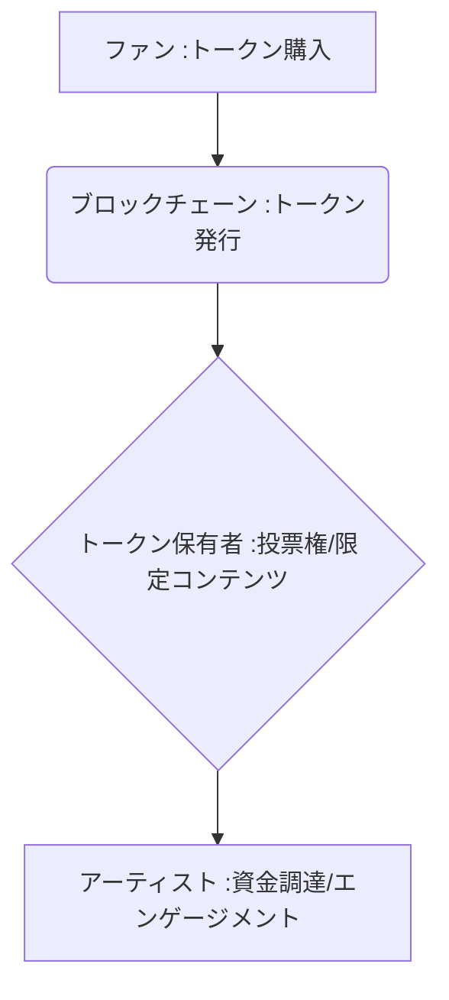

# T5-06-05 ブロックチェーン・トークンエコノミー（ファンエンゲージメント）

## Summary（5つの要点）

1. **直接支援・共同創造**: **ファンがトークンを購入することでアーティストやクリエイターの活動を直接的に支援**し、ファンがコミュニティの意思決定に参加する**DAO（分散型自律組織）**の概念を適用。
2. **権利のトークン化**: **トークン保有者には限定コンテンツへのアクセス権、活動方針への投票権、将来の収益分配権**など、多様な特典が付与される。
3. **先行事例**: **音楽業界の3LAU、Royal**が音楽ロイヤリティをトークン化。**日本ではFiNANCiE（スポーツ選手、団体）**、Anique（アーティスト）がファンコミュニティトークンサービスを提供。
4. **資金調達の革新**: 従来のクラウドファンディングとは異なり、**トークンが二次流通可能**（T5-05-02関連）な流動性を持つ資産となり、ファンとクリエイター双方にメリット。
5. **必要技術**: **ブロックチェーン基盤（T5-05-01）、スマートコントラクト**による権利の自動執行、**トークン発行規格（ERC-20）**。

#### 概念図

---

### 技術評価表（定量的な視点）
| 評価項目 | 評価 | 根拠 |
| :--- | :--- | :--- |
| 導入コスト | ⭐⭐⭐☆☆ | **プラットフォームの利用は容易。トークン設計と法務コストが高い** |
| 技術成熟度 | ⭐⭐⭐☆☆ | **技術は成熟。法的規制（金融商品取引法、資金決済法）対応が途上** |
| 日本の競争力 | ⭐⭐⭐⭐☆ | **FiNANCiEなど、規制に準拠したコミュニティトークンで先行** |
| 市場性 | ⭐⭐⭐⭐⭐ | **ファン経済のデジタル化とエンゲージメント向上の切り札** |
| 品質保証の重要性 | ⭐⭐⭐⭐⭐ | **トークンの流動性、権利の保証、詐欺対策が信頼の根幹** |

---

## 日本の立ち位置・強み弱みのSummary

### 強み：日本企業や研究機関が持つ独自の技術、優位性などを箇条書きで記述。

* **規制準拠のノウハウ**: **金融庁などの規制当局と連携し、トークン発行・運用を法的に安全に行うノウハウが蓄積**。
* **強力なファンベース**: **アニメ、アイドル、スポーツなど、世界的に見て熱量の高いファンコミュニティ（IP）を保有**。
* **国内プラットフォームの存在**: **FiNANCiE、Gaudiyなど、日本市場に特化したファンコミュニティプラットフォームが成長**。

### 弱み：日本が抱える規制、標準化の遅れ、海外依存などを箇条書きで記述。

* **トークン取引の税制課題**: **暗号資産と同様に「雑所得課税」となるケースが多く、ファンがトークン保有による利益を享受しにくい**。
* **法的位置づけの不明確さ**: **トークンが「モノ」なのか「証券」なのかの判断が複雑で、新規参入の障壁となっている**。
* **DAO法制度の遅れ**: **トークン保有者による意思決定（DAO）の法的枠組み（法人格）が未整備**。

---

## 技術ロードマップ（短期/中期/長期）

### 短期目標（～2027年）

* **ファンコミュニティトークン**の**税制上の優遇措置**（例：少額の非課税枠の創設）を政府が検討。
* **スポーツチーム、VTuber事務所**などがトークンエコノミーを導入し、コミュニティ運営の収益化を加速。
* **NFT（T5-05）とファンコミュニティトークン**を連携させ、NFTのロイヤリティ収益をトークン保有者に自動分配。

### 中期目標（2028年～2031年）

* **DAO（分散型自律組織）**に法人格を付与するための**法整備**が進み、コミュニティが自律的な経済圏として機能。
* **アーティストとの共創プロジェクト**がトークンエコノミー内で標準化され、ファンが初期投資から収益分配まで参加。
* **地域活性化**のための**「地域コミュニティトークン」**が普及し、地域経済の活性化に貢献。

### 長期目標（2032年～2035年）

* **エンタメ産業の資金調達**が、**銀行融資やVC投資からトークンファイナンスに大きく移行**。
* **個人の信用や活動実績**がNFT化され、それを担保に**トークンを発行**する「自己トークン化」が一般化。

### 📚 参照リンク

1. [FiNANCiE: コミュニティトークン発行プラットフォーム](https://www.financie.jp/)
2. [Royal: Music Royalty Tokenization](https://royal.io/)
3. [日本DAO協会: DAOの法整備に関する提言](https://www.dao.or.jp/)
