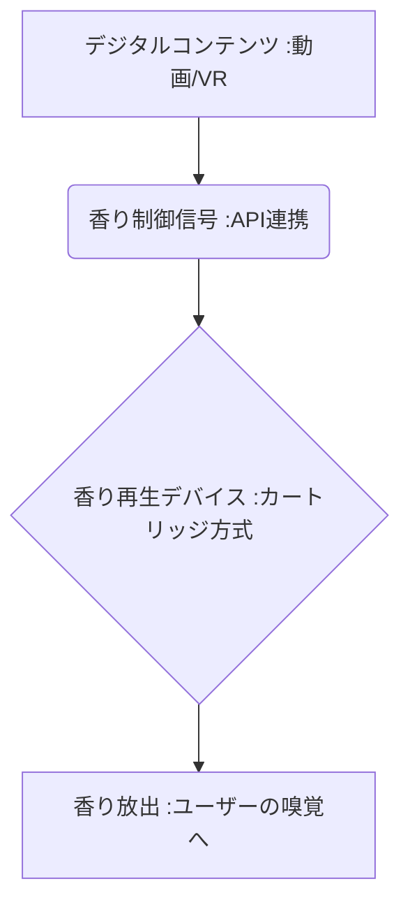

# T5-07-01 デジタル嗅覚デバイス・香り再生技術

## Summary（5つの要点）

1. **香りのデジタル化**: **電気信号で香り成分を生成・放出し、デジタルコンテンツ（映画、VR/AR、ゲーム）の臨場感を高める**技術。
2. **再生方式**: **マイクロ流体技術や電子制御**を用いて、複数の香り素（カートリッジ）を瞬時に組み合わせて狙った香りを再現する。
3. **ウェアラブル化**: **Aromajoin（日本）**が首にかけるウェアラブルデバイスを開発するなど、持ち運び可能で個人に最適化されたデバイスが進化。
4. **没入型体験への応用**: **VRヘッドセット（T8-01関連）**と連動し、仮想空間での体験（例：森の香り、コーヒーの香り）の没入感を極限まで高める。
5. **課題**: **香りの即時的な切り替え、再生できる香りの種類の豊富さ（レパートリー）、デバイスの小型化とコスト**が大きな課題。

#### 概念図

---

### 技術評価表（定量的な視点）
| 評価項目 | 評価 | 根拠 |
| :--- | :--- | :--- |
| 導入コスト | ⭐⭐⭐☆☆ | **一般向けデバイスは普及途上だが、専用カートリッジのランニングコストが高い** |
| 技術成熟度 | ⭐⭐⭐☆☆ | **基本的な香り再生は可能。複雑な香りの再現性、即時応答性に課題** |
| 日本の競争力 | ⭐⭐⭐⭐☆ | **Aromajoinなど、日本がウェアラブル・パーソナルデバイスで先行** |
| 市場性 | ⭐⭐⭐⭐⭐ | **エンタメ、教育、医療、リテールなど広範な応用可能性** |
| 品質保証の重要性 | ⭐⭐⭐⭐⭐ | **放出される香りの人体への安全性、正確な成分管理が必須** |

---

## 日本の立ち位置・強み弱みのSummary

### 強み：日本企業や研究機関が持つ独自の技術、優位性などを箇条書きで記述。

* **ウェアラブルデバイス技術**: **Aromajoin、Scenteeなど、小型化・携帯性に優れた香りデバイスの研究開発**。
* **電子部品・精密制御**: **日本の強みであるマイクロ流体、小型アクチュエータなどの精密電子部品技術**。
* **コンテンツとの連携**: **アニメ・ゲームコンテンツとの連携に意欲的な企業が多く、応用分野で先行**。

### 弱み：日本が抱える規制、標準化の遅れ、海外依存などを箇条書きで記述。

* **香りのデジタル標準化の遅れ**: **香り成分のデジタル記述方法（プロトコル）の国際標準化で主導権が取れていない**。
* **カートリッジのランニングコスト**: **香り素を定期的に交換する必要があり、ユーザーの継続利用の障壁**。
* **再現できる香りのレパートリー**: **現状、再現可能な香りの種類が限定的で、自然界の多様な香りの合成が難しい**。

---

## 技術ロードマップ（短期/中期/長期）

### 短期目標（～2027年）

* **VR/ARデバイス（T8-01）**との連携が標準化され、主要なメタバースプラットフォームで香り再生機能が実装。
* **デジタル香料データベース**が整備され、デバイスのレパートリーを**100種類以上**に拡大。
* **香りの再生精度**が、専門家が判別できないレベルに向上したことを実証。

### 中期目標（2028年～2031年）

* **香りコンテンツ配信プラットフォーム（T5-07-05）**が普及し、香りが付加された映画、音楽コンテンツが一般化。
* **嗅覚センサー（T5-07-04）**と連携し、ユーザーの嗅覚の状態をフィードバックしながら香りを最適化。
* **フレグランス、食品業界**で、試作品の香りを遠隔で共有・確認するビジネス利用が拡大。

### 長期目標（2032年～2035年）

* **電気信号による直接的な嗅覚刺激技術**が開発され、デバイスを介さずに脳に香りを伝送。
* **香りによる感情・記憶の操作（T5-08-01関連）**が実現し、アロマセラピーや記憶トレーニングに応用。

### 📚 参照リンク

1. [Aromajoin: The Future of Scent Technology](https://www.aromajoin.com/)
2. [Scentee: スマホ連動型香りデバイス](https://scentee.com/)
3. [Feelreal: VR用香りマスク](https://www.feelreal.com/)
