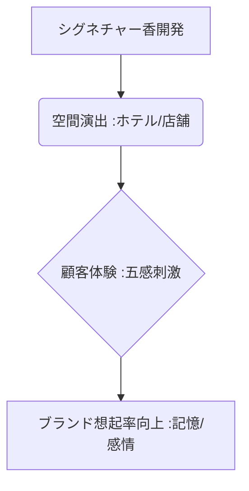

# T5-07-02 香りマーケティング・ブランディング技術

## Summary（5つの要点）

1. **五感によるブランディング**: **店舗、ホテル、イベント会場などで特定の香りを演出**し、顧客の感情や記憶に働きかけることでブランドイメージを強化。
2. **プルースト効果の活用**: **嗅覚と記憶・感情の結びつき**（プルースト効果）を利用し、顧客の**ブランド想起率や滞在時間を向上**させる。
3. **シグネチャー香**: ブランド独自の**「シグネチャー香」**を開発し、視覚・聴覚に次ぐ第三のブランドアイコンとして活用（例：高級ホテルのロビー香）。
4. **日本のサービス**: **@aroma、アットアロマ**などが、企業向けに香りの空間演出やオリジナル調香サービスを提供し、市場を牽引。
5. **デジタル連携**: **時間帯やイベント、顧客の属性**に応じて香りを動的に変化させる、**IoTディフューザーとデータ分析**（T5-06-04関連）の連携が進む。

#### 概念図

---

### 技術評価表（定量的な視点）
| 評価項目 | 評価 | 根拠 |
| :--- | :--- | :--- |
| 導入コスト | ⭐⭐⭐⭐☆ | **ディフューザー設置は容易。オリジナル香の開発コストが高い** |
| 技術成熟度 | ⭐⭐⭐⭐☆ | **ディフューザー、香りの制御技術は成熟。効果測定に課題** |
| 日本の競争力 | ⭐⭐⭐⭐⭐ | **@aromaなど、日本のサービス提供者が空間演出で高いノウハウを保有** |
| 市場性 | ⭐⭐⭐⭐⭐ | **顧客体験（CX）重視の流れで、リテール、ホテル、サービス業で需要拡大** |
| 品質保証の重要性 | ⭐⭐⭐⭐⭐ | **使用香料の安全性、香りの濃度制御による快適性の維持が必須** |

---

## 日本の立ち位置・強み弱みのSummary

### 強み：日本企業や研究機関が持つ独自の技術、優位性などを箇条書きで記述。

* **調香技術の繊細さ**: **日本の香料メーカーが持つ、複雑で繊細な香りを実現する調香技術**。
* **サービスノウハウ**: **空間デザイン、顧客導線、ブランド戦略に合わせた香りの演出提案ノウハウ**。
* **アロマテラピーとの融合**: **リラックス、集中力向上など、心理的効果を狙った香りの機能性研究**。

### 弱み：日本が抱える規制、標準化の遅れ、海外依存などを箇条書きで記述。

* **効果測定の難しさ**: **香りが売上やブランド価値に与える影響を定量的に測定する手法の標準化が遅れ**。
* **法規制の不透明さ**: **多くの人が集まる空間での香料利用に関する規制（消防法、換気基準）が明確でない**。
* **グローバル展開の課題**: **文化圏によって好まれる香りが異なり、グローバルな「シグネチャー香」の開発が困難**。

---

## 技術ロードマップ（短期/中期/長期）

### 短期目標（～2027年）

* **香りの効果を定量化**するための、**感情認識AI（T5-06-04）や生体センサー**との連携による実証実験を多数実施。
* **地域特性、季節、天気**など、外部環境データに応じた**香りの動的制御システム**を開発。
* **ホテル、自動車（カーエアコン）、イベント会場**での香り演出が標準的なサービスとして普及。

### 中期目標（2028年～2031年）

* **顧客の感情状態、購買履歴**と連携し、**個人に最適な香り**を提供するパーソナライズ化（T5-07-03）が店舗で実用化。
* **香りのデータプラットフォーム**を構築し、ブランド企業が利用した香りの効果データを共有・活用。
* **匂い検知技術（T5-07-04）**と連携し、空間の不快臭を検知した上で、最適な香りでマスキング・消臭。

### 長期目標（2032年～2035年）

* **広告、教育分野**で香りマーケティングが標準化され、学習効果、記憶定着率を最大化。
* **個人のライフスタイル**に合わせた**「パーソナルシグネチャー香」**をAIが生成し、デジタルID（T5-05-05）と連携。

### 📚 参照リンク

1. [@aroma: 香りの空間プロデュース](https://www.at-aroma.com/)
2. [スターバックス: コーヒー香によるブランディング事例](https://www.starbucks.co.jp/)
3. [プルースト効果に関する心理学研究](https://www.jstage.jst.go.jp/)
