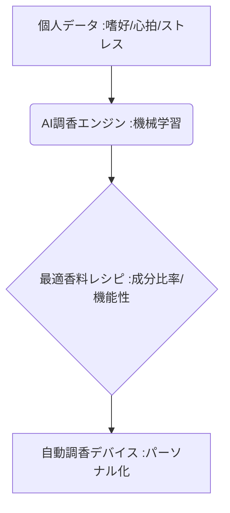

# T5-07-03 香り×AI パーソナライズ調香システム

## Summary（5つの要点）

1. **データの活用**: **個人の嗜好データ、生活習慣、心理状態、そして生体データ（心拍、ストレスレベル）**を収集・分析。
2. **AIによる調合**: **AI（機械学習）**がこれらのデータに基づき、**最適な香りの成分比率を自動で計算・提案**し、香水を自動で調合（調香）。
3. **目的別調香**: **アロマセラピー効果（リラックス、睡眠改善、集中力向上）**を最大化する機能性香料の調合に特化。
4. **海外の先行事例**: **Givaudan（スイスの香料大手）**がAIシステム「Carto」を開発し、調香師の創造性をAIで支援。
5. **日本のデバイス連携**: **Scentee（日本）**のスマホ連動デバイスが、個人の状態に合わせた香りをその場で自動生成するシステムを開発中。

#### 概念図

---

### 技術評価表（定量的な視点）
| 評価項目 | 評価 | 根拠 |
| :--- | :--- | :--- |
| 導入コスト | ⭐⭐⭐☆☆ | **AIエンジン開発は高額。香料データベースと生体センサーの導入コスト** |
| 技術成熟度 | ⭐⭐⭐☆☆ | **AIによるレシピ提案は実用段階。個人の生体データ連携は途上** |
| 日本の競争力 | ⭐⭐⭐⭐☆ | **生体センサー、アロマセラピー研究、小型デバイス技術で強み** |
| 市場性 | ⭐⭐⭐⭐⭐ | **パーソナライズ化粧品・健康食品市場の拡大に伴い需要が増加** |
| 品質保証の重要性 | ⭐⭐⭐⭐⭐ | **皮膚への安全性、機能性（効果）の再現性保証が必須** |

---

## 日本の立ち位置・強み弱みのSummary

### 強み：日本企業や研究機関が持つ独自の技術、優位性などを箇条書きで記述。

* **生体センサー技術**: **心拍数、汗に含まれる成分など、個人の生体データを高精度で取得するセンサー技術**。
* **伝統的な香りの知見**: **香道、和の香りなど、日本の伝統的な香りの文化と知見をAI学習データとして活用**。
* **フレグランスメーカーの技術力**: **高砂香料、長谷川香料など、世界のトップティアに名を連ねる日本の香料メーカーの調香基盤**。

### 弱み：日本が抱える規制、標準化の遅れ、海外依存などを箇条書きで記述。

* **生体データの利用規制**: **個人情報保護法、医療情報関連法による生体データの収集・利用に関する規制が、パーソナライズ化の足かせ**。
* **AI調香の評価基準**: **AIが提案した香りが人間の感性に合うかどうかの客観的評価基準が未確立**。
* **グローバルAIプラットフォームへの依存**: **香料のデータベース、AI学習基盤が海外の香料大手（Givaudan、Firmenich）に集中**。

---

## 技術ロードマップ（短期/中期/長期）

### 短期目標（～2027年）

* **AIが個人の睡眠データ（T5-08-01）に基づき、睡眠導入効果を最大化するアロマを自動調香**する実証実験を完了。
* **小売店にAI調香ブース**が設置され、顧客が嗜好をインプットすることでカスタム香水を購入可能に。
* **AIが提案した香りの心理的効果**を、第三者機関が科学的エビデンスとして検証する仕組みを構築。

### 中期目標（2028年～2031年）

* **ウェアラブルデバイス**にAI調香システムが統合され、**リアルタイムのストレスレベル**に応じて自動で香りを放出（T5-07-01と連携）。
* **AI調香のアルゴリズム**がオープンソース化され、世界中のクリエイターが利用できる環境が整備。
* **医療・介護分野**で、認知症患者の行動改善や、ストレス軽減を目的としたアロマがAIにより個別に処方される。

### 長期目標（2032年～2035年）

* **AIが人間の感情、記憶、思考**を完全に解析し、**精神的な充足感**を与える「ブレイン・フレグランス」が開発。
* **香りの遺伝子情報（嗅覚受容体）**と連携し、個人の嗅覚特性に完全にマッチした香りをAIが生成。

### 📚 参照リンク

1. [Givaudan: AI-Assisted Perfumery (Carto)](https://www.givaudan.com/fragrance-beauty/scent-design/ai-perfumery)
2. [Scentee: スマホ連動型香りデバイス](https://scentee.com/)
3. [高砂香料工業: 香料の技術革新](https://www.taka.co.jp/)
