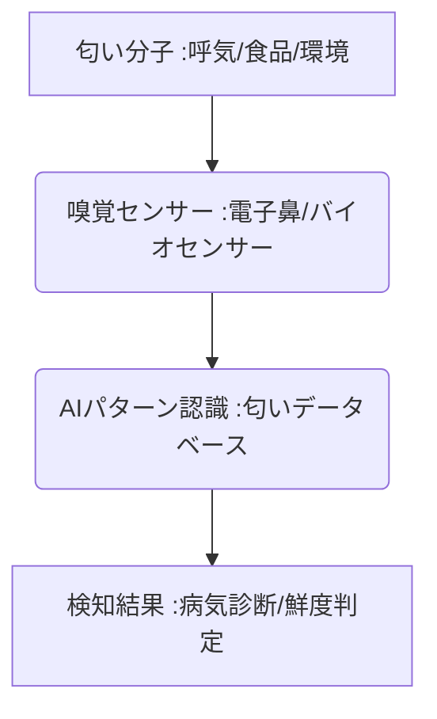

# T5-07-04 嗅覚センサー・匂い検知技術

## Summary（5つの要点）

1. **人間の鼻を超える高感度**: **化学センサー（MOSセンサー、QCMセンサー）**と**AI**を組み合わせた**「電子鼻（e-nose）」**により、人間の嗅覚では難しい微量な匂い成分を高精度で検知。
2. **医療診断への応用**: **呼気や汗**に含まれる微量な有機化合物を分析することで、**ガンの早期発見、糖尿病、認知症**などの病気を非侵襲的に診断（呼気診断）。
3. **食品・品質管理**: **食品の鮮度、ワインや酒類の品質判定、工場や環境の異臭・有害ガス**のリアルタイムモニタリング。
4. **日本の研究**: **物質・材料研究機構（NIMS）、島津製作所**などが、高感度なセンサーデバイスとAIによるパターン認識技術を開発。
5. **課題**: **環境依存性（温度、湿度による影響）、検知できる物質の種類の拡大、センサーの小型化とコスト**。

#### 概念図

---

### 技術評価表（定量的な視点）
| 評価項目 | 評価 | 根拠 |
| :--- | :--- | :--- |
| 導入コスト | ⭐⭐⭐☆☆ | **高精度センサー、AI解析システムの導入は高額。汎用機は低下傾向** |
| 技術成熟度 | ⭐⭐⭐☆☆ | **単一成分の検知は成熟。複雑な混合臭の識別（パターン認識）は途上** |
| 日本の競争力 | ⭐⭐⭐⭐⭐ | **センサー材料開発、分析機器（島津製作所）の技術で世界的優位性** |
| 市場性 | ⭐⭐⭐⭐⭐ | **医療、食品安全、環境監視、セキュリティなど巨大な応用市場** |
| 品質保証の重要性 | ⭐⭐⭐⭐⭐ | **医療診断、食品安全に関わるため、信頼性と精度保証が最重要** |

---

## 日本の立ち位置・強み弱みのSummary

### 強み：日本企業や研究機関が持つ独自の技術、優位性などを箇条書きで記述。

* **センサー材料技術**: **NIMS、大手化学メーカーによる高感度な半導体・ナノ材料センサーの開発**。
* **分析機器のノウハウ**: **島津製作所、HORIBAなどの高度なガスクロマトグラフィー、質量分析技術**。
* **医療連携**: **呼気診断における日本の医療機関との連携研究が活発**。

### 弱み：日本が抱える規制、標準化の遅れ、海外依存などを箇条書きで記述。

* **医療機器としての認可**: **呼気診断デバイスが医療機器として認可されるための規制ハードルが高い**。
* **匂いデータベースの統合**: **多様な匂い成分のデータベース化、共通の標準プロトコル整備が遅れ**。
* **ポータブル化の課題**: **実験室レベルの分析精度を、小型・ウェアラブルなデバイスで実現する技術的な難易度**。

---

## 技術ロードマップ（短期/中期/長期）

### 短期目標（～2027年）

* **食品工場、環境監視**分野で、特定の有害ガス、異臭の**リアルタイム検知・警告システム**が普及。
* **呼気診断**デバイスが**特定の病気（例：糖尿病、腎臓病）**について医療機器としての認可を取得し、臨床現場での導入が開始。
* **自動車の車内環境**で、眠気や体調不良を示す匂い成分を検知し、ドライバーに警告するシステムを実装。

### 中期目標（2028年～2031年）

* **家庭用e-nose**が普及し、冷蔵庫内の食材の鮮度、部屋の空気質などを常時モニタリング。
* **嗅覚センサー（T5-07-04）**の計測結果を基に、**AI調香システム（T5-07-03）**が不快臭を中和・マスキングする香りを自動で放出。
* **複数のセンサーを統合**し、複雑な匂いを人間と同等以上の精度で識別する**「次世代型電子鼻」**を開発。

### 長期目標（2032年～2035年）

* **匂いによる健康診断**が一般化し、定期的な呼気検査が早期病気発見の主要な手段となる。
* **警察・セキュリティ分野**で、爆発物、麻薬などを非接触で検知する小型ドローン搭載型e-noseが実用化。

### 📚 参照リンク

1. [NIMS: 超高感度匂いセンサーの開発](https://www.nims.go.jp/news/archive/2023/12/202312251.html)
2. [島津製作所: 匂い分析装置](https://www.shimadzu.co.jp/)
3. [NEDO: 次世代センサー技術開発プロジェクト](https://www.nedo.go.jp/)
