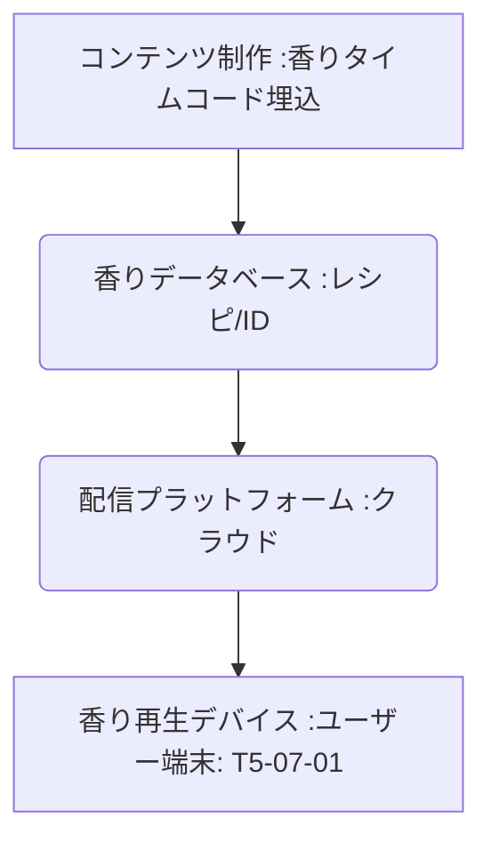

# T5-07-05 香りコンテンツ配信プラットフォーム

## Summary（5つの要点）

1. **香りデータの伝送**: **映画やゲームの映像・音声データに「香りタイムコード」**を埋め込み、インターネット経由で受信側のデバイス（T5-07-01）に香り再生指示を配信。
2. **配信の仕組み**: **香り成分のレシピ、放出のタイミング、濃度**などのデータを標準化されたフォーマットで格納した**「デジタル香りファイル」**をクラウドからストリーミング配信。
3. **メタバースでの共有**: **メタバース空間（T8-01関連）**で、同じ仮想空間にいるユーザー間で同じ香りを共有し、**臨場感と没入感を極限まで高める**。
4. **技術的課題**: **香りのデジタル記述方法（標準化）**、**大量の香りデータの著作権管理**、そして**多様な再生デバイス間の互換性**の確保が大きな課題。
5. **日本の構想**: **SMELLMAFIA（日本）**などが、香り付きコンテンツ配信の構想を持ち、技術実証を進めている。

#### 概念図

---

### 技術評価表（定量的な視点）
| 評価項目 | 評価 | 根拠 |
| :--- | :--- | :--- |
| 導入コスト | ⭐⭐⭐☆☆ | **プラットフォーム構築は高額。コンテンツへの組み込みコストは低い** |
| 技術成熟度 | ⭐⭐⭐☆☆ | **技術構想は進行中だが、国際的な標準化、エコシステム構築は途上** |
| 日本の競争力 | ⭐⭐⭐☆☆ | **コンテンツ産業、小型デバイス技術で強み。プラットフォーム構築は海外が先行** |
| 市場性 | ⭐⭐⭐⭐⭐ | **映画、音楽、ゲーム、広告など、デジタルコンテンツ市場全体が対象** |
| 品質保証の重要性 | ⭐⭐⭐⭐⭐ | **香りの再生エラー（タイミングのズレ）は没入感を損なう** |

---

## 日本の立ち位置・強み弱みのSummary

### 強み：日本企業や研究機関が持つ独自の技術、優位性などを箇条書きで記述。

* **高品質なコンテンツ産業**: **アニメ、ゲームなど、香り付加による価値向上効果の高いコンテンツが豊富**。
* **小型香りデバイスの技術**: **受信側の香り再生デバイス（T5-07-01）に関する技術開発で先行**。
* **データ著作権管理への意識**: **コンテンツの二次利用、著作権管理（T5-05-04）に対する意識が高く、データ配信基盤に強い**。

### 弱み：日本が抱える規制、標準化の遅れ、海外依存などを箇条書きで記述。

* **香りのデジタル標準の不在**: **香りの成分、レシピ、タイムコードに関する国際的な標準規格の策定が遅れ**。
* **プラットフォーム投資の不足**: **世界的なコンテンツ配信プラットフォーム（Netflix、Spotify）のような大規模な投資が未確立**。
* **コンテンツ制作ノウハウの不足**: **「香りの演出」を前提とした映像・ゲーム制作のクリエイティブなノウハウが不足**。

---

## 技術ロードマップ（短期/中期/長期）

### 短期目標（～2027年）

* **香りデータの記述方法**に関する**業界標準（プロトコル）**を、日本の業界団体が中心となって策定・提案。
* **VRライブ（T5-06-01）やメタバース**での**香り付与コンテンツ**のプロトタイプを公開し、ユーザーフィードバックを収集。
* **主要な映画館、ゲームセンター**などに香り再生デバイスを設置し、商業実証実験を開始。

### 中期目標（2028年～2031年）

* **世界中の香りコンテンツ制作者**が利用できる**オープンソースの香りデータベース**と、APIを搭載したプラットフォームを構築。
* **嗅覚センサー（T5-07-04）**のデータを利用し、ユーザーの嗅覚疲労を判断して**香りの放出を自動調整**する機能を実装。
* **NFT（T5-05）**と連携し、香りのレシピ自体を**デジタル資産**として取引する仕組みを構築。

### 長期目標（2032年～2035年）

* **五感情報のデジタル化（嗅覚、触覚、味覚）**が統合され、**「五感コンテンツ」**が映画、ゲームの標準となる。
* **香りコンテンツが個人の感情や記憶に影響を与える**ことを前提とした、倫理・法規制の枠組みを国際的に確立。

### 📚 参照リンク

1. [SMELLMAFIA: 香り付きコンテンツ配信の構想](https://smellmafia.com/)
2. [Digital Scent Technology Consortium](https://www.digitalsmell.com/)
3. [VR/ARにおける嗅覚提示技術の研究論文](https://www.jsme.or.jp/)
