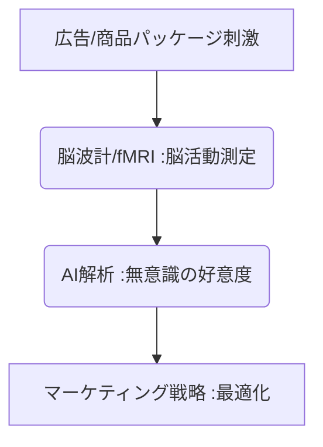

# T5-08-01 fMRI・脳波計測による消費者脳反応分析

## Summary（5つの要点）

1. **潜在的反応の可視化**: **機能的磁気共鳴画像法（fMRI）や脳波計（EEG）**を用いて、広告、製品、パッケージを見た際の**無意識の好意度、購買意欲、感情変化**を測定。
2. **測定技術の特性**: **fMRI**は脳の深い部分の活動（血流変化）を**空間的精度高く**測定。**EEG**は頭皮上から電気信号を**時間的精度高く**測定。
3. **従来の課題克服**: 従来のアンケートやインタビューでは捉えきれない、**潜在的な（顕在化されていない）消費者反応**を定量的に評価。
4. **市場応用**: **Nielsen Neuro（米国）、電通サイエンスジャム（日本）**などが、広告クリエイティブの最適化や製品開発にこの技術を応用。
5. **低コスト化**: **高額なfMRI設備**が課題だが、**簡易型のウェアラブルEEGデバイス（T5-08-05関連）**の普及により、低コストでの消費者テストが可能に。

#### 概念図

---

### 技術評価表（定量的な視点）
| 評価項目 | 評価 | 根拠 |
| :--- | :--- | :--- |
| 導入コスト | ⭐⭐⭐☆☆ | **fMRIは高額。簡易EEGデバイスの導入コストは低い** |
| 技術成熟度 | ⭐⭐⭐⭐☆ | **基礎研究は成熟。データ解析（特定の反応部位の特定）に課題** |
| 日本の競争力 | ⭐⭐⭐⭐☆ | **電通サイエンスジャムなど、マーケティング応用で先行事例あり** |
| 市場性 | ⭐⭐⭐⭐⭐ | **意思決定の無意識層解明は、全ての消費者マーケティングに必須** |
| 品質保証の重要性 | ⭐⭐⭐⭐⭐ | **データの信頼性（アーチファクト除去）、統計解析の妥当性が重要** |

---

## 日本の立ち位置・強み弱みのSummary

### 強み：日本企業や研究機関が持つ独自の技術、優位性などを箇条書きで記述。

* **脳科学の基礎研究**: **理化学研究所、ATR（国際電気通信通信基礎技術研究所）**など、世界トップクラスの脳機能マッピング研究。
* **簡易デバイス技術**: **小型・高精度なウェアラブルEEG、近赤外分光法（NIRS）デバイス**の開発力。
* **広告代理店の応用ノウハウ**: **電通、博報堂**など、脳科学をマーケティング戦略に落とし込むノウハウの蓄積。

### 弱み：日本が抱える規制、標準化の遅れ、海外依存などを箇条書きで記述。

* **脳データのプライバシー規制**: **生体データ、特に脳活動データの収集・利用に関する法規制の整備が途上**。
* **fMRI設備の高コスト**: **高額な設備投資が必要で、利用できる機会が限定的**。
* **結果解釈の標準化の遅れ**: **特定の脳活動パターンが購買意欲とどう結びつくか、業界標準となる解釈モデルの確立が不十分**。

---

## 技術ロードマップ（短期/中期/長期）

### 短期目標（～2027年）

* **簡易EEGデバイス**が、オンライン調査やホームユースに普及し、**低コストで大規模な消費者脳反応データ**を収集。
* **アイトラッキング（T5-08-02）、表情認識AI（T5-08-03）**などの複数の生体データとの**フュージョン解析**手法を開発。
* **認知負荷、集中度、記憶定着**といった、特定の脳指標を**リアルタイムで評価**するAIアルゴリズムが実用化。

### 中期目標（2028年～2031年）

* **VR/ARメタバース（T8-01）**内で、アバター（T8-01-02）に連動した**脳活動による感情表現**が実現。
* **ニューロフィードバック（T5-08-05）**と連携し、広告視聴者が無意識に感じる**「不快」を「快適」に変化させる**広告コンテンツを動的に生成。
* **脳データ**を個人が管理し、その**利用許諾**を**ブロックチェーン（T5-05-05）**で管理する仕組みを確立。

### 長期目標（2032年～2035年）

* **ブレイン・コンピュータ・インタフェース（BCI）**が普及し、**思考や意図**を直接製品開発やコンテンツ制作に反映（ブレイン・コンテンツ）。
* **脳活動を計測**しながら、**記憶や感情を操作**する（想起させる）技術が実用化し、倫理的な議論が不可避となる。

### 📚 参照リンク

1. [Nielsen NeuroScience: 消費者ニューロサイエンス](https://www.nielsen.com/ja/solutions/neuroscience/)
2. [電通サイエンスジャム: 脳科学を活用したソリューション](https://www.dentsu-sj.com/)
3. [理化学研究所 脳科学研究センター](https://www.brain.riken.jp/)
