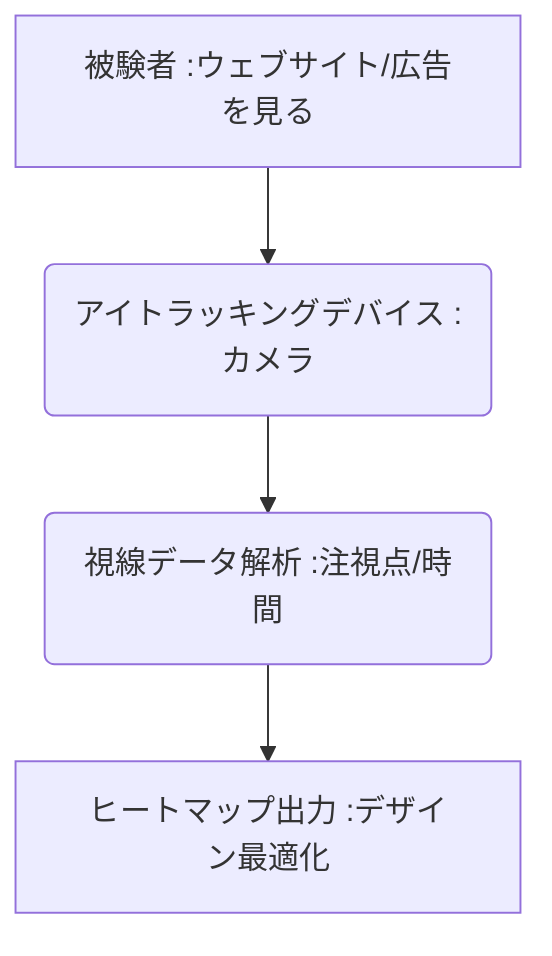

# T5-08-02 アイトラッキング・視線解析技術

## Summary（5つの要点）

1. **注視の定量化**: **特殊なカメラ**で視線の動き（**注視点、注視時間、視線移動パターン**）をミリ秒単位で追跡・計測。
2. **注目度の可視化**: 視線データを集計し、**ヒートマップやゲイズプロット**として可視化することで、広告、ウェブサイト、製品パッケージの**どの要素が注目されているか**を定量的に評価。
3. **応用分野**: **ウェブサイトのユーザビリティ改善、デジタルサイネージの広告効果測定、小売店の商品棚レイアウト最適化**など。
4. **主要デバイス**: **Tobii（スウェーデン）、Smart Eye**などが高精度な専用アイトラッキングデバイスを提供。
5. **簡易計測**: スマートフォンの**フロントカメラとAI画像認識**を組み合わせることで、専用デバイス不要の**低コストな簡易計測**が実用化。

#### 概念図

---

### 技術評価表（定量的な視点）
| 評価項目 | 評価 | 根拠 |
| :--- | :--- | :--- |
| 導入コスト | ⭐⭐⭐⭐☆ | **専用デバイスは高額だが、ソフトウェアによる簡易計測が普及** |
| 技術成熟度 | ⭐⭐⭐⭐⭐ | **基礎技術は成熟。AIによる視線意図の推定が進化中** |
| 日本の競争力 | ⭐⭐⭐☆☆ | **デバイスは海外依存。応用分野（ウェブ解析、UX）でのノウハウは強み** |
| 市場性 | ⭐⭐⭐⭐⭐ | **デジタルマーケティング、リテール、自動車（ドライバー監視）で必須** |
| 品質保証の重要性 | ⭐⭐⭐⭐☆ | **キャリブレーション精度、環境光によるノラナイズ（非動作）対策が重要** |

---

## 日本の立ち位置・強み弱みのSummary

### 強み：日本企業や研究機関が持つ独自の技術、優位性などを箇条書きで記述。

* **自動車分野での応用**: **ドライバーの脇見、居眠り検知**など、自動車分野での応用技術開発で世界的に先行。
* **UX/UIデザインの知見**: **ウェブサイト、アプリのユーザビリティテスト**における視線解析の応用ノウハウが豊富。
* **VR/ARデバイスへの組み込み**: **ソニー、パナソニック**など、VRヘッドセットへの視線入力機能（フォビエーテッド・レンダリング）の組み込み技術。

### 弱み：日本が抱える規制、標準化の遅れ、海外依存などを箇条書きで記述。

* **専用デバイスの海外依存**: **Tobii（スウェーデン）**など、高性能なアイトラッキングデバイスメーカーに依存。
* **公開データセットの不足**: **日本語環境、日本人特有の視線行動**を学習させるための大規模な公開データセットが不足。
* **プライバシー懸念**: **カメラによる常時監視**、**個人識別**に繋がる視線データの利用に対する社会的な抵抗感。

---

## 技術ロードマップ（短期/中期/長期）

### 短期目標（～2027年）

* **VR/ARヘッドセット**が視線トラッキングを標準搭載し、**メタバース（T8-01）**内での視線に基づくインタラクションが普及。
* **AIが視線移動パターン**から、**購買意欲、理解度、認知負荷**といった高次の意図をリアルタイムで推定。
* **ウェブサイト、アプリ**の分析ツールに、アイトラッキング解析機能が**低コスト**で統合。

### 中期目標（2028年～2031年）

* **デジタルサイネージ、小売店の棚**に搭載されたアイトラッキングAIが、通行人の視線データを自動解析し、**広告をパーソナライズ**して出し分け（T5-06-04と連携）。
* **教育分野**で、生徒の視線から**学習のつまずき、集中力の欠如**を検知し、教師にフィードバックするシステムを導入。
* **ウェアラブルデバイス**が、装着者の視線情報から**周囲の危険、体調不良**を検知し、警告。

### 長期目標（2032年～2035年）

* **視線によるUI操作（ハンズフリー操作）**が一般化し、スマートグラスやコンタクトレンズ型デバイスでの操作が主流に。
* **視線データ**が個人の**購買行動、意思決定**の予測に利用され、マーケティングの意思決定を完全に自動化。

### 📚 参照リンク

1. [Tobii: アイトラッキングのリーディングカンパニー](https://www.tobii.com/ja/)
2. [Smart Eye: 自動車向けアイトラッキング](https://smarteye.se/)
3. [日本ヒューマンインタフェース学会: 視線研究](https://www.his.gr.jp/)
