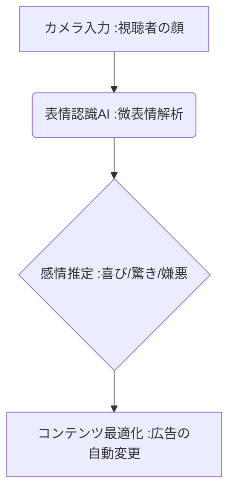

# T5-08-03 表情認識AI・感情分析（アフェクティブ・コンピューティング）

## Summary（5つの要点）

1. **感情の自動推定**: カメラで撮影された**顔の微細な表情変化（微表情）**をAI（深層学習）が解析し、**喜び、悲しみ、驚き、嫌悪**といった感情を推定。
2. **アフェクティブ・コンピューティング**: 人間の感情を理解し、それに応じて応答する**コンピューター技術（感情計算）**の中核をなす。
3. **広告評価への応用**: **広告視聴中の視聴者の感情変化**をリアルタイムで測定し、**クリエイティブのどの部分が効果的・非効果的か**を特定（T5-06-04関連）。
4. **主要プレイヤー**: **Affectiva（米国、表情認識API）、Realeyes**などが世界市場を牽引。
5. **応用展開**: **デジタルサイネージでの広告の出し分け、コールセンターでの顧客満足度推定、対面接客での感情に基づく応答**など。

#### 概念図

---

### 技術評価表（定量的な視点）
| 評価項目 | 評価 | 根拠 |
| :--- | :--- | :--- |
| 導入コスト | ⭐⭐⭐⭐⭐ | **汎用カメラとクラウドAPIで低コスト導入可能** |
| 技術成熟度 | ⭐⭐⭐⭐☆ | **基本感情の認識精度は高い。複雑な感情、文化差への対応に課題** |
| 日本の競争力 | ⭐⭐⭐☆☆ | **基礎研究は進展。実用プラットフォームはAffectivaなど米国勢が先行** |
| 市場性 | ⭐⭐⭐⭐⭐ | **顧客体験（CX）改善、広告、エンタメ、教育など全産業で需要** |
| 品質保証の重要性 | ⭐⭐⭐⭐⭐ | **誤った感情推定は、サービスの質、顧客満足度を損なう** |

---

## 日本の立ち位置・強み弱みのSummary

### 強み：日本企業や研究機関が持つ独自の技術、優位性などを箇条書きで記述。

* **ロボット・対話システム**: **ロボットの感情表現・インタラクション研究（例：Pepper、aibo）から得られた知見**。
* **微表情研究**: **日本特有の「建前と本音」**の文化背景を持つ、微細な感情変化を捉える研究。
* **アニメ・ゲームへの応用**: **AIキャラクターの感情豊かな表現、NPCの感情に基づく行動制御**。

### 弱み：日本が抱える規制、標準化の遅れ、海外依存などを箇条書きで記述。

* **個人情報保護規制**: **顔画像、感情データが機密性の高い個人情報と見なされ、データ収集・利用が制限**。
* **感情分類の標準化**: **感情の分類モデル（例：6基本感情）が国際的に多様で、日本独自の感情表現の取り込みが課題**。
* **公共空間での利用への抵抗**: **街中や店舗での「見られている」こと、感情を分析されていることへの心理的な抵抗感**。

---

## 技術ロードマップ（短期/中期/長期）

### 短期目標（～2027年）

* **コールセンター、オンライン接客**において、**顧客の不満、怒り**をAIがリアルタイム検知し、オペレーターに警告するシステムが普及。
* **オンライン教育**で、生徒の**集中度、退屈度**を表情から判断し、コンテンツを動的に変化（T5-06-04と連携）。
* **多文化・多言語環境**における感情認識の精度を向上させるため、大規模なグローバルデータセットの学習を強化。

### 中期目標（2028年～2031年）

* **VR/メタバース**で、ユーザーの現実世界の表情が**アバター（T8-01-02）に高精度で反映**され、感情豊かなコミュニケーションが可能に。
* **感情認識AI**と**AI調香システム（T5-07-03）**が連携し、ユーザーのストレスレベルに応じて最適なアロマを自動で放出。
* **デジタルサイネージ**が、通行人の属性、視線、感情を瞬時に解析し、**ターゲットに合わせた広告を秒単位で出し分け**。

### 長期目標（2032年～2035年）

* **AIが人間の感情、意図**を完全に理解し、**人間を超える共感能力**を持つAIアシスタント、サービスロボットが普及。
* **感情のプライバシー**を保護するための**法的な枠組み（例：感情データ利用の透明性義務）**が国際的に確立。

### 📚 参照リンク

1. [Affectiva: The World Leader in Emotion AI](https://www.affectiva.com/)
2. [Realeyes: 視聴者の感情測定プラットフォーム](https://www.realeyesit.com/)
3. [人工知能学会: 感情認識とアフェクティブコンピューティング](https://www.ai-gakkai.or.jp/)
