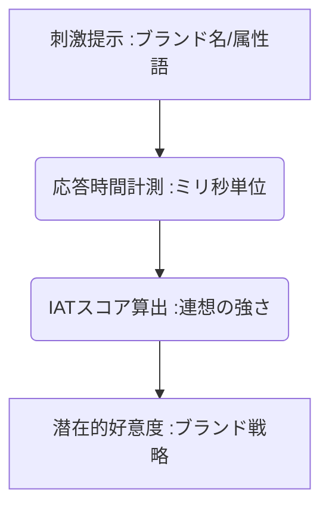

# T5-08-04 潜在意識テスト・インプリシット連想テスト（IAT）デジタル化

## Summary（5つの要点）

1. **無意識の連想の測定**: **インプリシット連想テスト（IAT）**は、**反応時間（RT）**を計測することで、**人が意識しない潜在的な連想**や態度（例：ブランドに対する潜在的イメージ）を測定する心理学的手法。
2. **デジタル化の進展**: 従来の紙ベースのテストから、**オンラインサーベイツール（Qualtrics、SurveyMonkey）**に統合され、大規模かつ低コストで実施可能に。
3. **測定原理**: 概念（例：自社ブランド、競合ブランド）と属性（例：良い、悪い）の組み合わせに対する**応答速度の差**から、潜在的な好意度、信頼度を定量評価。
4. **応用分野**: **ブランドイメージ調査**で、顧客が意識していない潜在的な連想を特定。また、**差別的偏見（Implicit Bias）の測定**と是正トレーニングに活用。
5. **課題**: **反応時間の正確な計測**（マイクロ秒単位）、テスト結果の**再現性の確保**、そして**結果の解釈（妥当性）**が重要。

#### 概念図

---

### 技術評価表（定量的な視点）
| 評価項目 | 評価 | 根拠 |
| :--- | :--- | :--- |
| 導入コスト | ⭐⭐⭐⭐⭐ | **既存のオンラインサーベイツールに機能統合され、低コストで実施可能** |
| 技術成熟度 | ⭐⭐⭐⭐☆ | **理論は確立。モバイル環境でのRT計測精度向上に課題** |
| 日本の競争力 | ⭐⭐⭐☆☆ | **基礎理論、ツールの開発は欧米が先行。応用研究は活発** |
| 市場性 | ⭐⭐⭐⭐⭐ | **顧客調査、人事、教育、社会心理学など広範囲でのニーズ** |
| 品質保証の重要性 | ⭐⭐⭐⭐⭐ | **応答時間の計測精度、データのアーチファクト除去が結果の信頼性を左右** |

---

## 日本の立ち位置・強み弱みのSummary

### 強み：日本企業や研究機関が持つ独自の技術、優位性などを箇条書きで記述。

* **心理学・行動経済学の研究**: **IATの基礎研究、消費者行動分析への応用研究が大学・研究機関で活発**。
* **モバイルサーベイ技術**: **スマートフォンなどモバイル環境での反応時間計測のノウハウ**。
* **ブランド・広告文化**: **日本の独特なブランド文化、キャラクター文化**における潜在意識連想の分析ニーズが高い。

### 弱み：日本が抱える規制、標準化の遅れ、海外依存などを箇条書きで記述。

* **ツール提供の海外依存**: **Qualtrics、SurveyMonkey**といった主要なオンラインサーベイツールに機能として依存。
* **テスト結果の公開制限**: **IATの結果が差別的偏見の測定に利用される際、倫理的配慮からデータ公開に慎重**。
* **解釈モデルの標準化の遅れ**: **計測結果をマーケティング施策に落とし込むための、業界共通の解釈モデルが未整備**。

---

## 技術ロードマップ（短期/中期/長期）

### 短期目標（～2027年）

* **オンライン調査**でのIAT実施が一般化し、**ブランドイメージ調査の必須項目**として定着。
* **ウェブ広告、動画広告**を見た直後の潜在意識変化を、**広告効果測定**のKPIとして導入。
* **VR/AR環境**で、**よりリアルな刺激（3Dモデル、ハプティクス）**を用いたIATの実施を実証。

### 中期目標（2028年～2031年）

* **脳波計測（T5-08-01）、表情認識AI（T5-08-03）**とIATを統合し、**意識的反応と無意識的反応のズレ**を多角的に分析するシステムを開発。
* **人事・教育分野**で、採用や社員研修にIATが導入され、**無意識の偏見**を特定し是正するトレーニングが普及。
* **パーソナライズ化**（T5-06-04）と連携し、**個人の潜在的な好みに合わせたコンテンツ**をAIが自動推薦。

### 長期目標（2032年～2035年）

* **思考や意図**を直接測定する**ブレイン・コンピュータ・インタフェース（BCI）**が、IATを置き換える主要な潜在意識測定手法となる。
* **IATの結果**が、個人の**デジタルID（T5-05-05）**の一部として管理され、サービス利用時のパーソナライズに活用。

### 📚 参照リンク

1. [Project Implicit (ハーバード大学)](https://implicit.harvard.edu/)
2. [Qualtrics: Experience Management Software](https://www.qualtrics.com/)
3. [日本行動経済学会](https://www.jabe-org.jp/)
