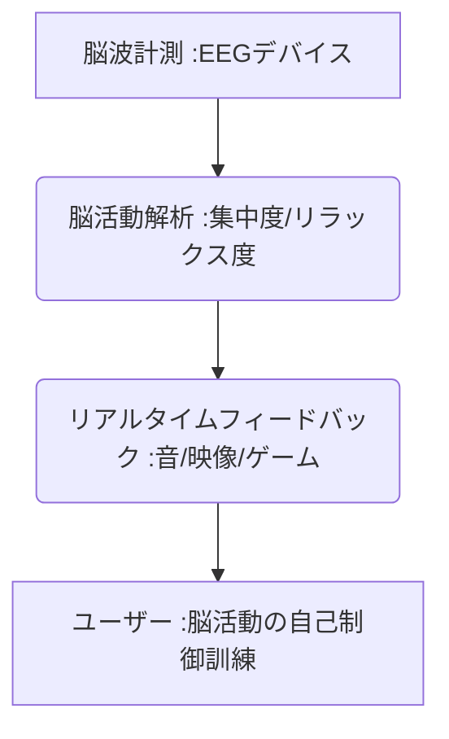

# T5-08-05 ニューロフィードバック・脳トレゲーム

## Summary（5つの要点）

1. **脳波のリアルタイム可視化**: **脳波（EEG）**を計測し、そのデータ（例：アルファ波、ベータ波の強度）を**音や映像**としてリアルタイムでユーザーにフィードバック（ニューロフィードバック）。
2. **自己制御訓練**: ユーザーはフィードバックされた情報（例：音が静かになる＝リラックスできている）を頼りに、**意識的に自身の脳活動をコントロール**する訓練を行う。
3. **デバイスと製品**: **Muse（瞑想サポート脳波計）、NeuroSky**などがウェアラブルな簡易型脳波計を製品化。脳波でオブジェクトを操作するゲーム**（マインドフレックス）**も登場。
4. **機能性**: **集中力向上（受験勉強、仕事）、リラックス、睡眠改善、ADHD（注意欠陥多動性障害）の症状緩和**などに臨床応用。
5. **将来展望**: 将来的には、脳波でVR世界を操作したり、思考を直接デバイスに伝える**ブレイン・コンピュータ・インタフェース（BCI）**へ発展（T5-08-01関連）。

#### 概念図

 

---

### 技術評価表（定量的な視点）
| 評価項目 | 評価 | 根拠 |
| :--- | :--- | :--- |
| 導入コスト | ⭐⭐⭐⭐☆ | **簡易EEGデバイスは低価格化。専門的な医療用途は高額** |
| 技術成熟度 | ⭐⭐⭐☆☆ | **リラックス、集中などの基本機能は実用化。医療分野でのエビデンス蓄積が課題** |
| 日本の競争力 | ⭐⭐⭐⭐☆ | **理化学研究所、ATRの基礎研究、オムロン等の医療機器メーカーの技術** |
| 市場性 | ⭐⭐⭐⭐⭐ | **ウェルネス、eスポーツ、教育、医療など広範な市場で需要** |
| 品質保証の重要性 | ⭐⭐⭐⭐⭐ | **計測データの信頼性、訓練効果の科学的エビデンスが最重要** |

---

## 日本の立ち位置・強み弱みのSummary

### 強み：日本企業や研究機関が持つ独自の技術、優位性などを箇条書きで記述。

* **BCIの基礎研究**: **理化学研究所、大阪大学**など、非侵襲・侵襲両面でのBCI研究が世界的に評価。
* **医療・ウェルネス分野の知見**: **アロマセラピー（T5-07-03）、睡眠科学**など、脳科学を健康・リラックスに繋げる知見。
* **エンタメ・ゲームへの応用**: **ゲームセンター、家庭用ゲーム機**への脳波コントローラー、脳トレゲーム導入実績。

### 弱み：日本が抱える規制、標準化の遅れ、海外依存などを箇条書きで記述。

* **医療機器としての認可**: **ADHD治療など、臨床応用における医療機器としての認可のハードルが高い**。
* **消費者保護の枠組み**: **脳波データの安全性、訓練効果の誇大広告に対する消費者保護の法整備が途上**。
* **BCIハードウェアのスタートアップ不足**: **Neuralink、Kernel**など、大規模なBCIスタートアップが米国で先行。

---

## 技術ロードマップ（短期/中期/長期）

### 短期目標（～2027年）

* **eスポーツ分野**で、選手の**集中度、ストレスレベル**を脳波で計測し、パフォーマンス向上に繋げるトレーニングが普及。
* **ウェアラブルEEGデバイス**が、**睡眠トラッキング（睡眠段階の精密な推定）**機能を強化し、アロマや照明と連動。
* **教育分野**で、**集中力を高めるための「脳波フィードバック学習」**が、学習塾、学校の一部で導入。

### 中期目標（2028年～2031年）

* **ブレイン・コンピュータ・インタフェース（BCI）**の非侵襲型デバイスが、**VR/メタバース（T8-01）**での操作（アバター移動、オブジェクト選択）を可能に。
* **BCI技術**が、ALSや脊髄損傷患者の**コミュニケーション、機器操作**を支援する医療・介護機器として実用化。
* **感情認識AI（T5-08-03）**と連携し、ユーザーの**感情の波を安定化**させるためのパーソナライズされた訓練プログラムを自動生成。

### 長期目標（2032年～2035年）

* **BCI**が、思考だけで情報を入力・操作する**主要なインターフェース**となり、スマートフォンやキーボードを置き換える。
* **脳活動の相互通信**が可能となり、**思考や感情をデジタルで共有**する「ブレイン・ネットワーキング」が実現。

### 📚 参照リンク

1. [Muse: 瞑想・睡眠用脳波計ヘッドバンド](https://choosemuse.com/)
2. [NeuroSky: ウェアラブルEEG技術](https://www.neurosky.com/)
3. [理化学研究所: BCI研究](https://www.riken.jp/)
